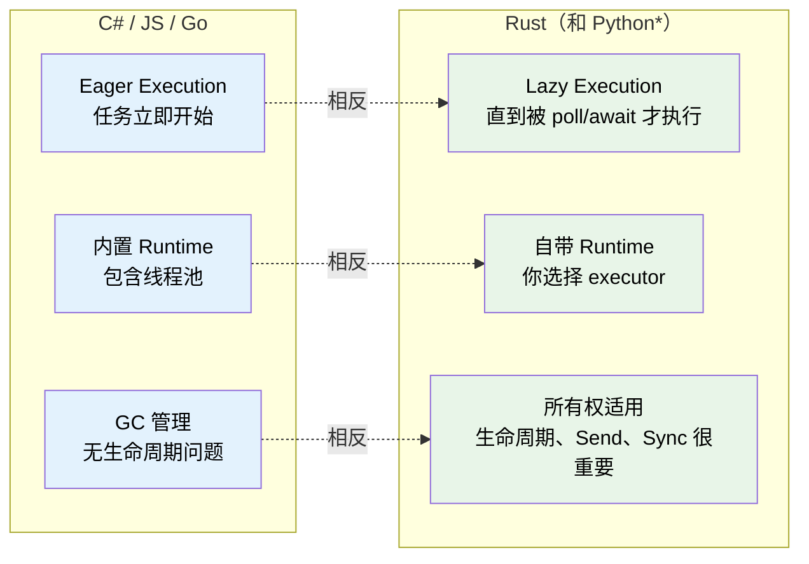
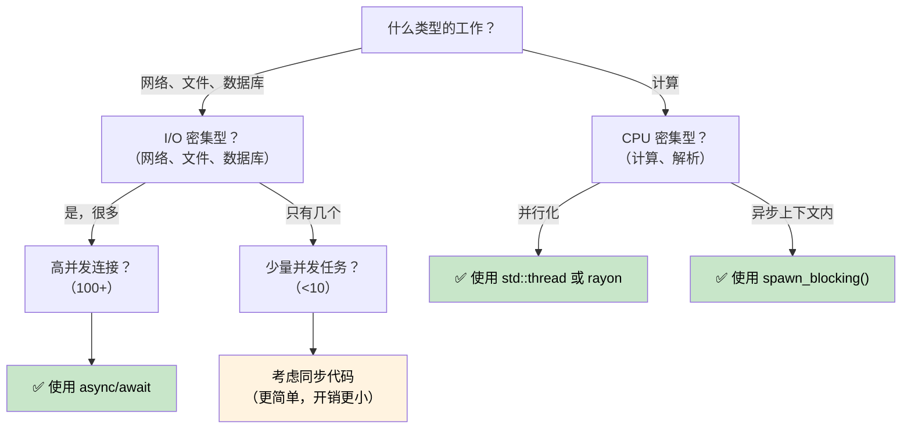

# 1. 为什么 Rust 的异步不同 🟢

> **你将学到：**
> - 为什么 Rust 没有内置的异步 runtime（这对你意味着什么）
> - 三个关键特性：惰性执行、无 runtime、零成本抽象
> - 何时异步是正确的工具（何时更慢）
> - Rust 的模型与 C#、Go、Python 和 JavaScript 的对比

## 根本区别

大多数带有 `async/await` 的语言隐藏了内部机制。C# 有 CLR 线程池。JavaScript 有事件循环。Go 有 goroutines 和内置于 runtime 的调度器。Python 有 `asyncio`。

**Rust 什么都没有。**

没有内置 runtime，没有线程池，没有事件循环。`async` 关键字是一个零成本的编译策略——它将你的函数转换为一个实现 `Future` trait 的状态机。必须由其他人（一个 *executor*）来驱动这个状态机向前执行。

### Rust 异步的三个关键特性



> \* Python 协程像 Rust future 一样是惰性的——它们不会被执行直到被 awaited 或调度。但是，Python 仍然使用 GC 且没有所有权/生命周期的顾虑。

### 没有内置 Runtime

```rust
// 这段代码编译通过但什么都不做：
async fn fetch_data() -> String {
    "hello".to_string()
}

fn main() {
    let future = fetch_data(); // 创建 Future，但不执行它
    // future 只是一个躺在栈上的 struct
    // 没有输出，没有副作用，什么都没发生
    drop(future); // 静默丢弃——工作从未开始
}
```

与 C# 对比，`Task` 是立即开始执行的：
```csharp
// C# —— 这立即开始执行：
async Task<string> FetchData() => "hello";

var task = FetchData(); // 已经在运行！
var result = await task; // 只是等待完成
```

### Lazy Futures vs Eager Tasks

这是最重要的思维转变：

| | C# / JavaScript | Python | Go | Rust |
|---|---|---|---|---|
| **创建** | `Task` 立即开始执行 | 协程**惰性**——返回对象，不被 awaited 或调度就不运行 | Goroutine 立即开始 | `Future` 在被 poll 之前什么都不做 |
| **丢弃** | 分离的 task 继续运行 | 未 await 的协程被垃圾回收（带警告） | Goroutine 运行到返回 | 丢弃 Future 会取消它 |
| **Runtime** | 内置于语言/VM | `asyncio` 事件循环（必须显式启动） | 内置于二进制文件（M:N 调度器） | 你选择（tokio、smol 等） |
| **调度** | 自动（线程池） | 事件循环 + `await` 或 `create_task()` | 自动（GMP 调度器） | 显式（`spawn`、`block_on`） |
| **取消** | `CancellationToken`（协作式） | `Task.cancel()`（协作式，抛出 `CancelledError`） | `context.Context`（协作式） | 丢弃 future（立即） |

```rust
// 要真正运行 future，需要一个 executor：
#[tokio::main]
async fn main() {
    let result = fetch_data().await; // 现在才执行
    println!("{result}");
}
```

### 何时使用异步（何时不用）



**经验法则**：异步用于 I/O 并发（在等待时做多件事），而不是 CPU 并行（让一件事更快）。如果你有 10,000 个网络连接，异步表现出色。如果你在 crunch 数字，使用 `rayon` 或 OS 线程。

### 何时异步可能*更慢*

异步不是免费的。对于低并发工作负载，同步代码性能可能优于异步：

| 开销 | 原因 |
|------|------|
| **状态机开销** | 每个 `.await` 添加一个 enum 变体；深度嵌套的 futures 产生大型复杂的状态机 |
| **动态分发** | `Box<dyn Future>` 添加间接层并破坏内联优化 |
| **上下文切换** | 协作式调度仍有开销——executor 必须管理 task 队列、waker 和 I/O 注册 |
| **编译时间** | 异步代码生成更复杂的类型，拖慢编译 |
| **可调试性** | 穿过状态机的栈追踪更难阅读（见第 12 章） |

**基准测试指导**：如果少于约 10 个并发 I/O 操作，在承诺使用异步之前先 profile。简单的每个连接一个 `std::thread::spawn` 在现代 Linux 上可以很好地扩展到数百个线程。

### 练习：何时使用异步？

<details>
<summary>🏋️ 练习（点击展开）</summary>

对于每个场景，判断是否适合使用异步并解释原因：

1. 一个 Web 服务器处理 10,000 个并发 WebSocket 连接
2. 一个 CLI 工具压缩单个大文件
3. 一个服务查询 5 个不同的数据库并合并结果
4. 一个游戏引擎以 60 FPS 运行物理模拟

<details>
<summary>🔑 解答</summary>

1. **异步** —— I/O 密集型且高并发。每个连接大部分时间在等待数据。线程需要 10K 栈空间。
2. **同步/线程** —— CPU 密集型，单个任务。异步增加开销但没有收益。使用 `rayon` 进行并行压缩。
3. **异步** —— 五个并发 I/O 等待。`tokio::join!` 同时运行所有五个查询。
4. **同步/线程** —— CPU 密集型，对延迟敏感。异步的协作式调度可能引入帧抖动。

</details>
</details>

> **关键要点——为什么异步不同**
> - Rust future 是**惰性的**——在被 executor poll 之前什么都不做
> - **没有内置 runtime**——你选择（或构建）自己的 runtime
> - 异步是产生状态机的**零成本编译策略**
> - 异步在**I/O 绑定并发**表现出色；对于 CPU 绑定工作，使用线程或 rayon

> **另见：** [第 2 章 — The Future Trait](ch02-the-future-trait.md) 了解实现这一切的 trait，[第 7 章 — Executors 和 Runtimes](ch07-executors-and-runtimes.md) 了解如何选择 runtime

***
