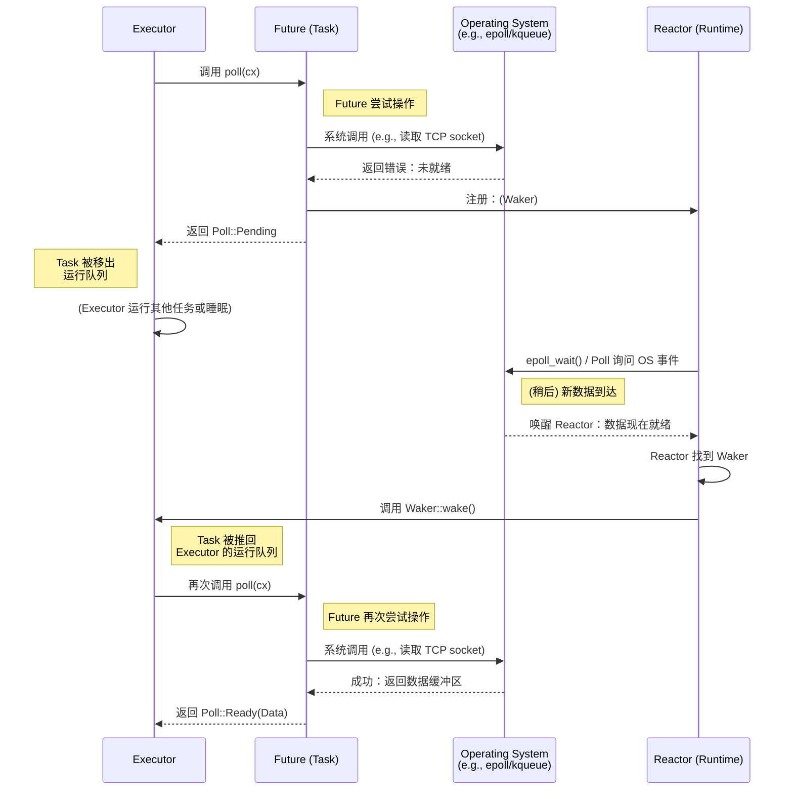

# 2. The Future Trait 🟡

> **你将学到：**
> - `Future` trait：`Output`、`poll()`、`Context`、`Waker`
> - Waker 如何告诉 executor "再次 poll 我"
> - 契约：从不调用 `wake()` = 你的程序静默挂起
> - 手动实现一个真实的 future（`Delay`）

## Future 的解剖

Rust 中的一切异步最终都实现这个 trait：

```rust
pub trait Future {
    type Output;

    fn poll(self: Pin<&mut Self>, cx: &mut Context<'_>) -> Poll<Self::Output>;
}

pub enum Poll<T> {
    Ready(T),   // Future 已完成，返回值 T
    Pending,    // Future 还未就绪——稍后再次调用我
}
```

就是这样。`Future` 是任何可以被 *poll* 的东西——被问"你完成了吗？"——然后回答"是的，这是结果"或"还没，我会在准备好时唤醒你。"

### Output、poll()、Context、Waker



让我们分解每个部分：

```rust
use std::future::Future;
use std::pin::Pin;
use std::task::{Context, Poll};

// 一个立即返回 42 的 future
struct Ready42;

impl Future for Ready42 {
    type Output = i32; // Future 最终产生的值

    fn poll(self: Pin<&mut Self>, _cx: &mut Context<'_>) -> Poll<i32> {
        Poll::Ready(42) // 总是就绪——无需等待
    }
}
```

**组件**：
- **`Output`** —— future 完成时产生的值的类型
- **`poll()`** —— 由 executor 调用来检查进度；返回 `Ready(value)` 或 `Pending`
- **`Pin<&mut Self>`** —— 确保 future 不会在内存中移动（我们将在第 4 章解释原因）
- **`Context`** —— 携带 `Waker` 以便 future 在准备好继续执行时向 executor 发信号

### Waker 契约

`Waker` 是回调机制。当 future 返回 `Pending` 时，它*必须*安排好稍后调用 `waker.wake()`——否则 executor 再也不会 poll 它，程序就会挂起。

```rust
use std::task::{Context, Poll, Waker};
use std::pin::Pin;
use std::future::Future;
use std::sync::{Arc, Mutex};
use std::thread;
use std::time::Duration;

/// 一个在延迟后完成的 future（玩具实现）
struct Delay {
    completed: Arc<Mutex<bool>>,
    waker_stored: Arc<Mutex<Option<Waker>>>,
    duration: Duration,
    started: bool,
}

impl Delay {
    fn new(duration: Duration) -> Self {
        Delay {
            completed: Arc::new(Mutex::new(false)),
            waker_stored: Arc::new(Mutex::new(None)),
            duration,
            started: false,
        }
    }
}

impl Future for Delay {
    type Output = ();

    fn poll(mut self: Pin<&mut Self>, cx: &mut Context<'_>) -> Poll<()> {
        // 在存储 waker 之前检查是否已经完成
        if *self.completed.lock().unwrap() {
            return Poll::Ready(());
        }

        // 存储 waker - executor 可能在每次 poll 时传递一个新的 waker
        *self.waker_stored.lock().unwrap() = Some(cx.waker().clone());

        // 在第一次 poll 时启动后台定时器
        if !self.started {
            self.started = true;
            let completed = Arc::clone(&self.completed);
            let waker = Arc::clone(&self.waker_stored);
            let duration = self.duration;

            thread::spawn(move || {
                thread::sleep(duration);
                *completed.lock().unwrap() = true;

                // 关键：唤醒 executor 以便它再次 poll 我们
                if let Some(w) = waker.lock().unwrap().take() {
                    w.wake(); // "嘿 executor，我准备好了——再次 poll 我！"
                }
            });
        }

        // 在存储 waker 后双重检查完成状态（处理竞态条件）
        if *self.completed.lock().unwrap() {
            return Poll::Ready(());
        }

        Poll::Pending // 还未完成
    }
}
```

> **核心洞察**：在 C# 中，TaskScheduler 自动处理唤醒。
> 在 Rust 中，**你**（或你使用的 I/O 库）负责调用 `waker.wake()`。
> 忘记它，你的程序就会静默挂起。

### 练习：实现 CountdownFuture

<details>
<summary>🏋️ 练习（点击展开）</summary>

**挑战**：实现一个 `CountdownFuture`，从 N 倒数到 0，每次被 poll 时打印当前计数。当达到 0 时，返回 `Ready("Liftoff!")`。

*提示*：future 需要存储当前计数并在每次 poll 时递减。记住始终重新注册 waker！

<details>
<summary>🔑 解答</summary>

```rust
use std::future::Future;
use std::pin::Pin;
use std::task::{Context, Poll};

struct CountdownFuture {
    count: u32,
}

impl CountdownFuture {
    fn new(start: u32) -> Self {
        CountdownFuture { count: start }
    }
}

impl Future for CountdownFuture {
    type Output = &'static str;

    fn poll(mut self: Pin<&mut Self>, cx: &mut Context<'_>) -> Poll<Self::Output> {
        if self.count == 0 {
            println!("Liftoff!");
            Poll::Ready("Liftoff!")
        } else {
            println!("{}...", self.count);
            self.count -= 1;
            cx.waker().wake_by_ref(); // 立即调度重新 poll
            Poll::Pending
        }
    }
}
```

**关键要点**：这个 future 每次计数被 poll 一次。每次返回 `Pending` 时，它立即唤醒自己以便再次被 poll。在生产环境中，你会使用定时器而不是忙 poll。

</details>
</details>

> **关键要点——The Future Trait**
> - `Future::poll()` 返回 `Poll::Ready(value)` 或 `Poll::Pending`
> - future 必须在返回 `Pending` 之前注册 `Waker`——executor 用它知道何时重新 poll
> - `Pin<&mut Self>` 保证 future 不会在内存中移动（对自引用状态机是必需的——见第 4 章）
> - Rust 异步中的一切——`async fn`、`.await`、组合器——都构建在这个 trait 之上

> **另见：** [第 3 章 — Poll 工作原理](ch03-how-poll-works.md) 了解 executor 循环，[第 6 章 — 手动构建 Futures](ch06-building-futures-by-hand.md) 了解更复杂的实现

***
