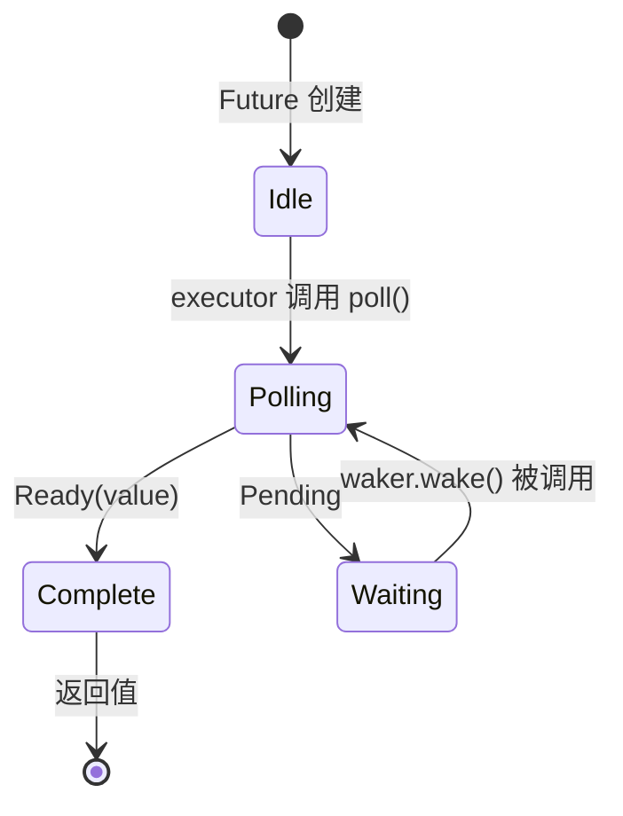

# 3. Poll 工作原理 🟡

> **你将学到：**
> - Executor 的 poll 循环：poll → pending → wake → 再次 poll
> - 如何从零构建最小化 executor
> - 虚假唤醒规则及其重要性
> - 工具函数：`poll_fn()` 和 `yield_now()`

## Polling 状态机

Executor 运行一个循环：poll 一个 future，如果是 `Pending`，挂起它直到 waker 触发，然后再次 poll。这与 OS 线程有根本不同，OS 线程由内核处理调度。



> **重要：** 在 *Waiting* 状态时，future **必须** 已经向 I/O 源注册了 waker。没有注册 = 永远挂起。

### 最小化 Executor

为了揭开 executor 的神秘面纱，让我们构建最简单的一个：

```rust
use std::future::Future;
use std::task::{Context, Poll, RawWaker, RawWakerVTable, Waker};
use std::pin::Pin;

/// 最简单的 executor：忙循环 poll 直到 Ready
fn block_on<F: Future>(mut future: F) -> F::Output {
    // 将 future pin 到栈上
    // SAFETY: `future` 从这个点起永远不会被移动——我们只
    // 通过 pinned 引用访问它直到完成。
    let mut future = unsafe { Pin::new_unchecked(&mut future) };

    // 创建一个无操作 waker（只是不断 poll——低效但简单）
    fn noop_raw_waker() -> RawWaker {
        fn no_op(_: *const ()) {}
        fn clone(_: *const ()) -> RawWaker { noop_raw_waker() }
        let vtable = &RawWakerVTable::new(clone, no_op, no_op, no_op);
        RawWaker::new(std::ptr::null(), vtable)
    }

    // SAFETY: noop_raw_waker() 返回一个有效的 RawWaker 和正确的 vtable。
    let waker = unsafe { Waker::from_raw(noop_raw_waker()) };
    let mut cx = Context::from_waker(&waker);

    // 忙循环直到 future 完成
    loop {
        match future.as_mut().poll(&mut cx) {
            Poll::Ready(value) => return value,
            Poll::Pending => {
                // 真实的 executor 会在这里 park 线程
                // 并等待 waker.wake() —— 我们只是自旋
                std::thread::yield_now();
            }
        }
    }
}

// 使用：
fn main() {
    let result = block_on(async {
        println!("Hello from our mini executor!");
        42
    });
    println!("Got: {result}");
}
```

> **不要在生产环境中使用这个！** 它忙循环，浪费 CPU。真实的 executor
> （tokio、smol）使用 `epoll`/`kqueue`/`io_uring` 睡眠直到 I/O 就绪。
> 但这展示了核心思想：executor 只是一个调用 `poll()` 的循环。

### 唤醒通知

真实的 executor 是事件驱动的。当所有 futures 都是 `Pending` 时，executor 睡眠。waker 是一种中断机制：

```rust
// 真实 executor 主循环的概念模型：
fn executor_loop(tasks: &mut TaskQueue) {
    loop {
        // 1. Poll 所有被唤醒的 tasks
        while let Some(task) = tasks.get_woken_task() {
            match task.poll() {
                Poll::Ready(result) => task.complete(result),
                Poll::Pending => { /* task 留在队列中，等待唤醒 */ }
            }
        }

        // 2. 睡眠直到有东西唤醒我们（epoll_wait、kevent 等）
        //    这就是 mio/polling 做繁重工作的地方
        tasks.wait_for_events(); // 阻塞直到 I/O 事件或 waker 触发
    }
}
```

### 虚假唤醒

即使 I/O 未就绪，future 也可能被 poll。这被称为 *虚假唤醒*。Futures 必须正确处理这种情况：

```rust
impl Future for MyFuture {
    type Output = Data;

    fn poll(self: Pin<&mut Self>, cx: &mut Context<'_>) -> Poll<Data> {
        // ✅ 正确：始终重新检查实际条件
        if let Some(data) = self.try_read_data() {
            Poll::Ready(data)
        } else {
            // 重新注册 waker（它可能已经改变了！）
            self.register_waker(cx.waker());
            Poll::Pending
        }

        // ❌ 错误：假设 poll 意味着数据就绪
        // let data = self.read_data(); // 可能阻塞或 panic
        // Poll::Ready(data)
    }
}
```

**实现 `poll()` 的规则**：
1. **从不明锁** —— 如果未就绪，立即返回 `Pending`
2. **始终重新注册 waker** —— 它可能在两次 poll 之间改变了
3. **处理虚假唤醒** —— 检查实际条件，不要假设就绪
4. **`Ready` 之后不要 poll** —— 行为**未指定**（可能 panic、返回 `Pending` 或重复 `Ready`）。只有 `FusedFuture` 保证完成后的 poll 是安全的

<details>
<summary><strong>🏋️ 练习：处理虚假唤醒的 Flag Future</strong>（点击展开）</summary>

**挑战**：实现一个 `FlagFuture`，包装一个共享的 `Arc<AtomicBool>` 标志。当被 poll 时，检查标志是否为 `true`。如果是，返回 `Ready(())`。如果不是，存储 waker 并返回 `Pending`。关键是：future 必须正确处理**虚假唤醒**——必须在每次 poll 时重新检查标志，从不会因为被唤醒就假设标志已设置。

*提示*：你需要一个 `Arc<Mutex<Option<Waker>>>`（或类似的东西），以便外部线程可以设置标志并唤醒 future。使用 `poll_fn` 可以获得简洁的替代方案。

<details>
<summary>🔑 解答</summary>

```rust
use std::future::Future;
use std::pin::Pin;
use std::sync::{Arc, Mutex};
use std::sync::atomic::{AtomicBool, Ordering};
use std::task::{Context, Poll, Waker};

struct FlagFuture {
    flag: Arc<AtomicBool>,
    waker_slot: Arc<Mutex<Option<Waker>>>,
}

impl FlagFuture {
    fn new(flag: Arc<AtomicBool>, waker_slot: Arc<Mutex<Option<Waker>>>) -> Self {
        FlagFuture { flag, waker_slot }
    }
}

impl Future for FlagFuture {
    type Output = ();

    fn poll(self: Pin<&mut Self>, cx: &mut Context<'_>) -> Poll<Self::Output> {
        // 始终重新检查实际条件——从不完全相信唤醒
        if self.flag.load(Ordering::Acquire) {
            return Poll::Ready(());
        }

        // 存储/更新 waker 以便我们收到通知
        let mut slot = self.waker_slot.lock().unwrap();
        *slot = Some(cx.waker().clone());

        // 在存储 waker 后重新检查以避免竞态：
        // 标志可能在第一次检查和存储 waker 之间被设置
        if self.flag.load(Ordering::Acquire) {
            Poll::Ready(())
        } else {
            Poll::Pending
        }
    }
}

// 设置标志的一侧（例如，另一个线程或 task）：
fn set_flag(flag: &AtomicBool, waker_slot: &Mutex<Option<Waker>>) {
    flag.store(true, Ordering::Release);
    if let Some(waker) = waker_slot.lock().unwrap().take() {
        waker.wake();
    }
}

// 使用 poll_fn 的等价实现：
// async fn wait_for_flag(flag: Arc<AtomicBool>, waker_slot: Arc<Mutex<Option<Waker>>>) {
//     std::future::poll_fn(|cx| {
//         if flag.load(Ordering::Acquire) {
//             return Poll::Ready(());
//         }
//         *waker_slot.lock().unwrap() = Some(cx.waker().clone());
//         if flag.load(Ordering::Acquire) { Poll::Ready(()) } else { Poll::Pending }
//     }).await
// }
```

**关键要点**：双重检查模式（检查 → 存储 waker → 再次检查）对于避免条件变化和 waker 注册之间的竞态至关重要。这是所有 I/O futures 内部使用的现实模式，它展示了为什么处理虚假唤醒很重要。

</details>
</details>

### 实用工具：`poll_fn` 和 `yield_now`

来自标准库和 tokio 的两个工具函数，避免编写完整的 `Future` 实现：

```rust
use std::future::poll_fn;
use std::task::Poll;

// poll_fn：从闭包创建一个一次性 future
let value = poll_fn(|cx| {
    // 对 cx.waker() 做些什么，返回 Ready 或 Pending
    Poll::Ready(42)
}).await;

// 现实用例：将基于回调的 API 桥接到异步
async fn read_when_ready(source: &MySource) -> Data {
    poll_fn(|cx| source.poll_read(cx)).await
}
```

```rust
// yield_now：自愿将控制权交给 executor
// 在 CPU 密集的异步循环中有用，避免饿死其他 tasks
async fn cpu_heavy_work(items: &[Item]) {
    for (i, item) in items.iter().enumerate() {
        process(item); // CPU 工作

        // 每 100 个元素，yield 让其他 tasks 运行
        if i % 100 == 0 {
            tokio::task::yield_now().await;
        }
    }
}
```

> **何时使用 `yield_now()`**：如果你的异步函数在循环中做 CPU 工作
> 而没有任何 `.await` 点，它会独占 executor 线程。定期插入
> `yield_now().await` 以实现协作式多任务处理。

> **关键要点——Poll 工作原理**
> - Executor 重复调用被唤醒的 futures 的 `poll()`
> - Futures 必须处理**虚假唤醒**——始终重新检查实际条件
> - `poll_fn()` 让你从闭包创建临时 futures
> - `yield_now()` 是 CPU 密集异步代码的协作式调度逃生舱

> **另见：** [第 2 章 — The Future Trait](ch02-the-future-trait.md) 了解 trait 定义，[第 5 章 — 状态机揭秘](ch05-the-state-machine-reveal.md) 了解编译器生成的代码

***
