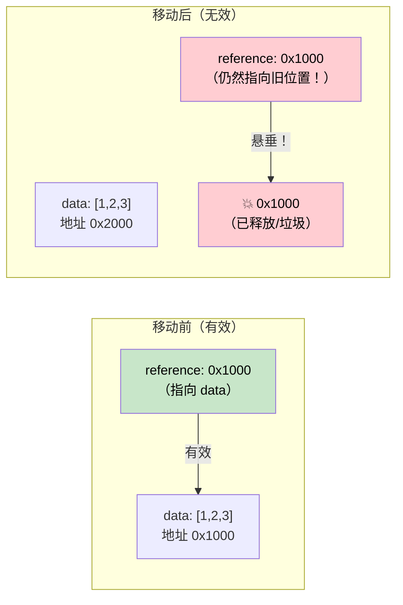

# 4. Pin 和 Unpin 🔴

> **你将学到：**
> - 为什么自引用 struct 在内存中移动时会破坏
> - `Pin<P>` 保证什么以及它如何防止移动
> - 三个实用的 pinning 模式：`Box::pin()`、`tokio::pin!()`、`Pin::new()`
> - 何时 `Unpin` 给你逃生舱

## 为什么 Pin 存在

这是 Rust 异步中最令人困惑的概念。让我们逐步建立直觉。

### 问题：自引用 Structs

当编译器将 `async fn` 转换为状态机时，该状态机可能包含对其自身字段的引用。这创建了*自引用 struct*——在内存中移动它会使这些内部引用失效。

```rust
// 编译器生成的内容（简化）对于：
// async fn example() {
//     let data = vec![1, 2, 3];
//     let reference = &data;       // 指向上面的 data
//     use_ref(reference).await;
// }

// 变成类似：
enum ExampleStateMachine {
    State0 {
        data: Vec<i32>,
        // reference: &Vec<i32>,  // 问题：指向 `data` 上面
        //                        // 如果这个 struct 移动，指针就悬垂了！
    },
    State1 {
        data: Vec<i32>,
        reference: *const Vec<i32>, // 指向 data 字段的内部指针
    },
    Complete,
}
```



### 自引用 Structs

这不是一个学术问题。每个 `async fn` 如果在 `.await` 点持有引用，就会创建一个自引用状态机：

```rust
async fn problematic() {
    let data = String::from("hello");
    let slice = &data[..]; // slice 借用 data
    
    some_io().await; // <-- .await 点：状态机同时存储 data 和 slice
    
    println!("{slice}"); // 在 await 后使用引用
}
// 生成的状态机有 `data: String` 和 `slice: &str`
// 其中 slice 指向 data 内部。移动状态机 = 悬垂指针。
```

### 实践中的 Pin

`Pin<P>` 是一个包装器，防止指针后面的值被移动：

```rust
use std::pin::Pin;

let mut data = String::from("hello");

// Pin 它——现在它不能移动了
let pinned: Pin<&mut String> = Pin::new(&mut data);

// 仍然可以使用它：
println!("{}", pinned.as_ref().get_ref()); // "hello"

// 但我们不能取回 &mut String（这将允许 mem::swap）：
// let mutable: &mut String = Pin::into_inner(pinned); // 仅当 String: Unpin
// String 是 Unpin，所以这实际上对 String 有效。
// 但对于自引用状态机（它们是 !Unpin），它被阻止。
```

在实际代码中，你主要在三个地方遇到 Pin：

```rust
// 1. poll() 签名——所有 futures 都通过 Pin 被 poll
fn poll(self: Pin<&mut Self>, cx: &mut Context<'_>) -> Poll<Output>;

// 2. Box::pin() —— 堆分配并 pin 一个 future
let future: Pin<Box<dyn Future<Output = i32>>> = Box::pin(async { 42 });

// 3. tokio::pin!() —— 在栈上 pin 一个 future
tokio::pin!(my_future);
// 现在 my_future: Pin<&mut impl Future>
```

### Unpin 逃生舱

Rust 中的大多数类型是 `Unpin`——它们不包含自引用，所以 pinning 没什么特别的。只有编译器生成的状态机（来自 `async fn`）是 `!Unpin`。

```rust
// 这些都是 Unpin——pinning 它们没什么特别作用：
// i32、String、Vec<T>、HashMap<K,V>、Box<T>、&T、&mut T

// 这些是 !Unpin——它们必须被 pinned 才能 poll：
// 由 `async fn` 和 `async {}` 生成的状态机

// 实际含义：
// 如果你手动编写 Future 且没有自引用，
// 实现 Unpin 让它更容易使用：
impl Unpin for MySimpleFuture {} // "我可以安全移动，相信我"
```

### 快速参考

| 什么 | 何时 | 如何 |
|------|------|------|
| 在堆上 pin future | 存储在集合中、从函数返回 | `Box::pin(future)` |
| 在栈上 pin future | 在 `select!` 或手动 poll 中本地使用 | `std::pin::pin!(future)` 或 `tokio::pin!(future)` |
| 在函数签名中 Pin | 接受 pinned futures | `future: Pin<&mut F>` |
| 要求 Unpin | 当你需要在创建后移动 future | `F: Future + Unpin` |

<details>
<summary><strong>🏋️ 练习：Pin 和移动</strong>（点击展开）</summary>

**挑战**：以下哪些代码片段编译？对于每个不能编译的，解释原因并修复。

```rust
// 片段 A
let fut = async { 42 };
let pinned = Box::pin(fut);
let moved = pinned; // 移动 Box
let result = moved.await;

// 片段 B
let fut = async { 42 };
tokio::pin!(fut);
let moved = fut; // 移动 pinned future
let result = moved.await;

// 片段 C
use std::pin::Pin;
let mut fut = async { 42 };
let pinned = Pin::new(&mut fut);
```

<details>
<summary>🔑 解答</summary>

**片段 A**：✅ **编译。** `Box::pin()` 将 future 放在堆上。移动 `Box` 移动的是*指针*，而不是 future 本身。future 保持在堆上的 pinned 位置。

**片段 B**：✅ **编译。** `tokio::pin!` 将 future pin 到栈上并将 `fut` 重新绑定为 `Pin<&mut ...>`。`let moved = fut` 移动 **`Pin` 包装器**（一个指针），而不是底层的 future——future 保持在栈上的 pinned 位置。这就像 `Box::pin`：移动 `Box` 不会移动堆分配。但是，`fut` 被移动消耗了，所以你之后不能使用 `fut`——只能使用 `moved`：
```rust
let fut = async { 42 };
tokio::pin!(fut);
let moved = fut;        // 移动 Pin<&mut> 包装器——OK
// fut.await;           // ❌ 错误：fut 被移动
let result = moved.await; // ✅ 使用 moved 代替
```

**片段 C**：❌ **不编译。** `Pin::new()` 要求 `T: Unpin`。Async 块生成 `!Unpin` 类型。**修复**：使用 `Box::pin()` 或 `unsafe Pin::new_unchecked()`：
```rust
let fut = async { 42 };
let pinned = Box::pin(fut); // 堆 pin——适用于 !Unpin
```

**关键要点**：`Box::pin()` 是安全的、简单的默认方式，用于在堆上 pin `!Unpin` futures。`tokio::pin!()` 在栈上 pin——你可以移动 `Pin<&mut>` 包装器（它只是一个指针），但底层的 future 保持不动。`Pin::new()` 只适用于 `Unpin` 类型。

</details>
</details>

> **关键要点——Pin 和 Unpin**
> - `Pin<P>` 是一个包装器，**防止被指向的值被移动**——对自引用状态机至关重要
> - `Box::pin()` 是安全的、简单的默认方式，用于在堆上 pin futures
> - `tokio::pin!()` 在栈上 pin——你可以移动 `Pin<&mut>` 包装器，但底层的 future 保持不动
> - `Unpin` 是一个自动 trait opt-out：实现 `Unpin` 的类型即使被 pinned 也可以移动（大多数类型是 `Unpin`；async 块不是）

> **另见：** [第 2 章 — The Future Trait](ch02-the-future-trait.md) 了解 poll 中的 `Pin<&mut Self>`，[第 5 章 — 状态机揭秘](ch05-the-state-machine-reveal.md) 了解为什么 async 状态机是自引用的

***
