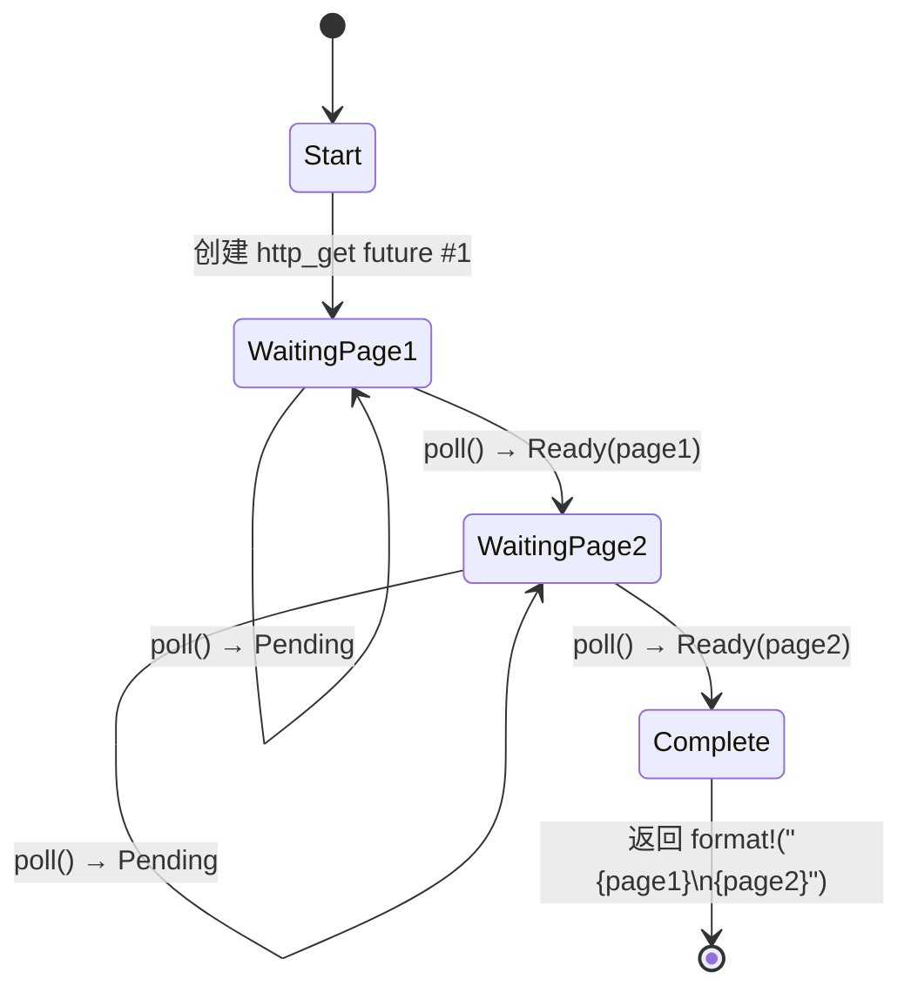

# 5. 状态机揭秘 🟢

> **你将学到：**
> - 编译器如何将 `async fn` 转换为 enum 状态机
> - 并排对比：源代码 vs 生成的状态
> - 为什么 `async fn` 中的大栈分配会撑大 future 大小
> - Drop 优化：值一旦不再需要就立即 drop

## 编译器实际生成的内容

当你编写 `async fn` 时，编译器将你看似顺序的代码转换为基于 enum 的状态机。理解这个转换是理解 Rust 异步性能特征和许多怪癖的关键。

### 并排对比：async fn vs 状态机

```rust
// 你写的：
async fn fetch_two_pages() -> String {
    let page1 = http_get("https://example.com/a").await;
    let page2 = http_get("https://example.com/b").await;
    format!("{page1}\n{page2}")
}
```

编译器生成概念上类似这样的内容：

```rust
enum FetchTwoPagesStateMachine {
    // State 0：准备调用 http_get 获取 page1
    Start,

    // State 1：等待 page1，持有 future
    WaitingPage1 {
        fut1: HttpGetFuture,
    },

    // State 2：已获取 page1，等待 page2
    WaitingPage2 {
        page1: String,
        fut2: HttpGetFuture,
    },

    // 终止状态
    Complete,
}

impl Future for FetchTwoPagesStateMachine {
    type Output = String;

    fn poll(mut self: Pin<&mut Self>, cx: &mut Context<'_>) -> Poll<String> {
        loop {
            match self.as_mut().get_mut() {
                Self::Start => {
                    let fut1 = http_get("https://example.com/a");
                    *self.as_mut().get_mut() = Self::WaitingPage1 { fut1 };
                }
                Self::WaitingPage1 { fut1 } => {
                    let page1 = match Pin::new(fut1).poll(cx) {
                        Poll::Ready(v) => v,
                        Poll::Pending => return Poll::Pending,
                    };
                    let fut2 = http_get("https://example.com/b");
                    *self.as_mut().get_mut() = Self::WaitingPage2 { page1, fut2 };
                }
                Self::WaitingPage2 { page1, fut2 } => {
                    let page2 = match Pin::new(fut2).poll(cx) {
                        Poll::Ready(v) => v,
                        Poll::Pending => return Poll::Pending,
                    };
                    let result = format!("{page1}\n{page2}");
                    *self.as_mut().get_mut() = Self::Complete;
                    return Poll::Ready(result);
                }
                Self::Complete => panic!("polled after completion"),
            }
        }
    }
}
```

> **注意**：这个反糖化是*概念性*的。真实的编译器输出使用 `unsafe` pin 投影——这里显示的 `get_mut()` 调用需要 `Unpin`，但 async 状态机是 `!Unpin`。目标是说明状态转换，而不是生成可编译代码。



> **状态内容：**
> - **WaitingPage1** —— 存储 `fut1: HttpGetFuture`（page2 还未分配）
> - **WaitingPage2** —— 存储 `page1: String`、`fut2: HttpGetFuture`（fut1 已被 drop）

### 为什么这对性能很重要

**零成本**：状态机是栈分配的 enum。每个 future 没有堆分配、没有垃圾回收器、没有 boxing——除非你显式使用 `Box::pin()`。

**大小**：enum 的大小是所有变体的最大值。每个 `.await` 点创建一个新的变体。这意味着：

```rust
async fn small() {
    let a: u8 = 0;
    yield_now().await;
    let b: u8 = 0;
    yield_now().await;
}
// 大小 ≈ max(size_of(u8), size_of(u8)) + 判别式 + future 大小
//      ≈ 很小！

async fn big() {
    let buf: [u8; 1_000_000] = [0; 1_000_000]; // 栈上 1MB！
    some_io().await;
    process(&buf);
}
// 大小 ≈ 1MB + 内部 future 大小
// ⚠️ 不要在 async 函数中栈分配巨大的缓冲区！
// 使用 Vec<u8> 或 Box<[u8]> 代替。
```

**Drop 优化**：当状态机转换时，它会 drop 不再需要的值。在上面的例子中，当我们从 `WaitingPage1` 转换到 `WaitingPage2` 时，`fut1` 被 drop——编译器自动插入 drop。

> **实用规则**：`async fn` 中的大栈分配会撑大 future 的大小。如果你在异步代码中看到栈溢出，检查是否有大数组或深度嵌套的 futures。如果需要，使用 `Box::pin()` 在堆上分配子 futures。

### 练习：预测状态机

<details>
<summary>🏋️ 练习（点击展开）</summary>

**挑战**：给定这个 async 函数， sketch 编译器生成的状态机。它有多少个状态（enum 变体）？每个状态存储什么值？

```rust
async fn pipeline(url: &str) -> Result<usize, Error> {
    let response = fetch(url).await?;
    let body = response.text().await?;
    let parsed = parse(body).await?;
    Ok(parsed.len())
}
```

<details>
<summary>🔑 解答</summary>

五个状态：

1. **Start** —— 存储 `url`
2. **WaitingFetch** —— 存储 `url`、`fetch` future
3. **WaitingText** —— 存储 `response`、`text()` future
4. **WaitingParse** —— 存储 `body`、`parse` future
5. **Done** —— 返回 `Ok(parsed.len())`

每个 `.await` 创建一个 yield 点 = 一个新的 enum 变体。`?` 添加提前退出路径但不添加额外状态——它只是对 `Poll::Ready` 值的 `match`。

</details>
</details>

> **关键要点——状态机揭秘**
> - `async fn` 编译为每个 `.await` 点一个变体的 enum
> - Future 的**大小** = 所有变体大小的最大值——大栈值会撑大它
> - 编译器在状态转换时自动插入 **drop**
> - 当 future 大小成为问题时使用 `Box::pin()` 或堆分配

> **另见：** [第 4 章 — Pin 和 Unpin](ch04-pin-and-unpin.md) 了解为什么生成的 enum 需要 pinning，[第 6 章 — 手动构建 Futures](ch06-building-futures-by-hand.md) 亲手构建这些状态机

***
