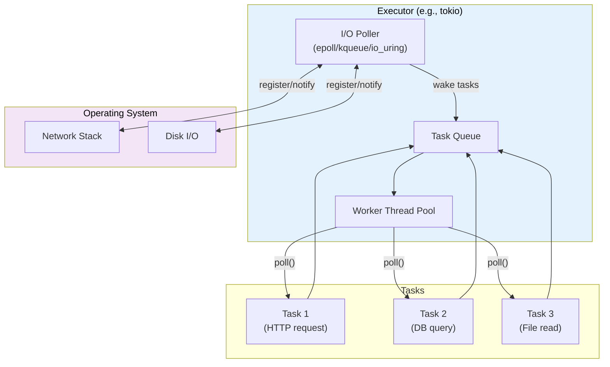
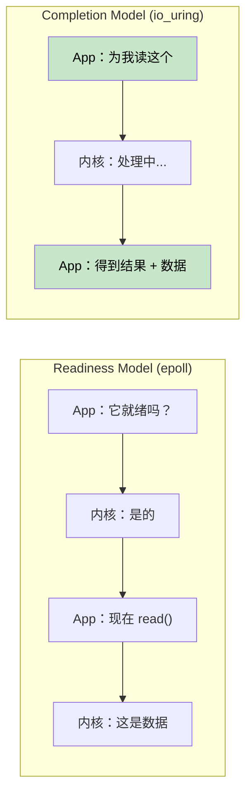
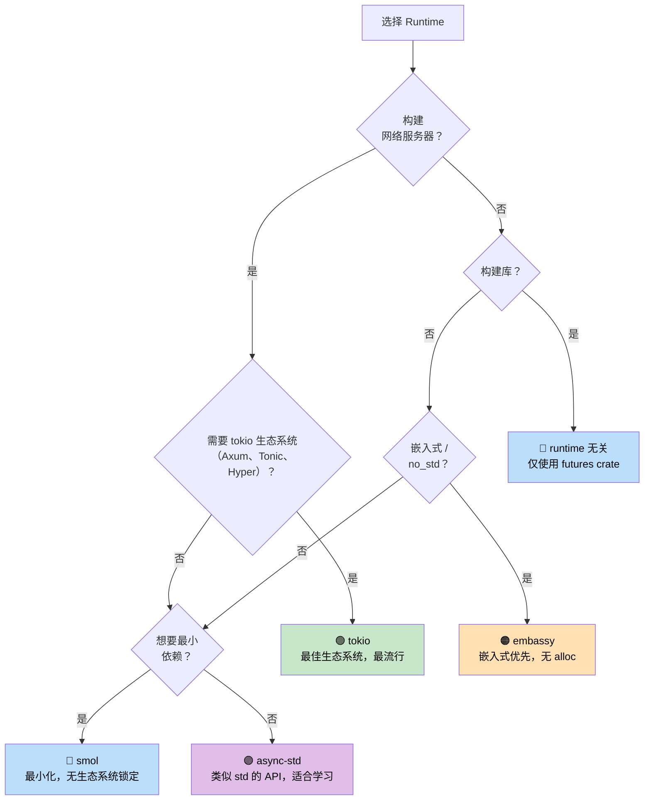

# 7. Executors 和 Runtimes 🟡

> **你将学到：**
> - Executor 做什么：poll + 高效睡眠
> - 六个主要 runtime：mio、io_uring、tokio、async-std、smol、embassy
> - 选择合适 runtime 的决策树
> - 为什么 runtime 无关的库设计很重要

## Executor 做什么

Executor 有两项工作：
1. **Poll futures** 当它们准备好继续执行时
2. **高效睡眠** 当没有 futures 就绪时（使用 OS I/O 通知 API）



### mio：基础层

[mio](https://github.com/tokio-rs/mio)（Metal I/O）不是一个 executor——它是最低级的跨平台 I/O 通知库。它包装了 `epoll`（Linux）、`kqueue`（macOS/BSD）和 IOCP（Windows）。

```rust
// 概念性的 mio 使用（简化）：
use mio::{Events, Interest, Poll, Token};
use mio::net::TcpListener;

let mut poll = Poll::new()?;
let mut events = Events::with_capacity(128);

let mut server = TcpListener::bind("0.0.0.0:8080")?;
poll.registry().register(&mut server, Token(0), Interest::READABLE)?;

// 事件循环——阻塞直到有事发生
loop {
    poll.poll(&mut events, None)?; // 睡眠直到 I/O 事件
    for event in events.iter() {
        match event.token() {
            Token(0) => { /* 服务器有新连接 */ }
            _ => { /* 其他 I/O 就绪 */ }
        }
    }
}
```

大多数开发者从不直接使用 mio——tokio 和 smol 构建在它之上。

### io_uring：基于 Completion 的 Future

Linux 的 `io_uring`（内核 5.1+）代表了从 mio/epoll 使用的基于 readiness 的 I/O 模型的根本转变：

```text
基于 Readiness（epoll / mio / tokio）：
  1. 问："这个 socket 可读吗？"     → epoll_wait()
  2. 内核："是的，它就绪了"           → EPOLLIN 事件
  3. 应用：read(fd, buf)                → 可能仍然短暂阻塞！

基于 Completion（io_uring）：
  1. 提交："从这个 socket 读到这个缓冲区"  → SQE
  2. 内核：异步执行读取
  3. 应用：获取完成的结果和数据           → CQE
```



**所有权挑战**：io_uring 要求内核在操作完成前拥有缓冲区。这与 Rust 标准 `AsyncRead` trait 借用缓冲区的方式冲突。这就是为什么 `tokio-uring` 有不同的 I/O traits：

```rust
// 标准 tokio（基于 readiness）——借用缓冲区：
let n = stream.read(&mut buf).await?;  // buf 被借用

// tokio-uring（基于 completion）——获取缓冲区所有权：
let (result, buf) = stream.read(buf).await;  // buf 被移入，然后返回
let n = result?;
```

```rust
// Cargo.toml: tokio-uring = "0.5"
// 注意：仅限 Linux，需要内核 5.1+

fn main() {
    tokio_uring::start(async {
        let file = tokio_uring::fs::File::open("data.bin").await.unwrap();
        let buf = vec![0u8; 4096];
        let (result, buf) = file.read_at(buf, 0).await;
        let bytes_read = result.unwrap();
        println!("Read {} bytes: {:?}", bytes_read, &buf[..bytes_read]);
    });
}
```

| 方面 | epoll (tokio) | io_uring (tokio-uring) |
|------|--------------|----------------------|
| **模型** | Readiness 通知 | Completion 通知 |
| **系统调用** | epoll_wait + read/write | 批量 SQE/CQE ring |
| **缓冲区所有权** | 应用保留（&mut buf） | 所有权转移（move buf） |
| **平台** | Linux、macOS (kqueue)、Windows (IOCP) | 仅 Linux 5.1+ |
| **Zero-copy** | 否（用户空间复制） | 是（注册的缓冲区） |
| **成熟度** | 生产就绪 | 实验性 |

> **何时使用 io_uring**：高吞吐量文件 I/O 或网络，其中系统调用开销是瓶颈（数据库、存储引擎、代理服务于 100k+ 连接）。对于大多数应用，标准的 tokio 与 epoll 是正确的选择。

### tokio：功能齐全的 Runtime

Rust 生态系统中占主导地位的 async runtime。被 Axum、Hyper、Tonic 和大多数生产级 Rust 服务器使用。

```rust
// Cargo.toml:
// [dependencies]
// tokio = { version = "1", features = ["full"] }

#[tokio::main]
async fn main() {
    // 生成一个带工作窃取调度器的多线程 runtime
    let handle = tokio::spawn(async {
        tokio::time::sleep(std::time::Duration::from_secs(1)).await;
        "done"
    });

    let result = handle.await.unwrap();
    println!("{result}");
}
```

**tokio 特性**：Timer、I/O、TCP/UDP、Unix sockets、信号处理、同步原语（Mutex、RwLock、Semaphore、channels）、fs、process、tracing 集成。

### async-std：标准库镜像

用 async 版本镜像 `std` API。不如 tokio 流行但对初学者更简单。

```rust
// Cargo.toml:
// [dependencies]
// async-std = { version = "1", features = ["attributes"] }

#[async_std::main]
async fn main() {
    use async_std::fs;
    let content = fs::read_to_string("hello.txt").await.unwrap();
    println!("{content}");
}
```

### smol：极简主义 Runtime

小型、零依赖的 async runtime。对想要 async 但不想引入 tokio 的库很好。

```rust
// Cargo.toml:
// [dependencies]
// smol = "2"

fn main() {
    smol::block_on(async {
        let result = smol::unblock(|| {
            // 在线程池上运行阻塞代码
            std::fs::read_to_string("hello.txt")
        }).await.unwrap();
        println!("{result}");
    });
}
```

### embassy：嵌入式的 Async（no_std）

用于嵌入式系统的 async runtime。不需要堆分配，不需要 `std`。

```rust
// 运行在微控制器上（例如 STM32、nRF52、RP2040）
#[embassy_executor::main]
async fn main(spawner: embassy_executor::Spawner) {
    // 用 async/await 闪烁 LED——不需要 RTOS！
    let mut led = Output::new(p.PA5, Level::Low, Speed::Low);
    loop {
        led.set_high();
        Timer::after(Duration::from_millis(500)).await;
        led.set_low();
        Timer::after(Duration::from_millis(500)).await;
    }
}
```

### Runtime 决策树



### Runtime 对比表

| 特性 | tokio | async-std | smol | embassy |
|------|------|-----------|------|---------|
| **生态系统** | 主导 | 小 | 最小 | 嵌入式 |
| **多线程** | ✅ 工作窃取 | ✅ | ✅ | ❌（单核） |
| **no_std** | ❌ | ❌ | ❌ | ✅ |
| **Timer** | ✅ 内置 | ✅ 内置 | 通过 `async-io` | ✅ 基于 HAL |
| **I/O** | ✅ 自己的抽象 | ✅ std 镜像 | ✅ 通过 `async-io` | ✅ HAL 驱动 |
| **Channels** | ✅ 丰富的集合 | ✅ | 通过 `async-channel` | ✅ |
| **学习曲线** | 中等 | 低 | 低 | 高（硬件） |
| **二进制大小** | 大 | 中等 | 小 | 极小 |

<details>
<summary><strong>🏋️ 练习：Runtime 对比</strong>（点击展开）</summary>

**挑战**：使用三个不同的 runtime（tokio、smol 和 async-std）编写相同的程序。程序应该：
1. 获取一个 URL（用睡眠模拟）
2. 读取一个文件（用睡眠模拟）
3. 打印两个结果

这个练习展示了 async/await 代码是相同的——只有 runtime 设置不同。

<details>
<summary>🔑 解答</summary>

```rust
// ----- tokio 版本 -----
// Cargo.toml: tokio = { version = "1", features = ["full"] }
#[tokio::main]
async fn main() {
    let (url_result, file_result) = tokio::join!(
        async {
            tokio::time::sleep(std::time::Duration::from_millis(100)).await;
            "Response from URL"
        },
        async {
            tokio::time::sleep(std::time::Duration::from_millis(50)).await;
            "Contents of file"
        },
    );
    println!("URL: {url_result}, File: {file_result}");
}

// ----- smol 版本 -----
// Cargo.toml: smol = "2", futures-lite = "2"
fn main() {
    smol::block_on(async {
        let (url_result, file_result) = futures_lite::future::zip(
            async {
                smol::Timer::after(std::time::Duration::from_millis(100)).await;
                "Response from URL"
            },
            async {
                smol::Timer::after(std::time::Duration::from_millis(50)).await;
                "Contents of file"
            },
        ).await;
        println!("URL: {url_result}, File: {file_result}");
    });
}

// ----- async-std 版本 -----
// Cargo.toml: async-std = { version = "1", features = ["attributes"] }
#[async_std::main]
async fn main() {
    let (url_result, file_result) = futures::future::join(
        async {
            async_std::task::sleep(std::time::Duration::from_millis(100)).await;
            "Response from URL"
        },
        async {
            async_std::task::sleep(std::time::Duration::from_millis(50)).await;
            "Contents of file"
        },
    ).await;
    println!("URL: {url_result}, File: {file_result}");
}
```

**关键要点**：async 业务逻辑在所有 runtime 中都是相同的。只有入口点和 timer/IO API 不同。这就是为什么编写 runtime 无关的库（仅使用 `std::future::Future`）是有价值的。

</details>
</details>

> **关键要点——Executors 和 Runtimes**
> - Executor 的工作：当被唤醒时 poll futures，使用 OS I/O API 高效睡眠
> - **tokio** 是服务器的默认选择；**smol** 用于最小占用；**embassy** 用于嵌入式
> - 你的业务逻辑应该依赖 `std::future::Future`，而不是特定的 runtime
> - io_uring（Linux 5.1+）是高性能 I/O 的未来，但生态系统仍在成熟中

> **另见：** [第 8 章 — Tokio 深入](ch08-tokio-deep-dive.md) 了解 tokio 细节，[第 9 章 — 何时 Tokio 不是最佳选择](ch09-when-tokio-isnt-the-right-fit.md) 了解替代方案

***
