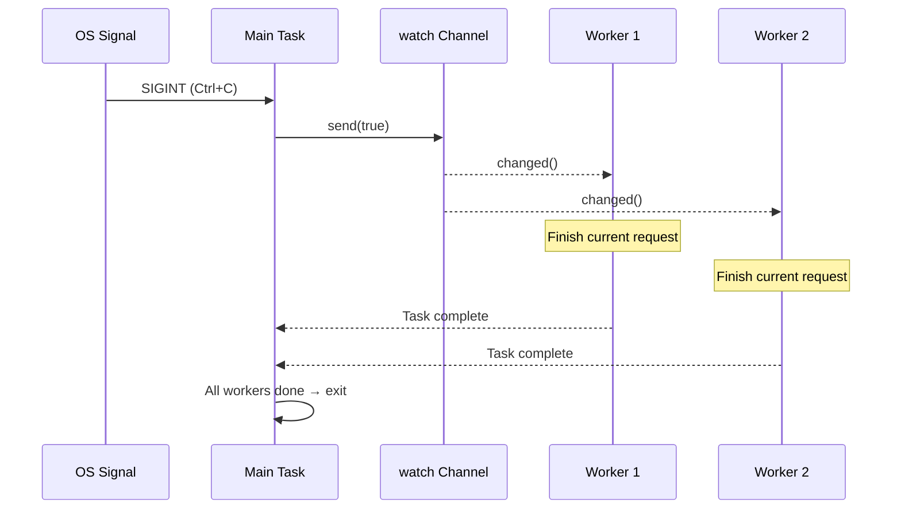

# 13. Production Patterns 🔴

> **你将学到：**
> - 优雅关闭与 `watch` channel 和 `select!`
> - 背压：有界 channel 防止 OOM
> - 结构化并发：`JoinSet` 和 `TaskTracker`
> - 超时、重试和指数退避
> - 错误处理：`thiserror` vs `anyhow`、双重 `?` 模式
> - Tower：axum、tonic 和 hyper 使用的中间件模式

## 优雅关闭

生产服务器必须干净地关闭 —— 完成进行中的请求、刷新缓冲区、关闭连接：

```rust
use tokio::signal;
use tokio::sync::watch;

async fn main_server() {
    // 创建关闭信号 channel
    let (shutdown_tx, shutdown_rx) = watch::channel(false);

    // 派生服务器
    let server_handle = tokio::spawn(run_server(shutdown_rx.clone()));

    // 等待 Ctrl+C
    signal::ctrl_c().await.expect("Failed to listen for Ctrl+C");
    println!("Shutdown signal received, finishing in-flight requests...");

    // 通知所有任务关闭
    // 注意：为了简洁使用 .unwrap()。生产代码应该处理
    // 所有接收者都被 drop 的情况。
    shutdown_tx.send(true).unwrap();

    // 等待服务器完成（带超时）
    match tokio::time::timeout(
        std::time::Duration::from_secs(30),
        server_handle,
    ).await {
        Ok(Ok(())) => println!("Server shut down gracefully"),
        Ok(Err(e)) => eprintln!("Server error: {e}"),
        Err(_) => eprintln!("Server shutdown timed out — forcing exit"),
    }
}

async fn run_server(mut shutdown: watch::Receiver<bool>) {
    loop {
        tokio::select! {
            // 接受新连接
            conn = accept_connection() => {
                let shutdown = shutdown.clone();
                tokio::spawn(handle_connection(conn, shutdown));
            }
            // 关闭信号
            _ = shutdown.changed() => {
                if *shutdown.borrow() {
                    println!("Stopping accepting new connections");
                    break;
                }
            }
        }
    }
    // 进行中的连接会自己完成
    // 因为它们有自己的 shutdown_rx clone
}

async fn handle_connection(conn: Connection, mut shutdown: watch::Receiver<bool>) {
    loop {
        tokio::select! {
            request = conn.next_request() => {
                // 完整处理请求 —— 不要在中途放弃
                process_request(request).await;
            }
            _ = shutdown.changed() => {
                if *shutdown.borrow() {
                    // 完成当前请求，然后退出
                    break;
                }
            }
        }
    }
}
```



### 有界 Channel 的背压

如果生产者比消费者快，无界 channel 会导致 OOM。在生产中始终使用有界 channel：

```rust
use tokio::sync::mpsc;

async fn backpressure_example() {
    // 有界 channel：最多缓冲 100 个 items
    let (tx, mut rx) = mpsc::channel::<WorkItem>(100);

    // 生产者：当缓冲区满时自然减速
    let producer = tokio::spawn(async move {
        for i in 0..1_000_000 {
            // send() 是异步的 —— 如果缓冲区满则等待
            // 这创造了自然背压！
            tx.send(WorkItem { id: i }).await.unwrap();
        }
    });

    // 消费者：按自己的节奏处理 items
    let consumer = tokio::spawn(async move {
        while let Some(item) = rx.recv().await {
            process(item).await; // 慢处理没问题 —— 生产者等待
        }
    });

    let _ = tokio::join!(producer, consumer);
}

// 与无界对比 —— 危险：
// let (tx, rx) = mpsc::unbounded_channel(); // 没有背压！
// 生产者可以无限填充内存
```

### 结构化并发：JoinSet 和 TaskTracker

`JoinSet` 将相关任务分组并确保它们都完成：

```rust
use tokio::task::JoinSet;
use tokio::time::{sleep, Duration};

async fn structured_concurrency() {
    let mut set = JoinSet::new();

    // 派生一批任务
    for url in get_urls() {
        set.spawn(async move {
            fetch_and_process(url).await
        });
    }

    // 收集所有结果（顺序不保证）
    let mut results = Vec::new();
    while let Some(result) = set.join_next().await {
        match result {
            Ok(Ok(data)) => results.push(data),
            Ok(Err(e)) => eprintln!("Task error: {e}"),
            Err(e) => eprintln!("Task panicked: {e}"),
        }
    }

    // 所有任务都完成了 —— 没有悬而未决的后台工作
    println!("Processed {} items", results.len());
}

// TaskTracker (tokio-util 0.7.9+) —— 等待所有派生的任务
use tokio_util::task::TaskTracker;

async fn with_tracker() {
    let tracker = TaskTracker::new();

    for i in 0..10 {
        tracker.spawn(async move {
            sleep(Duration::from_millis(100 * i)).await;
            println!("Task {i} done");
        });
    }

    tracker.close(); // 不再添加任务
    tracker.wait().await; // 等待所有跟踪的任务
    println!("All tasks finished");
}
```

### 超时和重试

```rust
use tokio::time::{timeout, sleep, Duration};

// 简单超时
async fn with_timeout() -> Result<Response, Error> {
    match timeout(Duration::from_secs(5), fetch_data()).await {
        Ok(Ok(response)) => Ok(response),
        Ok(Err(e)) => Err(Error::Fetch(e)),
        Err(_) => Err(Error::Timeout),
    }
}

// 指数退避重试
async fn retry_with_backoff<F, Fut, T, E>(
    max_attempts: u32,
    base_delay_ms: u64,
    operation: F,
) -> Result<T, E>
where
    F: Fn() -> Fut,
    Fut: std::future::Future<Output = Result<T, E>>,
    E: std::fmt::Display,
{
    let mut delay = Duration::from_millis(base_delay_ms);

    for attempt in 1..=max_attempts {
        match operation().await {
            Ok(result) => return Ok(result),
            Err(e) => {
                if attempt == max_attempts {
                    eprintln!("Final attempt {attempt} failed: {e}");
                    return Err(e);
                }
                eprintln!("Attempt {attempt} failed: {e}, retrying in {delay:?}");
                sleep(delay).await;
                delay *= 2; // 指数退避
            }
        }
    }
    unreachable!()
}

// 使用：
// let result = retry_with_backoff(3, 100, || async {
//     reqwest::get("https://api.example.com/data").await
// }).await?;
```

> **生产提示 —— 添加抖动**：上面的函数使用纯指数退避，但在生产中，
> 许多客户端同时失败会在相同时间间隔重试（惊群效应）。
> 添加随机*抖动* —— 例如 `sleep(delay + rand_jitter)`，其中 `rand_jitter` 是
> `0..delay/4` —— 这样重试分散在一段时间内。

### Async 代码中的错误处理

Async 引入独特的错误传播挑战 —— 派生的任务创建错误边界、超时错误包装内部错误、`?` 在 futures 跨任务边界时交互不同。

**`thiserror` vs `anyhow`** —— 选择正确的工具：

```rust
// thiserror：为库和公共 API 定义类型化错误
// 每个变体都是显式的 —— 调用者可以匹配特定错误
use thiserror::Error;

#[derive(Error, Debug)]
enum DiagError {
    #[error("IPMI command failed: {0}")]
    Ipmi(#[from] IpmiError),

    #[error("Sensor {sensor} out of range: {value}°C (max {max}°C)")]
    OverTemp { sensor: String, value: f64, max: f64 },

    #[error("Operation timed out after {0:?}")]
    Timeout(std::time::Duration),

    #[error("Task panicked: {0}")]
    TaskPanic(#[from] tokio::task::JoinError),
}

// anyhow：用于应用程序和原型的快速错误处理
// 包装任何错误 —— 不需要为每种情况定义类型
use anyhow::{Context, Result};

async fn run_diagnostics() -> Result<()> {
    let config = load_config()
        .await
        .context("Failed to load diagnostic config")?;  // 添加上下文

    let result = run_gpu_test(&config)
        .await
        .context("GPU diagnostic failed")?;              // 链接上下文

    Ok(())
}
// anyhow 打印："GPU diagnostic failed: IPMI command failed: timeout"
```

| Crate | 何时使用 | 错误类型 | 匹配 |
|-------|---------|---------|------|
| `thiserror` | 库代码、公共 API | `enum MyError { ... }` | `match err { MyError::Timeout => ... }` |
| `anyhow` | 应用程序、CLI 工具、脚本 | `anyhow::Error`（类型擦除） | `err.downcast_ref::<MyError>()` |
| 一起使用 | 库暴露 `thiserror`，应用用 `anyhow` 包装 | 两者优点 | 库错误有类型，应用不关心 |

**双重 `?` 模式** 与 `tokio::spawn`：

```rust
use thiserror::Error;
use tokio::task::JoinError;

#[derive(Error, Debug)]
enum AppError {
    #[error("HTTP error: {0}")]
    Http(#[from] reqwest::Error),

    #[error("Task panicked: {0}")]
    TaskPanic(#[from] JoinError),
}

async fn spawn_with_errors() -> Result<String, AppError> {
    let handle = tokio::spawn(async {
        let resp = reqwest::get("https://example.com").await?;
        Ok::<_, reqwest::Error>(resp.text().await?)
    });

    // 双重 ?：第一个 ? 解包 JoinError（任务 panic），第二个 ? 解包内部 Result
    let result = handle.await??;
    Ok(result)
}
```

**错误边界问题** —— `tokio::spawn` 擦除上下文：

```rust
// ❌ 错误上下文跨 spawn 边界丢失：
async fn bad_error_handling() -> Result<()> {
    let handle = tokio::spawn(async {
        some_fallible_work().await  // 返回 Result<T, SomeError>
    });

    // handle.await 返回 Result<Result<T, SomeError>, JoinError>
    // 内部错误没有关于哪个任务失败的上下文
    let result = handle.await??;
    Ok(())
}

// ✅ 在 spawn 边界添加上下文：
async fn good_error_handling() -> Result<()> {
    let handle = tokio::spawn(async {
        some_fallible_work()
            .await
            .context("worker task failed")  // 上下文在跨边界之前
    });

    let result = handle.await
        .context("worker task panicked")??;  // JoinError 也有上下文
    Ok(())
}
```

**超时错误** —— 包装 vs 替换：

```rust
use tokio::time::{timeout, Duration};

async fn with_timeout_context() -> Result<String, DiagError> {
    let dur = Duration::from_secs(30);
    match timeout(dur, fetch_sensor_data()).await {
        Ok(Ok(data)) => Ok(data),
        Ok(Err(e)) => Err(e),                      // 保留内部错误
        Err(_) => Err(DiagError::Timeout(dur)),     // 超时 → 类型化错误
    }
}
```

### Tower：中间件模式

[Tower](https://docs.rs/tower) crate 定义可组合的 `Service` trait —— Rust 中 async 中间件的支柱（被 `axum`、`tonic`、`hyper` 使用）：

```rust
// Tower 的核心 trait（简化）：
pub trait Service<Request> {
    type Response;
    type Error;
    type Future: Future<Output = Result<Self::Response, Self::Error>>;

    fn poll_ready(&mut self, cx: &mut Context<'_>) -> Poll<Result<(), Self::Error>>;
    fn call(&mut self, req: Request) -> Self::Future;
}
```

中间件包装 `Service` 添加横切关注点 —— 日志、超时、限流 —— 而不修改内部逻辑：

```rust
use tower::{ServiceBuilder, timeout::TimeoutLayer, limit::RateLimitLayer};
use std::time::Duration;

let service = ServiceBuilder::new()
    .layer(TimeoutLayer::new(Duration::from_secs(10)))       // 最外层：超时
    .layer(RateLimitLayer::new(100, Duration::from_secs(1))) // 然后：限流
    .service(my_handler);                                     // 最内层：你的代码
```

**为什么这很重要**：如果你用过 ASP.NET 中间件或 Express.js 中间件，Tower 是 Rust 等价物。这是生产级 Rust 服务添加横切关注点而不代码重复的方式。

### 练习：带工作池的优雅关闭

<details>
<summary>🏋️ 练习（点击展开）</summary>

**挑战**：构建一个基于 channel 的工作队列的任务处理器、N 个工作任务和 Ctrl+C 时的优雅关闭。工人应该在退出前完成进行中的工作。

<details>
<summary>🔑 解答</summary>

```rust
use tokio::sync::{mpsc, watch};
use tokio::time::{sleep, Duration};

struct WorkItem { id: u64, payload: String }

#[tokio::main]
async fn main() {
    let (work_tx, work_rx) = mpsc::channel::<WorkItem>(100);
    let (shutdown_tx, shutdown_rx) = watch::channel(false);
    let work_rx = std::sync::Arc::new(tokio::sync::Mutex::new(work_rx));

    let mut handles = Vec::new();
    for id in 0..4 {
        let rx = work_rx.clone();
        let mut shutdown = shutdown_rx.clone();
        handles.push(tokio::spawn(async move {
            loop {
                let item = {
                    let mut rx = rx.lock().await;
                    tokio::select! {
                        item = rx.recv() => item,
                        _ = shutdown.changed() => {
                            if *shutdown.borrow() { None } else { continue }
                        }
                    }
                };
                match item {
                    Some(work) => {
                        println!("Worker {id}: processing {}", work.id);
                        sleep(Duration::from_millis(200)).await;
                    }
                    None => break,
                }
            }
        }));
    }

    // 提交工作
    for i in 0..20 {
        let _ = work_tx.send(WorkItem { id: i, payload: format!("task-{i}") }).await;
        sleep(Duration::from_millis(50)).await;
    }

    // 在 Ctrl+C 时：发送关闭信号，等待工人
    // 注意：为了简洁使用 .unwrap() —— 生产环境中处理错误。
    tokio::signal::ctrl_c().await.unwrap();
    shutdown_tx.send(true).unwrap();
    for h in handles { let _ = h.await; }
    println!("Shut down cleanly.");
}
```

</details>
</details>

> **关键要点——Production Patterns**
> - 使用 `watch` channel + `select!` 进行协调的优雅关闭
> - 有界 channel（`mpsc::channel(N)`）提供**背压** —— 当缓冲区满时发送者阻塞
> - `JoinSet` 和 `TaskTracker` 提供**结构化并发**：跟踪、中止和等待任务组
> - 始终为网络操作添加超时 —— `tokio::time::timeout(dur, fut)`
> - Tower 的 `Service` trait 是生产级 Rust 服务的标准中间件模式

> **另见：** [第 8 章 — Tokio Deep Dive](ch08-tokio-deep-dive.md) 了解 channel 和同步原语，[第 12 章 — 常见陷阱](ch12-common-pitfalls.md) 了解关闭期间的取消风险

***
