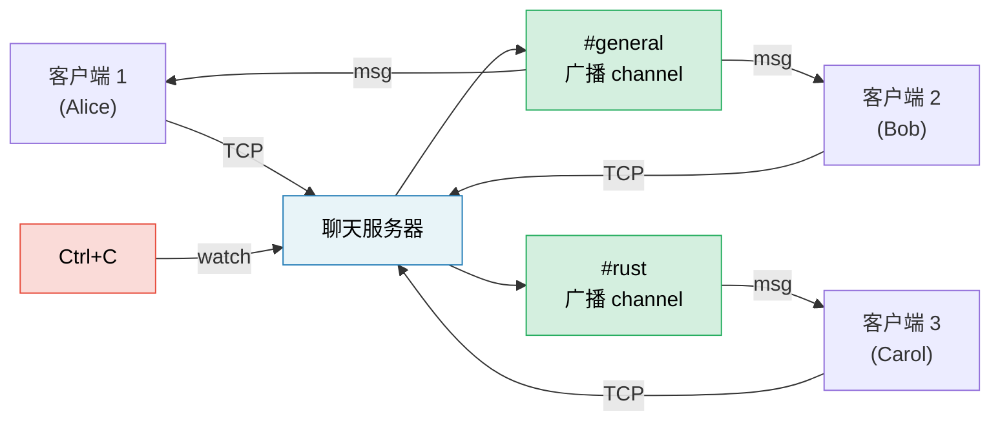

# Capstone Project: Async Chat Server

本项目将整本书的模式集成到一个生产级应用程序中。你将构建一个**多房间异步聊天服务器**，使用 tokio、channel、stream、优雅关闭和适当的错误处理。

**估计时间**：4-6 小时 | **难度**：★★★

> **你将练习：**
> - `tokio::spawn` 和 `'static` 要求（第 8 章）
> - Channel：`mpsc` 用于消息、`broadcast` 用于房间、`watch` 用于关闭（第 8 章）
> - Stream：从 TCP 连接读取行（第 11 章）
> - 常见陷阱：取消安全、跨 `.await` 的 MutexGuard（第 12 章）
> - 生产级模式：优雅关闭、背压（第 13 章）
> - Async trait 用于可插拔后端（第 10 章）

## 问题

构建一个 TCP 聊天服务器，其中：

1. **客户端** 通过 TCP 连接并加入命名的房间
2. **消息** 广播到同一房间的所有客户端
3. **命令**：`/join <room>`、`/nick <name>`、`/rooms`、`/quit`
4. 服务器在 Ctrl+C 时优雅关闭——完成进行中的消息



## 步骤 1：基本 TCP 接受循环

从接受连接并回显行的服务器开始：

```rust
use tokio::io::{AsyncBufReadExt, AsyncWriteExt, BufReader};
use tokio::net::TcpListener;

#[tokio::main]
async fn main() -> anyhow::Result<()> {
    let listener = TcpListener::bind("127.0.0.1:8080").await?;
    println!("Chat server listening on :8080");

    loop {
        let (socket, addr) = listener.accept().await?;
        println!("[{addr}] Connected");

        tokio::spawn(async move {
            let (reader, mut writer) = socket.into_split();
            let mut reader = BufReader::new(reader);
            let mut line = String::new();

            loop {
                line.clear();
                match reader.read_line(&mut line).await {
                    Ok(0) | Err(_) => break,
                    Ok(_) => {
                        let _ = writer.write_all(line.as_bytes()).await;
                    }
                }
            }
            println!("[{addr}] Disconnected");
        });
    }
}
```

**你的任务**：验证这可以编译并使用 `telnet localhost 8080` 工作。

## 步骤 2：带广播 channel 的房间状态

每个房间是一个 `broadcast::Sender`。房间中的所有客户端订阅接收消息。

```rust
use std::collections::HashMap;
use std::sync::Arc;
use tokio::sync::{broadcast, RwLock};

type RoomMap = Arc<RwLock<HashMap<String, broadcast::Sender<String>>>>;

fn get_or_create_room(rooms: &mut HashMap<String, broadcast::Sender<String>>, name: &str) -> broadcast::Sender<String> {
    rooms.entry(name.to_string())
        .or_insert_with(|| {
            let (tx, _) = broadcast::channel(100); // 100 消息缓冲
            tx
        })
        .clone()
}
```

**你的任务**：实现房间状态，使得：
- 客户端从 `#general` 开始
- `/join <room>` 切换房间（从旧的取消订阅，订阅新的）
- 消息广播到发送者当前房间的所有客户端

<details>
<summary>💡 提示——客户端任务结构</summary>

每个客户端任务需要两个并发循环：
1. **从 TCP 读取** → 解析命令或广播到房间
2. **从广播 receiver 读取** → 写入 TCP

使用 `tokio::select!` 运行两者：

```rust
loop {
    tokio::select! {
        // 客户端发送给我们一行
        result = reader.read_line(&mut line) => {
            match result {
                Ok(0) | Err(_) => break,
                Ok(_) => {
                    // 解析命令或广播消息
                }
            }
        }
        // 房间广播接收
        result = room_rx.recv() => {
            match result {
                Ok(msg) => {
                    let _ = writer.write_all(msg.as_bytes()).await;
                }
                Err(_) => break,
            }
        }
    }
}
```

</details>

## 步骤 3：命令

实现命令协议：

| 命令 | 动作 |
|---------|--------|
| `/join <room>` | 离开当前房间，加入新房间，在两个房间宣布 |
| `/nick <name>` | 更改显示名称 |
| `/rooms` | 列出所有活跃房间和成员计数 |
| `/quit` | 优雅断开 |
| 其他任何内容 | 作为聊天消息广播 |

**你的任务**：从输入行解析命令。对于 `/rooms`，你需要从 `RoomMap` 读取——使用 `RwLock::read()` 避免阻塞其他客户端。

## 步骤 4：优雅关闭

添加 Ctrl+C 处理，使服务器：
1. 停止接受新连接
2. 发送 "Server shutting down..." 到所有房间
3. 等待进行中的消息排空
4. 干净地退出

```rust
use tokio::sync::watch;

let (shutdown_tx, shutdown_rx) = watch::channel(false);

// 在接受循环中：
loop {
    tokio::select! {
        result = listener.accept() => {
            let (socket, addr) = result?;
            // 派生客户端任务，带 shutdown_rx.clone()
        }
        _ = tokio::signal::ctrl_c() => {
            println!("Shutdown signal received");
            shutdown_tx.send(true)?;
            break;
        }
    }
}
```

**你的任务**：在每个客户端的 `select!` 循环中添加 `shutdown_rx.changed()`，以便客户端在关闭信号发出时退出。

## 步骤 5：错误处理和边界情况

生产级强化服务器：

1. **滞后接收者**：如果慢客户端错过消息，`broadcast::recv()` 返回 `RecvError::Lagged(n)`。优雅处理（记录日志 + 继续，不要崩溃）。
2. **昵称验证**：拒绝空或太长的昵称。
3. **背压**：广播 channel 缓冲是有界的（100）。如果客户端跟不上，它们会得到 `Lagged` 错误。
4. **超时**：断开超过 5 分钟空闲的客户端。

```rust
use tokio::time::{timeout, Duration};

// 用超时包装读取：
match timeout(Duration::from_secs(300), reader.read_line(&mut line)).await {
    Ok(Ok(0)) | Ok(Err(_)) | Err(_) => break, // EOF、错误或超时
    Ok(Ok(_)) => { /* 处理行 */ }
}
```

## 步骤 6：集成测试

编写一个测试，启动服务器，连接两个客户端，并验证消息传递：

```rust
#[tokio::test]
async fn two_clients_can_chat() {
    // 在后台启动服务器
    let server = tokio::spawn(run_server("127.0.0.1:0")); // 端口 0 = OS 选择

    // 连接两个客户端
    let mut client1 = TcpStream::connect(addr).await.unwrap();
    let mut client2 = TcpStream::connect(addr).await.unwrap();

    // 客户端 1 发送消息
    client1.write_all(b"Hello from client 1\n").await.unwrap();

    // 客户端 2 应该接收到它
    let mut buf = vec![0u8; 1024];
    let n = client2.read(&mut buf).await.unwrap();
    let msg = String::from_utf8_lossy(&buf[..n]);
    assert!(msg.contains("Hello from client 1"));
}
```

## 评估标准

| 标准 | 目标 |
|-----------|--------|
| 并发 | 多个客户端在多个房间，无阻塞 |
| 正确性 | 消息只发送到同一房间的客户端 |
| 优雅关闭 | Ctrl+C 排空消息并干净退出 |
| 错误处理 | 滞后接收者、断开连接、超时处理 |
| 代码组织 | 清晰的分离：接受循环、客户端任务、房间状态 |
| 测试 | 至少 2 个集成测试 |

## 扩展想法

一旦基本聊天服务器工作，尝试这些增强：

1. **持久历史**：存储每个房间的最后 N 条消息；向新加入者重放
2. **WebSocket 支持**：使用 `tokio-tungstenite` 接受 TCP 和 WebSocket 客户端
3. **限流**：使用 `tokio::time::Interval` 限制每个客户端每秒的消息数
4. **指标**：通过 `prometheus` crate 跟踪连接客户端数、消息/秒、房间计数
5. **TLS**：添加 `tokio-rustls` 用于加密连接

***
