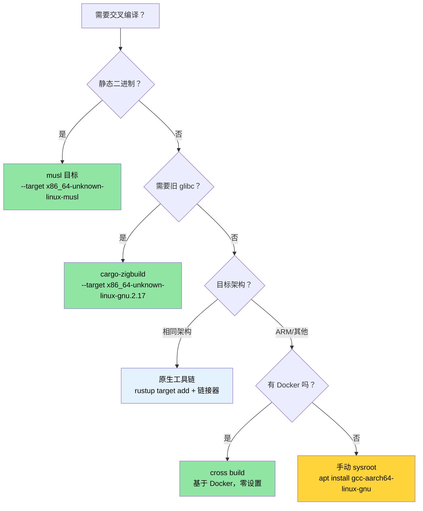

# 交叉编译——一份源码，多个目标 🟡

> **你将学到：**
> - Rust 目标三元组如何工作以及如何使用 `rustup` 添加它们
> - 为容器/云部署构建静态 musl 二进制
> - 使用原生工具链、`cross` 和 `cargo-zigbuild` 交叉编译到 ARM (aarch64)
> - 设置 GitHub Actions 矩阵构建用于多架构 CI
>
> **交叉引用：** [构建脚本](ch01-build-scripts-buildrs-in-depth.md) —— 交叉编译时 build.rs 在主机上运行 · [发布 Profile](ch07-release-profiles-and-binary-size.md) —— 交叉编译 release 二进制的 LTO 和 strip 设置 · [Windows](ch10-windows-and-conditional-compilation.md) —— Windows 交叉编译和 `no_std` 目标

交叉编译意味着在一台机器（**主机**）上构建一个可执行文件，
在另一台机器（**目标**）上运行。主机可能是你的 x86_64 笔记本电脑；
目标可能是 ARM 服务器、基于 musl 的容器，甚至是 Windows 机器。
Rust 使这变得异常可行，因为 `rustc` 已经是一个交叉编译器——
它只需要正确的目标库和兼容的链接器。

### 目标三元组解剖

每个 Rust 编译目标都由**目标三元组**标识（尽管名为三元组，但通常有四个部分）：

```text
<arch>-<vendor>-<os>-<env>

示例：
  x86_64  - unknown - linux  - gnu      ← 标准 Linux (glibc)
  x86_64  - unknown - linux  - musl     ← 静态 Linux (musl libc)
  aarch64 - unknown - linux  - gnu      ← ARM 64 位 Linux
  x86_64  - pc      - windows- msvc     ← 使用 MSVC 的 Windows
  aarch64 - apple   - darwin             ← Apple Silicon 上的 macOS
  x86_64  - unknown - none              ← 裸机（无操作系统）
```

列出所有可用目标：

```bash
# 显示 rustc 可以编译的所有目标（约 250 个目标）
rustc --print target-list | wc -l

# 显示系统上已安装的目标
rustup target list --installed

# 显示当前默认目标
rustc -vV | grep host
```

### 使用 rustup 安装工具链

```bash
# 添加目标库（该目标的 Rust std）
rustup target add x86_64-unknown-linux-musl
rustup target add aarch64-unknown-linux-gnu

# 现在你可以交叉编译：
cargo build --target x86_64-unknown-linux-musl
cargo build --target aarch64-unknown-linux-gnu  # 需要链接器——见下文
```

**`rustup target add` 给你的内容**：该目标的预编译 `std`、`core` 和 `alloc`
库。它*不*给你 C 链接器或 C 库。对于需要 C 工具链的目标（大多数 `gnu` 目标），
你需要单独安装一个。

```bash
# Ubuntu/Debian —— 安装 aarch64 的交叉链接器
sudo apt install gcc-aarch64-linux-gnu

# Ubuntu/Debian —— 安装 musl 工具链用于静态构建
sudo apt install musl-tools

# Fedora
sudo dnf install gcc-aarch64-linux-gnu
```

### `.cargo/config.toml` —— 每个目标的配置

与其在每个命令中传递 `--target`，不如在项目根目录或主目录的
`.cargo/config.toml` 中配置默认值：

```toml
# .cargo/config.toml

# 此项目的默认目标（可选——省略以保持原生默认）
# [build]
# target = "x86_64-unknown-linux-musl"

# aarch64 交叉编译的链接器
[target.aarch64-unknown-linux-gnu]
linker = "aarch64-linux-gnu-gcc"
rustflags = ["-C", "target-feature=+crc"]

# musl 静态构建的链接器（通常系统 gcc 就可以）
[target.x86_64-unknown-linux-musl]
linker = "musl-gcc"
rustflags = ["-C", "target-feature=+crc,+aes"]

# ARM 32 位（Raspberry Pi、嵌入式）
[target.armv7-unknown-linux-gnueabihf]
linker = "arm-linux-gnueabihf-gcc"

# 所有目标的环境变量
[env]
# 示例：设置自定义 sysroot
# SYSROOT = "/opt/cross/sysroot"
```

**配置文件搜索顺序**（第一个匹配获胜）：
1. `<project>/.cargo/config.toml`
2. `<project>/../.cargo/config.toml`（父目录，向上遍历）
3. `$CARGO_HOME/config.toml`（通常是 `~/.cargo/config.toml`）

### 使用 musl 构建静态二进制

对于部署到最小容器（Alpine、scratch Docker 镜像）或你无法控制 glibc 版本的系统，使用 musl 构建：

```bash
# 安装 musl 目标
rustup target add x86_64-unknown-linux-musl
sudo apt install musl-tools  # 提供 musl-gcc

# 构建完全静态的二进制
cargo build --release --target x86_64-unknown-linux-musl

# 验证它是静态的
file target/x86_64-unknown-linux-musl/release/diag_tool
# → ELF 64-bit LSB executable, x86-64, statically linked

ldd target/x86_64-unknown-linux-musl/release/diag_tool
# → not a dynamic executable
```

**静态 vs 动态权衡：**

| 方面 | glibc (动态) | musl (静态) |
|--------|-----------------|---------------|
| 二进制大小 | 更小（共享库） | 更大（增加约 5-15 MB） |
| 可移植性 | 需要匹配的 glibc 版本 | 在任何 Linux 上运行 |
| DNS 解析 | 完整的 `nsswitch` 支持 | 基础解析器（无 mDNS） |
| 部署 | 需要 sysroot 或容器 | 单一二进制，无依赖 |
| 性能 | 稍快的 malloc | 稍慢的 malloc |
| `dlopen()` 支持 | 是 | 否 |

> **对于项目**：静态 musl 构建非常适合部署到多样化的服务器硬件，
> 你无法保证主机操作系统版本。单一二进制部署模型消除了"在我的机器上工作"的问题。

### 交叉编译到 ARM (aarch64)

ARM 服务器（AWS Graviton、Ampere Altra、Grace）在数据中心越来越常见。
从 x86_64 主机交叉编译到 aarch64：

```bash
# 步骤 1：安装目标 + 交叉链接器
rustup target add aarch64-unknown-linux-gnu
sudo apt install gcc-aarch64-linux-gnu

# 步骤 2：在 .cargo/config.toml 中配置链接器（见上文）

# 步骤 3：构建
cargo build --release --target aarch64-unknown-linux-gnu

# 步骤 4：验证二进制
file target/aarch64-unknown-linux-gnu/release/diag_tool
# → ELF 64-bit LSB executable, ARM aarch64
```

**运行目标架构的测试**需要：
- 实际的 ARM 机器
- QEMU 用户模式模拟

```bash
# 安装 QEMU 用户模式（在 x86_64 上运行 ARM 二进制）
sudo apt install qemu-user qemu-user-static binfmt-support

# 现在 cargo test 可以通过 QEMU 运行交叉编译的测试
cargo test --target aarch64-unknown-linux-gnu
# （慢——每个测试二进制都被模拟。用于 CI 验证，而非日常开发。）
```

在 `.cargo/config.toml` 中配置 QEMU 作为测试运行器：

```toml
[target.aarch64-unknown-linux-gnu]
linker = "aarch64-linux-gnu-gcc"
runner = "qemu-aarch64-static -L /usr/aarch64-linux-gnu"
```

### `cross` 工具——基于 Docker 的交叉编译

[`cross`](https://github.com/cross-rs/cross) 工具使用预配置的 Docker 镜像
提供零设置的交叉编译体验：

```bash
# 安装 cross（来自 crates.io——稳定版本）
cargo install cross
# 或从 git 安装最新版本（较不稳定）：
# cargo install cross --git https://github.com/cross-rs/cross

# 交叉编译——无需工具链设置！
cross build --release --target aarch64-unknown-linux-gnu
cross build --release --target x86_64-unknown-linux-musl
cross build --release --target armv7-unknown-linux-gnueabihf

# 交叉测试——QEMU 包含在 Docker 镜像中
cross test --target aarch64-unknown-linux-gnu
```

**工作原理**：`cross` 替换 `cargo` 并在 Docker 容器内运行构建，
该容器已预装正确的交叉编译工具链。你的源码挂载到容器中，
输出进入你正常的 `target/` 目录。

**自定义 Docker 镜像** 使用 `Cross.toml`：

```toml
# Cross.toml
[target.aarch64-unknown-linux-gnu]
# 使用带有额外系统库的自定义 Docker 镜像
image = "my-registry/cross-aarch64:latest"

# 预安装系统包
pre-build = [
    "dpkg --add-architecture arm64",
    "apt-get update && apt-get install -y libpci-dev:arm64"
]

[target.aarch64-unknown-linux-gnu.env]
# 将环境变量传递到容器中
passthrough = ["CI", "GITHUB_TOKEN"]
```

`cross` 需要 Docker（或 Podman），但消除了手动安装交叉编译器、sysroot 和 QEMU 的需要。
这是 CI 的推荐方法。

### 使用 Zig 作为交叉编译链接器

[Zig](https://ziglang.org/) 将 C 编译器和交叉编译 sysroot 捆绑在单个约 40 MB 的下载中，
支持约 40 个目标。这使其成为 Rust 异常方便的交叉链接器：

```bash
# 安装 Zig（单一二进制，不需要包管理器）
# 从 https://ziglang.org/download/ 下载
# 或通过包管理器：
sudo snap install zig --classic --beta  # Ubuntu
brew install zig                          # macOS

# 安装 cargo-zigbuild
cargo install cargo-zigbuild
```

**为什么选择 Zig？** 关键优势是**glibc 版本定位**。Zig 允许你指定
要链接的确切 glibc 版本，确保你的二进制在较旧的 Linux 发行版上运行：

```bash
# 为 glibc 2.17 构建（CentOS 7 / RHEL 7 兼容性）
cargo zigbuild --release --target x86_64-unknown-linux-gnu.2.17

# 为 aarch64 与 glibc 2.28 构建（Ubuntu 18.04+）
cargo zigbuild --release --target aarch64-unknown-linux-gnu.2.28

# 为 musl 构建（完全静态）
cargo zigbuild --release --target x86_64-unknown-linux-musl
```

`.2.17` 后缀是 Zig 扩展——它告诉 Zig 的链接器使用 glibc 2.17 符号版本，
因此生成的二进制在 CentOS 7 及更高版本上运行。无需 Docker、
无需 sysroot 管理、无需交叉编译器安装。

**比较：cross vs cargo-zigbuild vs 手动：**

| 特性 | 手动 | cross | cargo-zigbuild |
|---------|--------|-------|----------------|
| 设置工作量 | 高（每个目标安装工具链） | 低（需要 Docker） | 低（单一二进制） |
| 需要 Docker | 否 | 是 | 否 |
| glibc 版本定位 | 否（使用主机 glibc） | 否（使用容器 glibc） | 是（确切版本） |
| 测试执行 | 需要 QEMU | 包含 | 需要 QEMU |
| macOS → Linux | 困难 | 容易 | 容易 |
| Linux → macOS | 非常困难 | 不支持 | 有限 |
| 二进制大小开销 | 无 | 无 | 无 |

### CI 流水线：GitHub Actions 矩阵

生产级 CI 工作流为多个目标构建：

```yaml
# .github/workflows/cross-build.yml
name: 跨平台构建

on: [push, pull_request]

env:
  CARGO_TERM_COLOR: always

jobs:
  build:
    strategy:
      matrix:
        include:
          - target: x86_64-unknown-linux-gnu
            os: ubuntu-latest
            name: linux-x86_64
          - target: x86_64-unknown-linux-musl
            os: ubuntu-latest
            name: linux-x86_64-static
          - target: aarch64-unknown-linux-gnu
            os: ubuntu-latest
            name: linux-aarch64
            use_cross: true
          - target: x86_64-pc-windows-msvc
            os: windows-latest
            name: windows-x86_64

    runs-on: ${{ matrix.os }}
    name: 构建 (${{ matrix.name }})

    steps:
      - uses: actions/checkout@v4

      - uses: dtolnay/rust-toolchain@stable
        with:
          targets: ${{ matrix.target }}

      - name: 安装 musl 工具
        if: matrix.target == 'x86_64-unknown-linux-musl'
        run: sudo apt-get install -y musl-tools

      - name: 安装 cross
        if: matrix.use_cross
        run: cargo install cross

      - name: 构建（原生）
        if: "!matrix.use_cross"
        run: cargo build --release --target ${{ matrix.target }}

      - name: 构建（cross）
        if: matrix.use_cross
        run: cross build --release --target ${{ matrix.target }}

      - name: 运行测试
        if: "!matrix.use_cross"
        run: cargo test --target ${{ matrix.target }}

      - name: 上传工件
        uses: actions/upload-artifact@v4
        with:
          name: diag_tool-${{ matrix.name }}
          path: target/${{ matrix.target }}/release/diag_tool*
```

### 应用：多架构服务器构建

二进制当前没有交叉编译设置。对于部署到多样化服务器群的硬件诊断工具，
建议添加：

```text
my_workspace/
├── .cargo/
│   └── config.toml          ← 每个目标的链接器配置
├── Cross.toml                ← cross 工具配置
└── .github/workflows/
    └── cross-build.yml       ← 3 个目标的 CI 矩阵
```

**推荐的 `.cargo/config.toml`：**

```toml
# 项目的 .cargo/config.toml

# Release profile 优化（已在 Cargo.toml 中，供参考）
# [profile.release]
# lto = true
# codegen-units = 1
# panic = "abort"
# strip = true

# ARM 服务器的 aarch64（Graviton、Ampere、Grace）
[target.aarch64-unknown-linux-gnu]
linker = "aarch64-linux-gnu-gcc"

# 可移植静态二进制的 musl
[target.x86_64-unknown-linux-musl]
linker = "musl-gcc"
```

**推荐的构建目标：**

| 目标 | 用例 | 部署到 |
|--------|----------|-----------|
| `x86_64-unknown-linux-gnu` | 默认原生构建 | 标准 x86 服务器 |
| `x86_64-unknown-linux-musl` | 静态二进制，任何发行版 | 容器、最小主机 |
| `aarch64-unknown-linux-gnu` | ARM 服务器 | Graviton、Ampere、Grace |

> **关键见解**：workspace 根目录 `Cargo.toml` 中的 `[profile.release]`
> 已经有 `lto = true`、`codegen-units = 1`、`panic = "abort"` 和 `strip = true`——
> 交叉编译部署二进制的理想 release profile
> （参见 [发布 Profile](ch07-release-profiles-and-binary-size.md) 了解完整影响表）。
> 与 musl 结合，这产生一个约 10 MB 的单一静态二进制，无运行时依赖。

### 交叉编译故障排除

| 症状 | 原因 | 修复 |
|---------|-------|-----|
| `linker 'aarch64-linux-gnu-gcc' not found` | 缺少交叉链接器工具链 | `sudo apt install gcc-aarch64-linux-gnu` |
| `cannot find -lssl` (musl 目标) | 系统 OpenSSL 是 glibc 链接的 | 使用 `vendored` feature：`openssl = { version = "0.10", features = ["vendored"] }` |
| `build.rs` 运行错误的二进制 | build.rs 在主机上运行，而非目标 | 在 build.rs 中检查 `CARGO_CFG_TARGET_OS`，而非 `cfg!(target_os)` |
| 测试在本地通过，在 `cross` 中失败 | Docker 镜像缺少测试夹具 | 通过 `Cross.toml` 挂载测试数据：`[build.env] volumes = ["./TestArea:/TestArea"]` |
| `undefined reference to __cxa_thread_atexit_impl` | 目标上 glibc 过旧 | 使用 `cargo-zigbuild` 与显式 glibc 版本：`--target x86_64-unknown-linux-gnu.2.17` |
| 二进制在 ARM 上段错误 | 为错误的 ARM 变体编译 | 验证目标三元组与硬件匹配：`aarch64-unknown-linux-gnu` 用于 64 位 ARM |
| 运行时 `GLIBC_2.XX not found` | 构建机器有更新的 glibc | 使用 musl 进行静态构建，或使用 `cargo-zigbuild` 进行 glibc 版本固定 |

### 交叉编译决策树



### 🏋️ 练习

#### 🟢 练习 1：静态 musl 二进制

为 `x86_64-unknown-linux-musl` 构建任何 Rust 二进制。使用 `file` 和 `ldd` 验证它是静态链接的。

<details>
<summary>解答</summary>

```bash
rustup target add x86_64-unknown-linux-musl
cargo new hello-static && cd hello-static
cargo build --release --target x86_64-unknown-linux-musl

# 验证
file target/x86_64-unknown-linux-musl/release/hello-static
# 输出：... statically linked ...

ldd target/x86_64-unknown-linux-musl/release/hello-static
# 输出：not a dynamic executable
```
</details>

#### 🟡 练习 2：GitHub Actions 交叉构建矩阵

编写一个 GitHub Actions 工作流，为三个目标构建 Rust 项目：
`x86_64-unknown-linux-gnu`、`x86_64-unknown-linux-musl` 和 `aarch64-unknown-linux-gnu`。
使用矩阵策略。

<details>
<summary>解答</summary>

```yaml
name: Cross-build
on: [push]
jobs:
  build:
    runs-on: ubuntu-latest
    strategy:
      matrix:
        target:
          - x86_64-unknown-linux-gnu
          - x86_64-unknown-linux-musl
          - aarch64-unknown-linux-gnu
    steps:
      - uses: actions/checkout@v4
      - uses: dtolnay/rust-toolchain@stable
        with:
          targets: ${{ matrix.target }}
      - name: 安装 cross
        run: cargo install cross --locked
      - name: 构建
        run: cross build --release --target ${{ matrix.target }}
      - uses: actions/upload-artifact@v4
        with:
          name: binary-${{ matrix.target }}
          path: target/${{ matrix.target }}/release/my-binary
```
</details>

### 关键要点

- Rust 的 `rustc` 已经是交叉编译器——你只需要正确的目标和链接器
- **musl** 产生零运行时依赖的完全静态二进制——容器的理想选择
- **`cargo-zigbuild`** 解决企业 Linux 目标的"glibc 版本"问题
- **`cross`** 是 ARM 和其他特殊目标的最简单路径——Docker 处理 sysroot
- 始终使用 `file` 和 `ldd` 验证二进制与你的部署目标匹配

---
