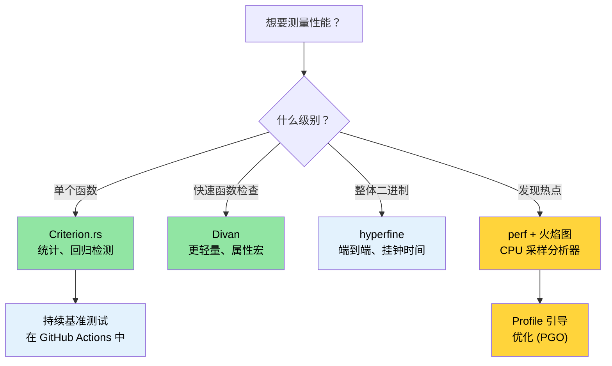

# 基准测试——度量关键指标 🟡

> **你将学到：**
> - 为什么使用 `Instant::now()` 的天真计时会产生不可靠的结果
> - 使用 Criterion.rs 和更轻量的 Divan 替代方案进行统计基准测试
> - 使用 `perf`、火焰图和 PGO 分析热点
> - 在 CI 中设置持续基准测试以自动捕获回归
>
> **交叉引用：** [发布 Profile](ch07-release-profiles-and-binary-size.md) —— 一旦找到热点，优化二进制 · [CI/CD 流水线](ch11-putting-it-all-together-a-production-cic.md) —— 流水线中的基准测试作业 · [代码覆盖率](ch04-code-coverage-seeing-what-tests-miss.md) —— 覆盖率告诉你测试了什么，基准测试告诉你什么快

"我们应该忘记小效率，大约 97% 的时间：过早优化是万恶之源。
然而，我们不应放弃那关键的 3% 中的机会。"——Donald Knuth

困难的部分不是*编写*基准测试——而是编写能产生**有意义的、可复现的、可操作的**数字的基准测试。
本章涵盖的工具和技术将带你从"看起来很快"到"我们有统计证据表明 PR #347 使解析吞吐量下降了 4.2%。"

### 为什么不使用 `std::time::Instant`？

诱惑：

```rust
// ❌ 天真基准测试——不可靠的结果
use std::time::Instant;

fn main() {
    let start = Instant::now();
    let result = parse_device_query_output(&sample_data);
    let elapsed = start.elapsed();
    println!("解析耗时 {:?}", elapsed);
    // 问题 1：编译器可能完全跳过计算（死代码消除）
    // 问题 2：单次采样——没有统计意义
    // 问题 3：CPU 频率缩放、热节流、其他进程
    // 问题 4：冷缓存与热缓存未控制
}
```

手动计时的问题：
1. **死代码消除**——如果结果未被使用，编译器可能完全跳过计算。
2. **无预热**——第一次运行包括缓存未命中、JIT 效应（在 Rust 中无关，但 OS 页故障适用）和惰性初始化。
3. **无统计分析**——单次测量不能告诉你方差、异常值或置信区间。
4. **无回归检测**——你无法与之前的运行比较。

### Criterion.rs——统计基准测试

[Criterion.rs](https://bheisler.github.io/criterion.rs/book/) 是 Rust 微基准测试的事实标准。
它使用统计方法产生可靠的测量结果，并自动检测性能回归。

**设置：**

```toml
# Cargo.toml
[dev-dependencies]
criterion = { version = "0.5", features = ["html_reports", "cargo_bench_support"] }

[[bench]]
name = "parsing_bench"
harness = false  # 使用 Criterion 的 harness，而非内置测试 harness
```

**完整基准测试：**

```rust
// benches/parsing_bench.rs
use criterion::{black_box, criterion_group, criterion_main, Criterion, BenchmarkId};

/// 用于解析 GPU 信息的数据类型
#[derive(Debug, Clone)]
struct GpuInfo {
    index: u32,
    name: String,
    temp_c: u32,
    power_w: f64,
}

/// 测试中的函数——模拟解析 device-query CSV 输出
fn parse_gpu_csv(input: &str) -> Vec<GpuInfo> {
    input
        .lines()
        .filter(|line| !line.starts_with('#'))
        .filter_map(|line| {
            let fields: Vec<&str> = line.split(", ").collect();
            if fields.len() >= 4 {
                Some(GpuInfo {
                    index: fields[0].parse().ok()?,
                    name: fields[1].to_string(),
                    temp_c: fields[2].parse().ok()?,
                    power_w: fields[3].parse().ok()?,
                })
            } else {
                None
            }
        })
        .collect()
}

fn bench_parse_gpu_csv(c: &mut Criterion) {
    // 代表性测试数据
    let small_input = "0, Acme Accel-V1-80GB, 32, 65.5\n\
                       1, Acme Accel-V1-80GB, 34, 67.2\n";

    let large_input = (0..64)
        .map(|i| format!("{i}, Acme Accel-X1-80GB, {}, {:.1}\n", 30 + i % 20, 60.0 + i as f64))
        .collect::<String>();

    c.bench_function("parse_2_gpus", |b| {
        b.iter(|| parse_gpu_csv(black_box(small_input)))
    });

    c.bench_function("parse_64_gpus", |b| {
        b.iter(|| parse_gpu_csv(black_box(&large_input)))
    });
}

criterion_group!(benches, bench_parse_gpu_csv);
criterion_main!(benches);
```

**运行和读取结果：**

```bash
# 运行所有基准测试
cargo bench

# 按名称运行特定基准测试
cargo bench -- parse_64

# 输出：
# parse_2_gpus        time:   [1.2345 µs  1.2456 µs  1.2578 µs]
#                      ▲            ▲           ▲
#                      │       置信区间
#                   下 95%    中位数    上 95%
#
# parse_64_gpus       time:   [38.123 µs  38.456 µs  38.812 µs]
#                     change: [-1.2345% -0.5678% +0.1234%] (p = 0.12 > 0.05)
#                     性能未检测到变化。
```

**`black_box()` 的作用**：它是一个编译器提示，防止死代码消除和过度激进的常量折叠。
编译器无法看穿 `black_box`，所以它必须实际计算结果。

### 参数化基准测试和基准测试组

比较多种实现或输入大小：

```rust
// benches/comparison_bench.rs
use criterion::{criterion_group, criterion_main, Criterion, BenchmarkId, Throughput};

fn bench_parsing_strategies(c: &mut Criterion) {
    let mut group = c.benchmark_group("csv_parsing");

    // 测试不同输入大小
    for num_gpus in [1, 8, 32, 64, 128] {
        let input = generate_gpu_csv(num_gpus);

        // 设置吞吐量用于字节/秒报告
        group.throughput(Throughput::Bytes(input.len() as u64));

        group.bench_with_input(
            BenchmarkId::new("split_based", num_gpus),
            &input,
            |b, input| b.iter(|| parse_split(input)),
        );

        group.bench_with_input(
            BenchmarkId::new("regex_based", num_gpus),
            &input,
            |b, input| b.iter(|| parse_regex(input)),
        );

        group.bench_with_input(
            BenchmarkId::new("nom_based", num_gpus),
            &input,
            |b, input| b.iter(|| parse_nom(input)),
        );
    }
    group.finish();
}

criterion_group!(benches, bench_parsing_strategies);
criterion_main!(benches);
```

**输出**：Criterion 在 `target/criterion/report/index.html` 生成 HTML 报告，
带有小提琴图、比较图表和回归分析——在浏览器中打开。

### Divan——更轻量的替代方案

[Divan](https://github.com/nvzqz/divan) 是一个更新的基准测试框架，
使用属性宏而非 Criterion 的宏 DSL：

```toml
# Cargo.toml
[dev-dependencies]
divan = "0.1"

[[bench]]
name = "parsing_bench"
harness = false
```

```rust
// benches/parsing_bench.rs
use divan::black_box;

const SMALL_INPUT: &str = "0, Acme Accel-V1-80GB, 32, 65.5\n\
                          1, Acme Accel-V1-80GB, 34, 67.2\n";

fn generate_gpu_csv(n: usize) -> String {
    (0..n)
        .map(|i| format!("{i}, Acme Accel-X1-80GB, {}, {:.1}\n", 30 + i % 20, 60.0 + i as f64))
        .collect()
}

fn main() {
    divan::main();
}

#[divan::bench]
fn parse_2_gpus() -> Vec<GpuInfo> {
    parse_gpu_csv(black_box(SMALL_INPUT))
}

#[divan::bench(args = [1, 8, 32, 64, 128])]
fn parse_n_gpus(n: usize) -> Vec<GpuInfo> {
    let input = generate_gpu_csv(n);
    parse_gpu_csv(black_box(&input))
}

// Divan 输出是干净的表格：
// ╰─ parse_2_gpus   fastest  │ slowest  │ median   │ mean     │ samples │ iters
//                   1.234 µs │ 1.567 µs │ 1.345 µs │ 1.350 µs │ 100     │ 1600
```

**何时选择 Divan 而非 Criterion：**
- 更简单的 API（属性宏，更少的样板代码）
- 更快的编译（更少的依赖）
- 适合开发期间的快速性能检查

**何时选择 Criterion：**
- 跨运行的统计回归检测
- 带图表的 HTML 报告
- 成熟的生态系统，更多的 CI 集成

### 使用 `perf` 和火焰图分析

基准测试告诉你*有多快*——分析告诉*时间花在哪里*。

```bash
# 步骤 1：构建时带调试信息（release 速度，调试符号）
cargo build --release
# 确保有调试信息：
# [profile.release]
# debug = true          # 临时添加用于分析

# 步骤 2：使用 perf 记录
perf record --call-graph=dwarf ./target/release/diag_tool --run-diagnostics

# 步骤 3：生成火焰图
# 安装：cargo install flamegraph
# 安装：cargo install addr2line --features=bin（可选，加速 cargo-flamegraph）
cargo flamegraph --root -- --run-diagnostics
# 打开交互式 SVG 火焰图

# 替代方案：使用 perf + inferno
perf script | inferno-collapse-perf | inferno-flamegraph > flamegraph.svg
```

**读取火焰图：**
- **宽度** = 函数中花费的时间（越宽=越慢）
- **高度** = 调用栈深度（越高≠越慢，只是更深）
- **底部** = 入口点，**顶部** = 执行实际工作的叶函数
- 在顶部寻找宽平台——那些是你的热点

**Profile 引导优化 (PGO)：**

```bash
# 步骤 1：使用 instrumentation 构建
RUSTFLAGS="-Cprofile-generate=/tmp/pgo-data" cargo build --release

# 步骤 2：运行代表性工作负载
./target/release/diag_tool --run-full   # 生成 profile 数据

# 步骤 3：合并 profile 数据
# 使用与 rustc 的 LLVM 版本匹配的 llvm-profdata：
# $(rustc --print sysroot)/lib/rustlib/x86_64-unknown-linux-gnu/bin/llvm-profdata
# 或如果安装了 llvm-tools：rustup component add llvm-tools
llvm-profdata merge -o /tmp/pgo-data/merged.profdata /tmp/pgo-data/

# 步骤 4：使用 profile 反馈重新构建
RUSTFLAGS="-Cprofile-use=/tmp/pgo-data/merged.profdata" cargo build --release
# 典型改进：对于计算密集型代码（解析、加密、代码生成）为 5-20%。
# I/O 密集型或 syscall 重的代码（如大型项目）收益较少，
# 因为 CPU 大部分时间在等待，而非执行热点循环。
```

> **提示**：在花时间进行 PGO 之前，确保你的 [release profile](ch07-release-profiles-and-binary-size.md)
> 已经启用 LTO——它通常以较少的工作量提供更大的收益。

### `hyperfine`——快速端到端计时

[`hyperfine`](https://github.com/sharkdp/hyperfine) 基准测试整个命令，
而非单个函数。它非常适合测量整体二进制性能：

```bash
# 安装
cargo install hyperfine
# 或：sudo apt install hyperfine  (Ubuntu 23.04+)

# 基础基准测试
hyperfine './target/release/diag_tool --run-diagnostics'

# 比较两种实现
hyperfine './target/release/diag_tool_v1 --run-diagnostics' \
          './target/release/diag_tool_v2 --run-diagnostics'

# 预热运行 + 最小迭代次数
hyperfine --warmup 3 --min-runs 10 './target/release/diag_tool --run-all'

# 导出结果为 JSON 用于 CI 比较
hyperfine --export-json bench.json './target/release/diag_tool --run-all'
```

**何时使用 `hyperfine` vs Criterion：**
- `hyperfine`：整体二进制计时、重构前后比较、I/O 密集型工作负载
- Criterion：单个函数的微基准测试、统计回归检测

### CI 中的持续基准测试

在性能回归发布前检测到它们：

```yaml
# .github/workflows/bench.yml
name: Benchmarks

on:
  pull_request:
    paths: ['**/*.rs', 'Cargo.toml', 'Cargo.lock']

jobs:
  benchmark:
    runs-on: ubuntu-latest
    steps:
      - uses: actions/checkout@v4

      - uses: dtolnay/rust-toolchain@stable

      - name: 运行基准测试
        # 需要 criterion = { features = ["cargo_bench_support"] } 用于 --output-format
        run: cargo bench -- --output-format bencher | tee bench_output.txt

      - name: 存储基准测试结果
        uses: benchmark-action/github-action-benchmark@v1
        with:
          tool: 'cargo'
          output-file-path: bench_output.txt
          github-token: ${{ secrets.GITHUB_TOKEN }}
          auto-push: true
          alert-threshold: '120%'    # 如果慢 20% 则告警
          comment-on-alert: true
          fail-on-alert: true        # 检测到回归则阻塞 PR
```

**关键 CI 考虑：**
- 使用**专用的基准测试运行器**（而非共享 CI）以获得一致的结果
- 如果使用云 CI，将运行器固定到特定机器类型
- 存储历史数据以检测逐渐回归
- 根据工作负载的容忍度设置阈值（热点路径 5%，冷路径 20%）

### 应用：解析性能

项目有几个性能敏感的解析路径受益于基准测试：

| 解析热点 | Crate | 为什么重要 |
|------------------|-------|----------------|
| accelerator-query CSV/XML 输出 | `device_diag` | 每次调用每个 GPU，每次运行最多 8 次 |
| 传感器事件解析 | `event_log` | 在繁忙服务器上有数千条记录 |
| PCIe 拓扑 JSON | `topology_lib` | 复杂嵌套结构，golden 文件验证 |
| 报告 JSON 序列化 | `diag_framework` | 最终报告输出，大小敏感 |
| 配置 JSON 加载 | `config_loader` | 启动延迟 |

**推荐的第一个基准测试**——拓扑解析器，已有 golden 文件测试数据：

```rust
// topology_lib/benches/parse_bench.rs（建议）
use criterion::{criterion_group, criterion_main, Criterion, Throughput};
use std::fs;

fn bench_topology_parse(c: &mut Criterion) {
    let mut group = c.benchmark_group("topology_parse");

    for golden_file in ["S2001", "S1015", "S1035", "S1080"] {
        let path = format!("tests/test_data/{golden_file}.json");
        let data = fs::read_to_string(&path).expect("golden file not found");
        group.throughput(Throughput::Bytes(data.len() as u64));

        group.bench_function(golden_file, |b| {
            b.iter(|| {
                topology_lib::TopologyProfile::from_json_str(
                    criterion::black_box(&data)
                )
            });
        });
    }
    group.finish();
}

criterion_group!(benches, bench_topology_parse);
criterion_main!(benches);
```

### 自己尝试

1. **编写 Criterion 基准测试**：选择代码库中的任何解析函数。
   创建 `benches/` 目录，设置以字节/秒测量吞吐量的 Criterion 基准测试。
   运行 `cargo bench` 并检查 HTML 报告。

2. **生成火焰图**：在 `[profile.release]` 中构建带 `debug = true` 的项目，
   然后运行 `cargo flamegraph -- <your-args>`。识别火焰图顶部三个最宽的栈——那些是你的热点。

3. **与 `hyperfine` 比较**：安装 `hyperfine` 并用不同标志基准测试二进制的整体执行时间。
   与 Criterion 的每函数时间比较。Criterion 看不到的时间花在哪里？
   （答案：I/O、系统调用、进程启动。）

### 基准测试工具选择



### 🏋️ 练习

#### 🟢 练习 1：第一个 Criterion 基准测试

创建一个 crate，带有一个对 10,000 个随机元素的 `Vec<u64>` 排序的函数。
为其编写 Criterion 基准测试，然后切换到 `.sort_unstable()` 并在 HTML 报告中观察性能差异。

<details>
<summary>解答</summary>

```toml
# Cargo.toml
[[bench]]
name = "sort_bench"
harness = false

[dev-dependencies]
criterion = { version = "0.5", features = ["html_reports"] }
rand = "0.8"
```

```rust
// benches/sort_bench.rs
use criterion::{black_box, criterion_group, criterion_main, Criterion};
use rand::Rng;

fn generate_data(n: usize) -> Vec<u64> {
    let mut rng = rand::thread_rng();
    (0..n).map(|_| rng.gen()).collect()
}

fn bench_sort(c: &mut Criterion) {
    let mut group = c.benchmark_group("sort-10k");

    group.bench_function("stable", |b| {
        b.iter_batched(
            || generate_data(10_000),
            |mut data| { data.sort(); black_box(&data); },
            criterion::BatchSize::SmallInput,
        )
    });

    group.bench_function("unstable", |b| {
        b.iter_batched(
            || generate_data(10_000),
            |mut data| { data.sort_unstable(); black_box(&data); },
            criterion::BatchSize::SmallInput,
        )
    });

    group.finish();
}

criterion_group!(benches, bench_sort);
criterion_main!(benches);
```

```bash
cargo bench
open target/criterion/sort-10k/report/index.html
```
</details>

#### 🟡 练习 2：火焰图热点

在 `[profile.release]` 中构建带 `debug = true` 的项目，然后生成火焰图。
识别前 3 个最宽的栈。

<details>
<summary>解答</summary>

```toml
# Cargo.toml
[profile.release]
debug = true  # 为火焰图保留符号
```

```bash
cargo install flamegraph
cargo flamegraph --release -- <your-args>
# 在浏览器中打开 flamegraph.svg
# 顶部最宽的栈是你的热点
```
</details>

### 关键要点

- 永远不要使用 `Instant::now()` 进行基准测试——使用 Criterion.rs 获得统计严谨性和回归检测
- `black_box()` 防止编译器优化掉你的基准测试目标
- `hyperfine` 测量整个二进制的挂钟时间；Criterion 测量单个函数——两者都使用
- 火焰图显示*哪里*花时间；基准测试显示*花多少*时间
- CI 中的持续基准测试在性能回归发布前捕获它们

---
