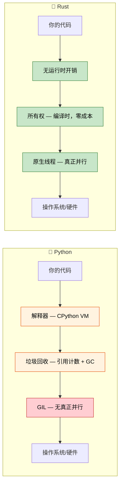

## 讲师介绍与课程方法

- **讲师背景**
  - 微软 SCHIE（硅与云硬件基础设施工程）团队首席固件架构师
  - 行业资深专家，专长于安全、系统编程（固件、操作系统、管理程序）、CPU 与平台架构、C++ 系统
  - 2017 年开始在 AWS EC2 使用 Rust 编程，从此爱上这门语言
- **课程特点**：尽可能采用互动式学习
  - 前提假设：你已掌握 Python 及其生态系统
  - 示例刻意将 Python 概念映射到 Rust 对应概念
  - **欢迎随时提问**

---

## 为什么 Python 开发者需要学习 Rust

> **你将学到：** Python 开发者为何转向 Rust、真实世界的性能提升案例（Dropbox、Discord、Pydantic）、
> 何时应该选择 Rust 而非 Python，以及两种语言的核心理念差异。
>
> **难度：** 🟢 初学者

### 性能：从几分钟到几毫秒

Python 在 CPU 密集型任务上以缓慢著称。而 Rust 提供了 C 语言级别的性能，同时保持高级语言的易用性。

```python
# Python — 1000 万次调用约需 2 秒
import time

def fibonacci(n: int) -> int:
    if n <= 1:
        return n
    a, b = 0, 1
    for _ in range(2, n + 1):
        a, b = b, a + b
    return b

start = time.perf_counter()
results = [fibonacci(n % 30) for n in range(10_000_000)]
elapsed = time.perf_counter() - start
print(f"耗时：{elapsed:.2f}秒")  # 典型硬件上约 2 秒
```

```rust
// Rust — 同样的 1000 万次调用仅需约 0.07 秒
use std::time::Instant;

fn fibonacci(n: u64) -> u64 {
    if n <= 1 {
        return n;
    }
    let (mut a, mut b) = (0u64, 1u64);
    for _ in 2..=n {
        let temp = b;
        b = a + b;
        a = temp;
    }
    b
}

fn main() {
    let start = Instant::now();
    let results: Vec<u64> = (0..10_000_000).map(|n| fibonacci(n % 30)).collect();
    println!("耗时：{:.2?}", start.elapsed());  // 约 0.07 秒
}
```

> **注意：** Rust 应使用 release 模式运行（`cargo run --release`）以获得公平的性能对比。
>
> **为何差异如此之大？** Python 对每个 `+` 操作都要通过字典查找来分发，
> 从堆对象中拆箱整数，并在每次操作时检查类型。而 Rust 将 `fibonacci` 直接编译为
> 几条 x86 的 `add`/`mov` 指令——与 C 编译器生成的代码几乎相同。

### 无需垃圾回收器的内存安全

Python 的引用计数垃圾回收机制存在已知问题：循环引用、`__del__` 时机不可预测、内存碎片化。
Rust 在编译时就从根源上消除了这些问题。

```python
# Python — 循环引用导致 CPython 的引用计数无法释放
class Node:
    def __init__(self, value):
        self.value = value
        self.parent = None
        self.children = []

    def add_child(self, child):
        self.children.append(child)
        child.parent = self  # 循环引用！

# 这两个节点相互引用 — 引用计数永远不会归零
# CPython 的循环检测器*最终*会清理它们，
# 但你无法控制时机，而且会带来 GC 暂停的开销
root = Node("root")
child = Node("child")
root.add_child(child)
```

```rust
// Rust — 所有权机制从设计上就防止了循环引用
struct Node {
    value: String,
    children: Vec<Node>,  // 子节点被*拥有* — 不可能形成循环
}

impl Node {
    fn new(value: &str) -> Self {
        Node {
            value: value.to_string(),
            children: Vec::new(),
        }
    }

    fn add_child(&mut self, child: Node) {
        self.children.push(child);  // 所有权在此转移
    }
}

fn main() {
    let mut root = Node::new("root");
    let child = Node::new("child");
    root.add_child(child);
    // 当 root 被丢弃时，所有子节点也会同时被丢弃
    // 确定性、零开销、无垃圾回收
}
```

> **核心洞察**：在 Rust 中，子节点不持有指向父节点的引用。
> 如果你确实需要交叉引用（例如图结构），必须使用显式机制如 `Rc<RefCell<T>>` 或索引——
> 这使得复杂性变得显而易见，且是有意为之的设计。

---

## Rust 解决的 Python 常见痛点

### 1. 运行时类型错误

Python 在生产环境中最常见的 bug：向函数传递了错误的类型。
类型提示有所帮助，但它们并非强制执行的。

```python
# Python — 类型提示只是建议，不是规则
def process_user(user_id: int, name: str) -> dict:
    return {"id": user_id, "name": name.upper()}

# 这些调用在运行时"可以运行" — 但会失败
process_user("not-a-number", 42)        # TypeError: int 没有 .upper() 方法
process_user(None, "Alice")             # 静默地将 None 存储为 id — bug 潜伏直到下游代码期望 int

# 即使使用 mypy，你仍然可以绕过类型检查：
data = json.loads('{"id": "oops"}')     # 总是返回 Any
process_user(data["id"], data["name"])  # mypy 无法捕获这个错误
```

```rust
// Rust — 编译器在程序运行前就抓住所有这些错误
fn process_user(user_id: i64, name: &str) -> User {
    User {
        id: user_id,
        name: name.to_uppercase(),
    }
}

// process_user("not-a-number", 42);     // ❌ 编译错误：期望 i64，找到 &str
// process_user(None, "Alice");           // ❌ 编译错误：期望 i64，找到 Option
// 参数多余会导致编译错误

// 反序列化 JSON 也是类型安全的：
#[derive(Deserialize)]
struct UserInput {
    id: i64,      // JSON 中必须是数字
    name: String, // JSON 中必须是字符串
}
let input: UserInput = serde_json::from_str(json_str)?; // 类型不匹配时返回 Err
process_user(input.id, &input.name); // ✅ 保证类型正确
```

### 2. None：十亿美元的错误（Python 版本）

`None` 可以出现在任何期望值的地方。Python 在编译时无法防止 
`AttributeError: 'NoneType' object has no attribute ...` 这类错误的发生。

```python
# Python — None 无处不在
def find_user(user_id: int) -> dict | None:
    users = {1: {"name": "Alice"}, 2: {"name": "Bob"}}
    return users.get(user_id)

user = find_user(999)         # 返回 None
print(user["name"])           # 💥 TypeError: 'NoneType' 对象不可订阅

# 即使使用 Optional 类型提示，也没有强制检查：
from typing import Optional
def get_name(user_id: int) -> Optional[str]:
    return None

name: Optional[str] = get_name(1)
print(name.upper())          # 💥 AttributeError — mypy 会警告，但运行时不在乎
```

```rust
// Rust — None 不可能出现，除非显式处理
fn find_user(user_id: i64) -> Option<User> {
    let users = HashMap::from([
        (1, User { name: "Alice".into() }),
        (2, User { name: "Bob".into() }),
    ]);
    users.get(&user_id).cloned()
}

let user = find_user(999);  // 返回 Option<User> 的 None 变体
// println!("{}", user.name); // ❌ 编译错误：Option<User> 没有 name 字段

// 你*必须*处理 None 情况：
match find_user(999) {
    Some(user) => println!("{}", user.name),
    None => println!("未找到用户"),
}

// 或使用组合子：
let name = find_user(999)
    .map(|u| u.name)
    .unwrap_or_else(|| "Unknown".to_string());
```

### 3. GIL：Python 的并发天花板

Python 的全局解释器锁（GIL）意味着线程无法并行执行 Python 代码。
`threading` 仅适用于 I/O 密集型任务；CPU 密集型任务需要使用 `multiprocessing`
（带有序列化开销）或 C 扩展来实现。

```python
# Python — 由于 GIL，线程无法加速 CPU 工作
import threading
import time

def cpu_work(n):
    total = 0
    for i in range(n):
        total += i * i
    return total

start = time.perf_counter()
threads = [threading.Thread(target=cpu_work, args=(10_000_000,)) for _ in range(4)]
for t in threads:
    t.start()
for t in threads:
    t.join()
elapsed = time.perf_counter() - start
print(f"4 个线程：{elapsed:.2f}秒")  # 与 1 个线程*几乎相同*！GIL 阻止了并行

# multiprocessing"可以工作"，但需要在进程间序列化数据：
from multiprocessing import Pool
with Pool(4) as p:
    results = p.map(cpu_work, [10_000_000] * 4)  # 快约 4 倍，但有 pickle 开销
```

```rust
// Rust — 真正的并行，无 GIL，无序列化开销
use std::thread;

fn cpu_work(n: u64) -> u64 {
    (0..n).map(|i| i * i).sum()
}

fn main() {
    let start = std::time::Instant::now();
    let handles: Vec<_> = (0..4)
        .map(|_| thread::spawn(|| cpu_work(10_000_000)))
        .collect();

    let results: Vec<u64> = handles.into_iter()
        .map(|h| h.join().unwrap())
        .collect();

    println!("4 个线程：{:.2?}", start.elapsed());  // 比单线程快约 4 倍
}
```

> **使用 Rayon**（Rust 的并行迭代器库），并行化更简单：
> ```rust
> use rayon::prelude::*;
> let results: Vec<u64> = inputs.par_iter().map(|&n| cpu_work(n)).collect();
> ```

### 4. 部署和分发的痛苦

Python 的部署出了名地困难：虚拟环境配置、系统 Python 冲突、`pip install` 失败、
C 扩展 wheel 问题、以及包含完整 Python 运行时的 Docker 镜像过于庞大。

```python
# Python 部署检查清单：
# 1. 哪个 Python 版本？3.9? 3.10? 3.11? 3.12?
# 2. 虚拟环境：venv、conda、poetry、pipenv?
# 3. C 扩展：需要编译器？manylinux wheel?
# 4. 系统依赖：libssl、libffi 等？
# 5. Docker：完整的 python:3.12 镜像约 1.0 GB
# 6. 启动时间：import 多的应用需要 200-500ms

# Docker 镜像：约 1 GB
# FROM python:3.12-slim
# COPY requirements.txt .
# RUN pip install -r requirements.txt
# COPY . .
# CMD ["python", "app.py"]
```

```rust
// Rust 部署：单个静态二进制文件，无需运行时
// cargo build --release → 一个二进制文件，约 5-20 MB
// 可复制到任何地方 — 无需 Python、无需虚拟环境、无依赖

// Docker 镜像：约 5 MB（from scratch 或 distroless）
// FROM scratch
// COPY target/release/my_app /my_app
// CMD ["/my_app"]

// 启动时间：<1ms
// 交叉编译：cargo build --target x86_64-unknown-linux-musl
```

---

## 何时选择 Rust 而非 Python

### 选择 Rust 的场景：
- **性能至关重要**：数据管道、实时处理、计算密集型服务
- **正确性重要**：金融系统、安全关键代码、协议实现
- **部署简单**：单个二进制文件，无运行时依赖
- **底层控制**：硬件交互、操作系统集成、嵌入式系统
- **真正的并发**：CPU 密集型并行，无需 GIL 变通方案
- **内存效率**：降低内存密集型服务的云成本
- **长时间运行的服务**：可预测的延迟很重要（无 GC 暂停）

### 继续使用 Python 的场景：
- **快速原型**：探索性数据分析、脚本、一次性工具
- **ML/AI 工作流**：PyTorch、TensorFlow、scikit-learn 生态系统
- **胶水代码**：连接 API、数据转换脚本
- **团队专长**：当 Rust 学习曲线不值得时
- **上市时间**：开发速度胜过执行速度
- **交互式工作**：Jupyter notebook、REPL 驱动开发
- **脚本编写**：自动化任务、系统管理任务、快速工具

### 考虑两者结合（使用 PyO3 的混合方法）：
- **计算密集型代码用 Rust**：通过 PyO3/maturin 从 Python 调用
- **业务逻辑和编排用 Python**：熟悉、高效
- **渐进式迁移**：识别热点，用 Rust 扩展替换
- **兼得两者优势**：Python 的生态系统 + Rust 的性能

---

## 真实世界影响：公司为何选择 Rust

### Dropbox：存储基础设施
- **之前（Python）**：同步引擎中 CPU 使用率高、内存开销大
- **之后（Rust）**：性能提升 10 倍，内存减少 50%
- **结果**：节省数百万美元的基础设施成本

### Discord：语音/视频后端
- **之前（Python → Go）**：GC 暂停导致音频丢失
- **之后（Rust）**：持续的低延迟性能
- **结果**：更好的用户体验，降低服务器成本

### Cloudflare：Edge Workers
- **为何选择 Rust**：WebAssembly 编译、边缘性能可预测
- **结果**：Workers 以微秒级冷启动运行

### Pydantic V2
- **之前**：纯 Python 验证 — 大负载下缓慢
- **之后**：Rust 核心（通过 PyO3）— 验证速度**快 5-50 倍**
- **结果**：相同的 Python API，显著更快的执行速度

### 为何这对 Python 开发者重要：
1. **互补技能**：Rust 和 Python 解决不同的问题
2. **PyO3 桥梁**：编写可从 Python 调用的 Rust 扩展
3. **性能理解**：了解 Python 为何慢以及如何修复热点
4. **职业发展**：系统编程专业知识越来越有价值
5. **云成本**：10 倍更快的代码 = 显著更低的基础设施支出

---

## 语言哲学对比

### Python 哲学
- **可读性很重要**：简洁的语法，"一种显而易见的方法"
- **自带电池**：丰富的標準庫、快速原型
- **鸭子类型**："如果它像鸭子一样走路，像鸭子一样叫……"
- **开发者速度**：优化编写速度，而非执行速度
- **动态一切**：运行时修改类、猴子补丁、元类

### Rust 哲学
- **无牺牲的性能**：零成本抽象，无运行时开销
- **正确性优先**：如果能编译，某些类别的 bug 就不可能发生
- **显式优于隐式**：无隐藏行为，无隐式转换
- **所有权**：资源恰好有一个所有者 — 内存、文件、套接字
- **无畏并发**：类型系统在编译时防止数据竞争



---

## 快速参考：Rust vs Python

| **概念** | **Python** | **Rust** | **关键差异** |
|-------------|-----------|----------|-------------|
| 类型系统 | 动态（鸭子类型） | 静态（编译时） | 错误在编译前捕获 |
| 内存 | 垃圾回收（引用计数 + 循环 GC） | 所有权系统 | 零成本、确定性清理 |
| None/null | 任何地方的 `None` | `Option<T>` | 编译时 None 安全 |
| 错误处理 | `raise`/`try`/`except` | `Result<T, E>` | 显式、无隐藏控制流 |
| 可变性 | 全部可变 | 默认不可变 | 需要显式选择可变 |
| 速度 | 解释型（慢 10-100 倍） | 编译型（C/C++ 速度） | 快几个数量级 |
| 并发 | GIL 限制线程 | 无 GIL，`Send`/`Sync` trait | 默认真正并行 |
| 依赖管理 | `pip install` / `poetry add` | `cargo add` | 内置依赖管理 |
| 构建系统 | setuptools/poetry/hatch | Cargo | 单一统一工具 |
| 打包配置 | `pyproject.toml` | `Cargo.toml` | 类似的声明式配置 |
| REPL | `python` 交互式 | 无 REPL（用测试/`cargo run`） | 编译优先工作流 |
| 类型提示 | 可选、不强制 | 必需、编译器强制 | 类型不是装饰品 |

---

## 练习

<details>
<summary><strong>🏋️ 练习：思维模型检查</strong>（点击展开）</summary>

**挑战**：对于每个 Python 代码片段，预测 Rust 会有什么不同要求。无需编写代码 — 只需描述约束。

1. `x = [1, 2, 3]; y = x; x.append(4)` — Rust 中会发生什么？
2. `data = None; print(data.upper())` — Rust 如何防止这个错误？
3. `import threading; shared = []; threading.Thread(target=shared.append, args=(1,)).start()` — Rust 要求什么？

<details>
<summary>🔑 解答</summary>

1. **所有权移动**：`let y = x;` 会移动 `x` — `x.push(4)` 是编译错误。你需要 `let y = x.clone();` 或者用 `let y = &x;` 借用。
2. **无 null**：`data` 不能是 `None`，除非它是 `Option<String>`。你必须 `match` 或使用 `.unwrap()` / `if let` — 不会有意外的 `NoneType` 错误。
3. **Send + Sync**：编译器要求 `shared` 包裹在 `Arc<Mutex<Vec<i32>>>` 中。忘记加锁 = 编译错误，而不是竞态条件。

**核心要点**：Rust 将运行时失败转变为编译时错误。你感受到的"阻力"是编译器在捕获真正的 bug。

</details>
</details>
