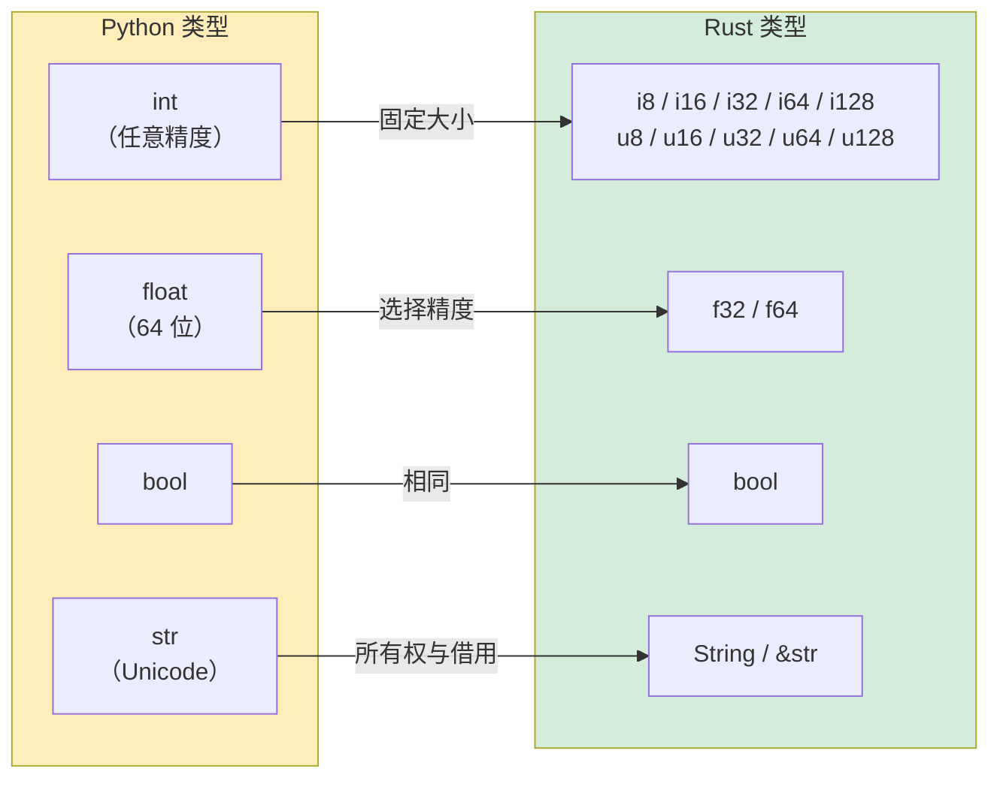

## 变量与可变性

> **你将学到：** 默认不可变的变量、显式的 `mut`、原始数值类型与 Python 任意精度 `int` 的对比、
> `String` 与 `&str`（前期最难的概念）、字符串格式化，以及 Rust 中必需的类型注解。
>
> **难度：** 🟢 初学者

### Python 变量声明

```python
# Python — 一切皆可变，动态类型
count = 0          # 可变，类型推断为 int
count = 5          # ✅ 可以
count = "hello"    # ✅ 可以 — 类型可以改变！（动态类型）

# "常量" 只是约定：
MAX_SIZE = 1024    # 没有什么能阻止后续 MAX_SIZE = 999
```

### Rust 变量声明

```rust
// Rust — 默认不可变，静态类型
let count = 0;           // 不可变，类型推断为 i32
// count = 5;           // ❌ 编译错误：不能对不可变变量二次赋值
// count = "hello";     // ❌ 编译错误：期望整数，找到 &str

let mut count = 0;       // 显式可变
count = 5;               // ✅ 可以
// count = "hello";     // ❌ 仍然不能改变类型

const MAX_SIZE: usize = 1024; // 真正的常量 — 由编译器强制
```

### Python 开发者的关键思维转变

```rust
// Python：变量是指向对象的标签
// Rust：变量是命名的存储位置，并且"拥有"它们的值

// 变量遮蔽（shadowing）— Rust 特有，非常有用
let input = "42";              // &str
let input = input.parse::<i32>().unwrap();  // 现在是 i32 — 新变量，同名
let input = input * 2;         // 现在是 84 — 又一个新变量

// Python 中，你只是重新赋值并改变类型：
# input = "42"
# input = int(input)   # 同名，不同类型 — Python 也允许
# 但在 Rust 中，每个 `let` 都创建一个真正新的绑定。旧的绑定消失了。
```

### 实用示例：计数器

```python
# Python 版本
class Counter:
    def __init__(self):
        self.value = 0
    
    def increment(self):
        self.value += 1
    
    def get_value(self):
        return self.value

c = Counter()
c.increment()
print(c.get_value())  # 1
```

```rust
// Rust 版本
struct Counter {
    value: i64,
}

impl Counter {
    fn new() -> Self {
        Counter { value: 0 }
    }

    fn increment(&mut self) {     // &mut self = 我将修改这个对象
        self.value += 1;
    }

    fn get_value(&self) -> i64 {  // &self = 我只读取这个对象
        self.value
    }
}

fn main() {
    let mut c = Counter::new();   // 必须是 `mut` 才能调用 increment()
    c.increment();
    println!("{}", c.get_value()); // 1
}
```

> **关键差异**：在 Rust 中，方法签名里的 `&mut self` 告诉你（和编译器）`increment` 会修改计数器。
> 在 Python 中，任何方法都可以修改任何东西 — 你必须阅读代码才能知道是否会修改。

***

## 原始类型对比



### 数值类型

| Python | Rust | 说明 |
|--------|------|------|
| `int`（任意精度） | `i8`, `i16`, `i32`, `i64`, `i128`, `isize` | Rust 整数有固定大小 |
| `int`（无符号：无独立类型） | `u8`, `u16`, `u32`, `u64`, `u128`, `usize` | 显式的无符号类型 |
| `float`（64 位 IEEE 754） | `f32`, `f64` | Python 只有 64 位浮点数 |
| `bool` | `bool` | 相同概念 |
| `complex` | 无内置（使用 `num` crate） | 系统代码中很少用 |

```python
# Python — 一种整数类型，任意精度
x = 42                     # int — 可以增长到任意大小
big = 2 ** 1000            # 仍然可以 — 数千位数字
y = 3.14                   # float — 始终 64 位
```

```rust
// Rust — 显式大小，溢出是编译时/运行时错误
let x: i32 = 42;           // 32 位有符号整数
let y: f64 = 3.14;         // 64 位浮点数（等同于 Python 的 float）
let big: i128 = 2_i128.pow(100); // 128 位最大值 — 没有任意精度
// 如需任意精度：使用 `num-bigint` crate

// 下划线增强可读性（与 Python 的 1_000_000 相同）：
let million = 1_000_000;   // 与 Python 语法相同！

// 类型后缀语法：
let a = 42u8;              // u8
let b = 3.14f32;           // f32
```

### 大小类型（重要！）

```rust
// usize 和 isize — 指针大小的整数，用于索引
let length: usize = vec![1, 2, 3].len();  // .len() 返回 usize
let index: usize = 0;                     // 数组索引始终是 usize

// Python 中，len() 返回 int，索引也是 int — 没有区别。
// Rust 中，混用 i32 和 usize 需要显式转换：
let i: i32 = 5;
// let item = vec[i];    // ❌ 错误：期望 usize，找到 i32
let item = vec[i as usize]; // ✅ 显式转换
```

### 类型推断

```rust
// Rust 会推断类型，但类型是"固定的" — 不是动态的
let x = 42;          // 编译器推断为 i32（默认整数类型）
let y = 3.14;        // 编译器推断为 f64（默认浮点数类型）
let s = "hello";     // 编译器推断为 &str（字符串切片）
let v = vec![1, 2];  // 编译器推断为 Vec<i32>

// 你可以总是显式指定：
let x: i64 = 42;
let y: f32 = 3.14;

// 与 Python 不同，类型在推断后"绝不能"改变：
let x = 42;
// x = "hello";     // ❌ 错误：期望整数，找到 &str
```

***

## 字符串类型：String vs &str

这是 Python 开发者最大的意外之一。Rust 有**两种**主要字符串类型，而 Python 只有一种。

### Python 字符串处理

```python
# Python — 一种字符串类型，不可变，引用计数
name = "Alice"          # str — 不可变，堆分配
greeting = f"Hello, {name}!"  # f-string 格式化
chars = list(name)      # 转换为字符列表
upper = name.upper()    # 返回新字符串（不可变）
```

### Rust 字符串类型

```rust
// Rust 有两种字符串类型：

// 1. &str（字符串切片）— 借用、不可变，像字符串数据的"视图"
let name: &str = "Alice";           // 指向二进制文件中的字符串数据
                                     // 最接近 Python 的 str，但它是"引用"

// 2. String（拥有所有权的字符串）— 堆分配、可增长、拥有所有权
let mut greeting = String::from("Hello, ");  // 拥有所有权，可以修改
greeting.push_str(name);
greeting.push('!');
// greeting 现在是 "Hello, Alice!"
```

### 何时使用哪个？

```rust
// 可以这样理解：
// &str  = "我在看别人拥有的字符串"（只读视图）
// String = "我拥有这个字符串，可以修改它"（拥有的数据）

// 函数参数：优先使用 &str（接受两种类型）
fn greet(name: &str) -> String {          // 接受 &str 和 &String
    format!("Hello, {}!", name)           // format! 创建新的 String
}

let s1 = "world";                         // &str 字面量
let s2 = String::from("Rust");            // String

greet(s1);      // ✅ &str 可以直接用
greet(&s2);     // ✅ &String 自动转换为 &str（Deref 强制转换）
```

### 实用示例

```python
# Python 字符串操作
name = "alice"
upper = name.upper()               # "ALICE"
contains = "lic" in name           # True
parts = "a,b,c".split(",")         # ["a", "b", "c"]
joined = "-".join(["a", "b", "c"]) # "a-b-c"
stripped = "  hello  ".strip()     // "hello"
replaced = name.replace("a", "A")  # "Alice"
```

```rust
// Rust 等价写法
let name = "alice";
let upper = name.to_uppercase();           // String — 新分配
let contains = name.contains("lic");       // bool
let parts: Vec<&str> = "a,b,c".split(',').collect();  // Vec<&str>
let joined = ["a", "b", "c"].join("-");    // String
let stripped = "  hello  ".trim();         // &str — 无需分配！
let replaced = name.replace("a", "A");     // String

// 关键要点：有些操作返回 &str（无需分配），有些返回 String。
// .trim() 返回原始字符串的切片 — 高效！
// .to_uppercase() 必须创建新的 String — 需要分配。
```

### Python 开发者：这样理解

```text
Python str     ≈ Rust &str     （你通常读取字符串）
Python str     ≈ Rust String   （当你需要拥有/修改时）

经验法则：
- 函数参数      → 使用 &str（最灵活）
- 结构体字段    → 使用 String（结构体拥有它的数据）
- 返回值        → 使用 String（调用者需要拥有它）
- 字符串字面量  → 自动成为 &str
```

***

## 打印与字符串格式化

### 基本输出

```python
# Python
print("Hello, World!")
print("Name:", name, "Age:", age)    # 空格分隔
print(f"Name: {name}, Age: {age}")   # f-string
```

```rust
// Rust
println!("Hello, World!");
println!("Name: {} Age: {}", name, age);    // 位置占位符 {}
println!("Name: {name}, Age: {age}");       // 内联变量（Rust 1.58+，类似 f-string！）
```

### 格式化说明符

```python
# Python 格式化
print(f"{3.14159:.2f}")          # "3.14" — 2 位小数
print(f"{42:05d}")               # "00042" — 零填充
print(f"{255:#x}")               # "0xff" — 十六进制
print(f"{42:>10}")               # "        42" — 右对齐
print(f"{'left':<10}|")          # "left      |" — 左对齐
```

```rust
// Rust 格式化（与 Python 非常相似！）
println!("{:.2}", 3.14159);         // "3.14" — 2 位小数
println!("{:05}", 42);              // "00042" — 零填充
println!("{:#x}", 255);             // "0xff" — 十六进制
println!("{:>10}", 42);             // "        42" — 右对齐
println!("{:<10}|", "left");        // "left      |" — 左对齐
```

### 调试打印

```python
# Python — repr() 和 pprint
print(repr([1, 2, 3]))             # "[1, 2, 3]"
from pprint import pprint
pprint({"key": [1, 2, 3]})         # 漂亮打印
```

```rust
// Rust — {:?} 和 {:#?}
println!("{:?}", vec![1, 2, 3]);       // "[1, 2, 3]" — Debug 格式
println!("{:#?}", vec![1, 2, 3]);      // 漂亮打印的 Debug 格式

// 让你的类型可打印，派生 Debug：
#[derive(Debug)]
struct Point { x: f64, y: f64 }

let p = Point { x: 1.0, y: 2.0 };
println!("{:?}", p);                   // "Point { x: 1.0, y: 2.0 }"
println!("{p:?}");                     // 相同，内联语法
```

### 快速参考

| Python | Rust | 说明 |
|--------|------|------|
| `print(x)` | `println!("{}", x)` 或 `println!("{x}")` | Display 格式 |
| `print(repr(x))` | `println!("{:?}", x)` | Debug 格式 |
| `f"Hello {name}"` | `format!("Hello {name}")` | 返回 String |
| `print(x, end="")` | `print!("{x}")` | 无换行（`print!` vs `println!`） |
| `print(x, file=sys.stderr)` | `eprintln!("{x}")` | 打印到 stderr |
| `sys.stdout.write(s)` | `print!("{s}")` | 无换行 |

***

## 类型注解：可选 vs 必需

### Python 类型提示（可选，不强制）

```python
# Python — 类型提示是文档，不是强制
def add(a: int, b: int) -> int:
    return a + b

add(1, 2)         # ✅
add("a", "b")     # ✅ Python 不在乎 — 返回 "ab"
add(1, "2")       # ✅ 直到运行时崩溃：TypeError

# Union 类型、Optional
def find(key: str) -> int | None:
    ...

# 泛型类型
def first(items: list[int]) -> int | None:
    return items[0] if items else None

# 类型别名
UserId = int
Mapping = dict[str, list[int]]
```

### Rust 类型声明（必需，编译器强制）

```rust
// Rust — 类型是强制的。永远。没有例外。
fn add(a: i32, b: i32) -> i32 {
    a + b
}

add(1, 2);         // ✅
// add("a", "b");  // ❌ 编译错误：期望 i32，找到 &str

// 可选值使用 Option<T>
fn find(key: &str) -> Option<i32> {
    // 返回 Some(value) 或 None
    Some(42)
}

// 泛型类型
fn first(items: &[i32]) -> Option<i32> {
    items.first().copied()
}

// 类型别名
type UserId = i64;
type Mapping = HashMap<String, Vec<i32>>;
```

> **关键要点**：在 Python 中，类型提示帮助你的 IDE 和 mypy，但不影响运行时。
> 在 Rust 中，类型**就是**程序 — 编译器用它们保证内存安全、防止数据竞争、消除空指针错误。
>
> 📌 **另见**：[第 6 章 — 枚举与模式匹配](ch06-enums-and-pattern-matching.md) 展示 Rust 类型系统如何替代 Python 的 `Union` 类型和 `isinstance()` 检查。

---

## 练习

<details>
<summary><strong>🏋️ 练习：温度转换器</strong>（点击展开）</summary>

**挑战**：编写函数 `celsius_to_fahrenheit(c: f64) -> f64` 和函数 `classify(temp_f: f64) -> &'static str`，
根据阈值返回 "cold"、"mild" 或 "hot"。打印 0、20 和 35 摄氏度的结果。使用字符串格式化。

<details>
<summary>🔑 解答</summary>

```rust
fn celsius_to_fahrenheit(c: f64) -> f64 {
    c * 9.0 / 5.0 + 32.0
}

fn classify(temp_f: f64) -> &'static str {
    if temp_f < 50.0 { "cold" }
    else if temp_f < 77.0 { "mild" }
    else { "hot" }
}

fn main() {
    for c in [0.0, 20.0, 35.0] {
        let f = celsius_to_fahrenheit(c);
        println!("{c:.1}°C = {f:.1}°F — {}", classify(f));
    }
}
```

**核心要点**：Rust 需要显式的 `f64`（没有隐式 int→float），`for` 直接迭代数组（不是 `range()`），
`if/else` 块是表达式。

</details>
</details>

***
