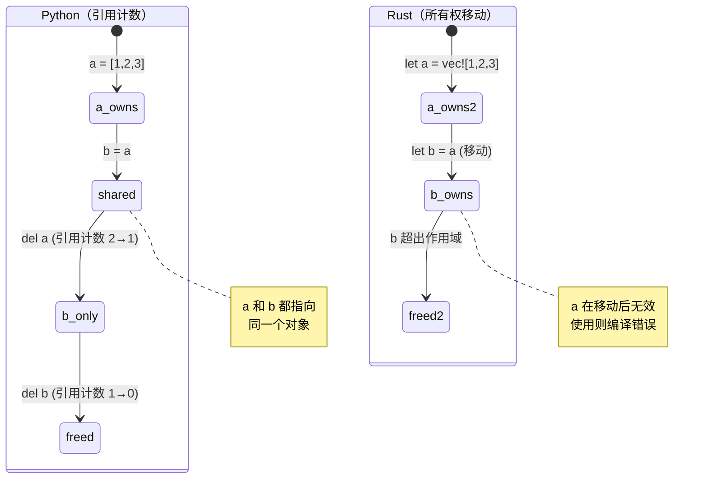
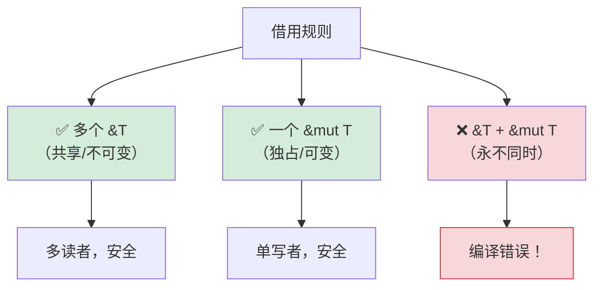

## 理解所有权

> **你将学到：** Rust 为什么需要所有权系统（因为没有 GC！）、移动语义与 Python 引用计数的对比、
> 借用（`&` 和 `&mut`）、生命周期基础，以及智能指针（`Box`、`Rc`、`Arc`）。
>
> **难度：** 🟡 中级

这是 Python 开发者最难理解的概念。在 Python 中，你从不需要思考谁"拥有"
数据 — 垃圾回收器会处理。在 Rust 中，每个值恰好有一个所有者，编译器在编译时跟踪。

### Python：无处不在的共享引用

```python
# Python — 一切都是引用，gc 清理
a = [1, 2, 3]
b = a              # b 和 a 指向同一个列表
b.append(4)
print(a)            # [1, 2, 3, 4] — 没想到吧！a 也跟着变了

# 谁拥有这个列表？a 和 b 都引用它。
# 垃圾回收器在没有引用时释放它。
# 你从不需要思考这个。
```

### Rust：单一所有权

```rust
// Rust — 每个值恰好有一个所有者
let a = vec![1, 2, 3];
let b = a;           // 所有权"移动"到 b
// println!("{:?}", a); // ❌ 编译错误：移动后使用值

// a 不再存在。b 是唯一所有者。
println!("{:?}", b); // ✅ [1, 2, 3]

// 当 b 超出作用域，Vec 被释放。确定性。无 GC。
```

### 所有权的三条规则

```rust
1. 每个值恰好有一个所有者变量。
2. 当所有者超出作用域，值被丢弃（释放）。
3. 所有权可以转移（移动）但不能复制（除非实现 Clone）。
```

### 移动语义 — Python 开发者最难适应的概念

```python
# Python — 赋值复制引用，不是数据
def process(data):
    data.append(42)
    # 原始列表被修改！

my_list = [1, 2, 3]
process(my_list)
print(my_list)       # [1, 2, 3, 42] — 被 process 修改！
```

```rust
// Rust — 传递给函数会"移动"所有权（对于非 Copy 类型）
fn process(mut data: Vec<i32>) -> Vec<i32> {
    data.push(42);
    data  // 必须返回它以归还所有权！
}

let my_vec = vec![1, 2, 3];
let my_vec = process(my_vec);  // 所有权移入并移出
println!("{:?}", my_vec);      // [1, 2, 3, 42]

// 或更好 — 借用而不是移动：
fn process_borrowed(data: &mut Vec<i32>) {
    data.push(42);
}

let mut my_vec = vec![1, 2, 3];
process_borrowed(&mut my_vec);  // 临时借出
println!("{:?}", my_vec);       // [1, 2, 3, 42] — 仍然属于我们
```

### 所有权可视化

```text
Python:                              Rust:

  a ──────┐                           a ──→ [1, 2, 3]
           ├──→ [1, 2, 3]
  b ──────┘                           之后：let b = a;

  (a 和 b 共享一个对象)                a（无效，已移动）
  (引用计数 = 2)                      b ──→ [1, 2, 3]
                                      (只有 b 拥有数据)

  del a → 引用计数 = 1                drop(b) → 数据释放
  del b → 引用计数 = 0 → 释放          (确定性，无 GC)
```



***

## 移动语义 vs 引用计数

### Copy vs Move

```rust
// 简单类型（整数、浮点数、布尔值、字符）被"复制"，不是移动
let x = 42;
let y = x;    // x 被"复制"到 y（两者都有效）
println!("{x} {y}");  // ✅ 42 42

// 堆分配类型（String、Vec、HashMap）被"移动"
let s1 = String::from("hello");
let s2 = s1;  // s1 被移动到 s2
// println!("{s1}");  // ❌ 错误：移动后使用值

// 要显式复制堆数据，使用 .clone()
let s1 = String::from("hello");
let s2 = s1.clone();  // 深拷贝
println!("{s1} {s2}");  // ✅ hello hello（两者都有效）
```

### Python 开发者的思维模型

```text
Python:                    Rust:
─────────                  ─────
int, float, bool           Copy 类型（i32、f64、bool、char）
→ 共享引用到不可变对象     → 按位复制（按赋值）
  （无真正拷贝）            （始终是独立的值）
                           （注意：Python 会缓存小整数，而 Rust 的复制行为始终是可预测的）

list, dict, str            Move 类型（Vec、HashMap、String）
→ 共享引用                 → 所有权转移（不同的行为！）
→ gc 清理                  → 所有者丢弃数据
→ clone with list(x)       → clone with x.clone()
   or copy.deepcopy(x)
```

### Python 共享模型导致 bug 的情况

```python
# Python — 意外的别名
def remove_duplicates(items):
    seen = set()
    result = []
    for item in items:
        if item not in seen:
            seen.add(item)
            result.append(item)
    return result

original = [1, 2, 2, 3, 3, 3]
alias = original          # 别名，不是拷贝
unique = remove_duplicates(alias)
# original 仍然是 [1, 2, 2, 3, 3, 3] — 但只是因为我们没有修改
# 如果 remove_duplicates 修改了输入，original 也会受影响
```

```rust
use std::collections::HashSet;

// Rust — 所有权防止意外别名
fn remove_duplicates(items: &[i32]) -> Vec<i32> {
    let mut seen = HashSet::new();
    items.iter()
        .filter(|&&item| seen.insert(item))
        .copied()
        .collect()
}

let original = vec![1, 2, 2, 3, 3, 3];
let unique = remove_duplicates(&original); // 借用 — 不能修改
// original 保证不变 — 编译器通过 & 阻止了修改
```

***

## 借用与生命周期

### 借用规则 — 以借书为例

```rust
把所有权想象成一本实体书：

Python:  每个人都有复印件（共享引用 + GC）
Rust:    一个人拥有这本书。其他人可以：
         - &书     = 看它（不可变借用，允许多个）
         - &mut 书 = 在里面写（可变借用，独占）
         - 书      = 送出去（移动）
```

### 借用规则



```rust
// 规则 1：你可以有多个不可变借用"或"一个可变借用（不能同时）

let mut data = vec![1, 2, 3];

// 多个不可变借用 — 没问题
let a = &data;
let b = &data;
println!("{:?} {:?}", a, b);  // ✅

// 可变借用 — 必须独占
let c = &mut data;
c.push(4);
// println!("{:?}", a);  // ❌ 错误：可变借用存在时不能使用不可变借用

// 这在编译时防止数据竞争！
// Python 没有等价物 — 所以 Python 的 dict 在迭代时被修改会导致运行时崩溃。
```

### 生命周期 — 简介

```rust
// 生命周期回答："这个引用活多久？"
// 通常编译器推断它们。你很少显式编写。

// 简单情况 — 编译器处理：
fn first_word(s: &str) -> &str {
    s.split_whitespace().next().unwrap_or("")
}
// 编译器知道：返回的 &str 与输入 &str 活得一样长

// 当你需要显式生命周期时（罕见）：
fn longest<'a>(a: &'a str, b: &'a str) -> &'a str {
    if a.len() > b.len() { a } else { b }
}
// 'a 说："返回值与两个输入活得一样长"
```

> **给 Python 开发者**：初期不要担心生命周期。编译器会在需要时告诉你，
> 95% 的情况下它都会自动推断。把生命周期注解想象成在编译器无法自己推断关系时
> 给出的提示。

***

## 智能指针

对于单一所有权太受限的情况，Rust 提供智能指针。
这些更接近 Python 的所有权模型 — 但是显式的、可选的。

```rust
// Box<T> — 堆分配，单一所有者（类似 Python 的正常分配）
let boxed = Box::new(42);  // 堆分配的 i32

// Rc<T> — 引用计数（类似 Python 的引用计数！）
use std::rc::Rc;
let shared = Rc::new(vec![1, 2, 3]);
let clone1 = Rc::clone(&shared);  // 增加引用计数
let clone2 = Rc::clone(&shared);  // 增加引用计数
// 三者指向同一个 Vec。当全部丢弃时，Vec 被释放。
// 类似 Python 的引用计数，但 Rc"不"处理循环 —
// 使用 Weak<T> 打破循环（Python 的 GC 自动处理循环）

// Arc<T> — 原子引用计数（用于多线程的 Rc）
use std::sync::Arc;
let thread_safe = Arc::new(vec![1, 2, 3]);
// 跨线程共享时使用 Arc（Rc 是单线程的）

// RefCell<T> — 运行时借用检查（类似 Python 的"什么都可以"模型）
use std::cell::RefCell;
let cell = RefCell::new(42);
*cell.borrow_mut() = 99;  // 运行时可变借用（如果双重借用则 panic）
```

### 何时使用哪一个

| 智能指针 | Python 类比 | 用例 |
|----------|------------|------|
| `Box<T>` | 正常分配 | 大数据、递归类型、特征对象 |
| `Rc<T>` | Python 默认引用计数 | 共享所有权，单线程 |
| `Arc<T>` | 线程安全引用计数 | 共享所有权，多线程 |
| `RefCell<T>` | Python 的"直接修改它" | 内部可变性（后门） |
| `Rc<RefCell<T>>` | Python 正常对象模型 | 共享 + 可变（图结构） |

> **关键要点**：`Rc<RefCell<T>>` 给你 Python 般的语义（共享、可变的数据），
> 但你必须显式选择它。Rust 的默认行为（拥有、移动）更快，避免了引用计数的开销。
> 对于有循环的图状结构，使用 `Weak<T>` 打破引用循环 — 与 Python 不同，
> Rust 的 `Rc` 没有循环回收机制。

> 📌 **另见**：[第 13 章 — 并发](ch13-concurrency.md) 涵盖多线程共享状态的 `Arc<Mutex<T>>`。

---

## 练习

<details>
<summary><strong>🏋️ 练习：找出借用检查器错误</strong>（点击展开）</summary>

**挑战**：以下代码有 3 个借用检查器错误。找出每个错误并修复，不要使用 `.clone()`：

```rust
fn main() {
    let mut names = vec!["Alice".to_string(), "Bob".to_string()];
    let first = &names[0];
    names.push("Charlie".to_string());
    println!("First: {first}");

    let greeting = make_greeting(names[0]);
    println!("{greeting}");
}

fn make_greeting(name: String) -> String {
    format!("Hello, {name}!")
}
```

<details>
<summary>🔑 解答</summary>

```rust
fn main() {
    let mut names = vec!["Alice".to_string(), "Bob".to_string()];
    let first = &names[0];
    println!("First: {first}"); // 可变之前使用借用
    names.push("Charlie".to_string()); // 现在安全 — 没有存活的不可变借用

    let greeting = make_greeting(&names[0]); // 传递引用，不是所有权
    println!("{greeting}");
}

fn make_greeting(name: &str) -> String { // 接受 &str，不是 String
    format!("Hello, {name}!")
}
```

**修复的错误**：
1. **不可变借用 + 可变**：`first` 借用 `names`，然后 `push` 修改它。修复：在 push 之前使用 `first`。
2. **从 Vec 移动**：`names[0]` 尝试从 Vec 移动 String（不允许）。修复：用 `&names[0]` 借用。
3. **函数获取所有权**：`make_greeting(String)` 消耗值。修复：改为接受 `&str`。

</details>
</details>

***
