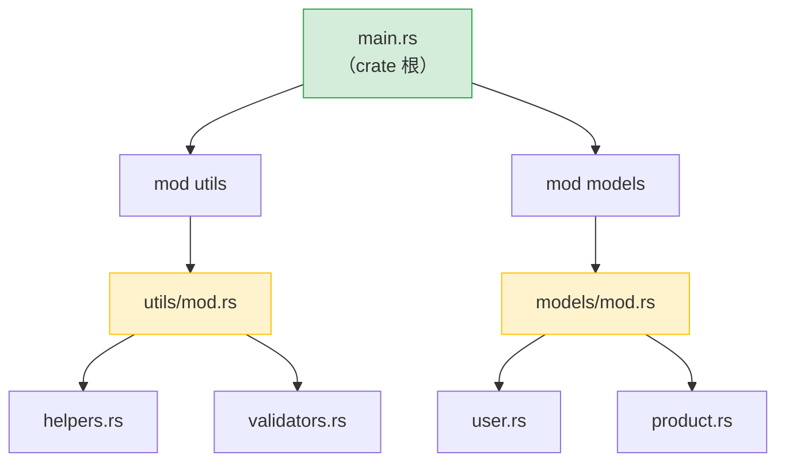

## Rust 模块 vs Python 包

> **你将学到：** `mod` 和 `use` 与 Python `import` 的对比、可见性（`pub`）与 Python 基于约定的隐私、
> Cargo.toml 与 pyproject.toml、crates.io 与 PyPI，以及工作区与单仓库。
>
> **难度：** 🟢 初学者

### Python 模块系统

```python
# Python — 文件是模块，带 __init__.py 的目录是包

# myproject/
# ├── __init__.py          # 使其成为包
# ├── main.py
# ├── utils/
# │   ├── __init__.py      # 使 utils 成为子包
# │   ├── helpers.py
# │   └── validators.py
# └── models/
# │   ├── __init__.py
# │   ├── user.py
# │   └── product.py

# 导入：
from myproject.utils.helpers import format_name
from myproject.models.user import User
import myproject.utils.validators as validators
```

### Rust 模块系统

```rust
// Rust — mod 声明创建模块树，文件提供内容

// src/
// ├── main.rs             # Crate 根 — 声明模块
// ├── utils/
// │   ├── mod.rs           # 模块声明（类似 __init__.py）
// │   ├── helpers.rs
// │   └── validators.rs
// └── models/
//     ├── mod.rs
//     ├── user.rs
//     └── product.rs

// 在 src/main.rs 中：
mod utils;       // 告诉 Rust 去查找 src/utils/mod.rs
mod models;      // 告诉 Rust 去查找 src/models/mod.rs

use utils::helpers::format_name;
use models::user::User;

// 在 src/utils/mod.rs 中：
pub mod helpers;      // 声明并重新导出 helpers.rs
pub mod validators;   // 声明并重新导出 validators.rs
```



> **Python 等价**：把 `mod.rs` 想象成 `__init__.py` — 它声明模块导出什么。
> crate 根（`main.rs` / `lib.rs`）就像你的顶层包的 `__init__.py`。

### 关键差异

| 概念 | Python | Rust |
|------|--------|------|
| 模块 = 文件 | ✅ 自动 | 必须用 `mod` 声明 |
| 包 = 目录 | `__init__.py` | `mod.rs` + `mod` 声明 |
| 默认公开 | ✅ 一切 | ❌ 默认私有 |
| 设为公开 | `_前缀` 约定 | `pub` 关键字 |
| 导入语法 | `from x import y` | `use x::y;` |
| 通配符导入 | `from x import *` | `use x::*;`（不鼓励） |
| 相对导入 | `from . import sibling` | `use super::sibling;` |
| 重新导出 | `__all__` 或显式 | `pub use inner::Thing;` |

### 可见性 — 默认私有

```python
# Python — "我们都是成年人"的约定
class User:
    def __init__(self):
        self.name = "Alice"       # 公开（按约定）
        self._age = 30            # "私有"（约定：单下划线）
        self.__secret = "shhh"    # 名称修饰（不是真正私有）

# 没有什么能阻止你访问 _age 或甚至 __secret
print(user._age)                  # 可以工作
print(user._User__secret)         # 也可以（名称修饰）
```

```rust
// Rust — 私有性由编译器强制检查
pub struct User {
    pub name: String,      // 公开 — 任何人都可以访问
    age: i32,              // 私有 — 只有本模块可以访问
}

impl User {
    pub fn new(name: &str, age: i32) -> Self {
        User { name: name.to_string(), age }
    }

    pub fn age(&self) -> i32 {   // 公开的 getter 方法
        self.age
    }

    fn validate(&self) -> bool { // 私有方法
        self.age > 0
    }
}

// 在模块外：
let user = User::new("Alice", 30);
println!("{}", user.name);        // ✅ 公开
// println!("{}", user.age);      // ❌ 编译错误：字段私有
println!("{}", user.age());       // ✅ 公开方法（getter）
```

***

## Crate vs PyPI 包

### Python 包（PyPI）

```bash
# Python
pip install requests           # 从 PyPI 安装
pip install "requests>=2.28"   # 版本约束
pip freeze > requirements.txt  # 锁定版本
pip install -r requirements.txt # 复现环境
```

### Rust Crate（crates.io）

```bash
# Rust
cargo add reqwest              # 从 crates.io 安装（添加到 Cargo.toml）
cargo add reqwest@0.12         # 版本约束
# Cargo.lock 是自动生成的 — 无需手动管理
cargo build                    # 下载并编译依赖
```

### Cargo.toml vs pyproject.toml

```toml
# Rust — Cargo.toml
[package]
name = "my-project"
version = "0.1.0"
edition = "2021"

[dependencies]
serde = { version = "1.0", features = ["derive"] }  # 带特性标志
reqwest = { version = "0.12", features = ["json"] }
tokio = { version = "1", features = ["full"] }
log = "0.4"

[dev-dependencies]
mockall = "0.13"
```

### Python 开发者必知 Crate

| Python 库 | Rust Crate | 用途 |
|----------|-----------|------|
| `requests` | `reqwest` | HTTP 客户端 |
| `json`（标准库） | `serde_json` | JSON 解析 |
| `pydantic` | `serde` | 序列化/验证 |
| `pathlib` | `std::path`（标准库） | 路径处理 |
| `os` / `shutil` | `std::fs`（标准库） | 文件操作 |
| `re` | `regex` | 正则表达式 |
| `logging` | `tracing` / `log` | 日志 |
| `click` / `argparse` | `clap` | CLI 参数解析 |
| `asyncio` | `tokio` | 异步运行时 |
| `datetime` | `chrono` | 日期时间 |
| `pytest` | 内置 + `rstest` | 测试 |
| `dataclasses` | `#[derive(...)]` | 数据结构 |
| `typing.Protocol` | Traits | 结构类型 |
| `subprocess` | `std::process`（标准库） | 运行外部命令 |
| `sqlite3` | `rusqlite` | SQLite |
| `sqlalchemy` | `diesel` / `sqlx` | ORM / SQL 工具包 |
| `fastapi` | `axum` / `actix-web` | Web 框架 |

***

## 工作区 vs 单仓库

### Python 单仓库（典型）

```text
# Python 单仓库（各种方法，无标准）
myproject/
├── pyproject.toml           # 根项目
├── packages/
│   ├── core/
│   │   ├── pyproject.toml   # 每个包有自己的配置
│   │   └── src/core/...
│   ├── api/
│   │   ├── pyproject.toml
│   │   └── src/api/...
│   └── cli/
│       ├── pyproject.toml
│       └── src/cli/...
# 工具：poetry workspaces、pip -e .、uv workspaces — 无标准
```

### Rust 工作区

```toml
# Rust — 根目录 Cargo.toml
[workspace]
members = [
    "core",
    "api",
    "cli",
]

# 跨工作区共享依赖
[workspace.dependencies]
serde = { version = "1.0", features = ["derive"] }
tokio = { version = "1", features = ["full"] }
```

```text
# Rust 工作区结构 — 标准化，Cargo 内置支持
myproject/
├── Cargo.toml               # 工作区根
├── Cargo.lock               # 所有 crate 共享一个锁定文件
├── core/
│   ├── Cargo.toml           # [dependencies] serde.workspace = true
│   └── src/lib.rs
├── api/
│   ├── Cargo.toml
│   └── src/lib.rs
└── cli/
    ├── Cargo.toml
    └── src/main.rs
```

```bash
# 工作区命令
cargo build                  # 构建所有
cargo test                   # 测试所有
cargo build -p core          # 只构建 core crate
cargo test -p api            # 只测试 api crate
cargo clippy --all           # lint 所有
```

> **关键要点**：Rust 工作区是一等公民，由 Cargo 内置支持。Python 单仓库需要第三方工具
> （poetry、uv、pants），支持程度不一。在 Rust 工作区中，所有 crate 共享单个
> `Cargo.lock`，确保整个项目的依赖版本一致。

---

## 练习

<details>
<summary><strong>🏋️ 练习：模块可见性</strong>（点击展开）</summary>

**挑战**：给定以下模块结构，预测哪些行可以编译，哪些不能：

```rust
mod kitchen {
    fn secret_recipe() -> &'static str { "42 spices" }
    pub fn menu() -> &'static str { "Today's special" }

    pub mod staff {
        pub fn cook() -> String {
            format!("Cooking with {}", super::secret_recipe())
        }
    }
}

fn main() {
    println!("{}", kitchen::menu());             // Line A
    println!("{}", kitchen::secret_recipe());     // Line B
    println!("{}", kitchen::staff::cook());       // Line C
}
```

<details>
<summary>🔑 解答</summary>

- **Line A**: ✅ 编译 — `menu()` 是 `pub`
- **Line B**: ❌ 编译错误 — `secret_recipe()` 对 `kitchen` 外私有
- **Line C**: ✅ 编译 — `staff::cook()` 是 `pub`，且 `cook()` 可以通过 `super::` 访问 `secret_recipe()`（子模块可以访问父模块的私有项）

**核心要点**：在 Rust 中，子模块可以访问父模块的私有项（类似 Python 的 `_private` 约定，但由编译器强制）。
模块外部则不能。这与 Python 相反，Python 中 `_private` 只是一个约定提示。

</details>
</details>

***
