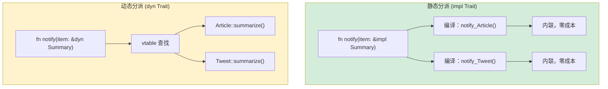

## Traits vs 鸭子类型

> **你将学到：** trait 作为显式契约（对比 Python 鸭子类型）、`Protocol` (PEP 544) ≈ trait、
> 使用 `where` 子句的泛型约束、trait 对象 (`dyn Trait`) vs 静态分派，以及常见的 std trait。
>
> **难度：** 🟡 中级

这里是 Rust 类型系统真正让 Python 开发者眼前一亮的地方。Python 的"鸭子类型"说：
"如果它走起来像鸭子、叫起来像鸭子，那它就是鸭子。"Rust 的 trait 说：
"我会在编译时明确告诉你，我需要鸭子具备哪些行为。"

### Python 鸭子类型

```python
# Python — 鸭子类型：任何有正确方法的都能工作
def total_area(shapes):
    """适用于任何有 .area() 方法的对象。"""
    return sum(shape.area() for shape in shapes)

class Circle:
    def __init__(self, radius): self.radius = radius
    def area(self): return 3.14159 * self.radius ** 2

class Rectangle:
    def __init__(self, w, h): self.w, self.h = w, h
    def area(self): return self.w * self.h

# 运行时工作 —— 不需要继承！
shapes = [Circle(5), Rectangle(3, 4)]
print(total_area(shapes))  # 90.54

# 但如果某个对象没有 .area() 会怎样？
class Dog:
    def bark(self): return "Woof!"

total_area([Dog()])  # 💥 AttributeError: 'Dog' has no attribute 'area'
# 错误发生在运行时，而不是定义时
```

### Rust Trait —— 显式的鸭子类型

```rust
// Rust — trait 让"鸭子"契约变得明确
trait HasArea {
    fn area(&self) -> f64;  // 任何实现此 trait 的类型都有 .area()
}

struct Circle { radius: f64 }
struct Rectangle { width: f64, height: f64 }

impl HasArea for Circle {
    fn area(&self) -> f64 {
        std::f64::consts::PI * self.radius * self.radius
    }
}

impl HasArea for Rectangle {
    fn area(&self) -> f64 {
        self.width * self.height
    }
}

// trait 约束是显式的 —— 编译器在编译时检查
fn total_area(shapes: &[&dyn HasArea]) -> f64 {
    shapes.iter().map(|s| s.area()).sum()
}

// 使用：
let shapes: Vec<&dyn HasArea> = vec![&Circle { radius: 5.0 }, &Rectangle { width: 3.0, height: 4.0 }];
println!("{}", total_area(&shapes));  // 90.54

// struct Dog;
// total_area(&[&Dog {}]);  // ❌ 编译错误：Dog 没有实现 HasArea
```

> **核心洞察**：Python 的鸭子类型将错误推迟到运行时。Rust 的 trait 在编译时就能捕获它们。
> 同样的灵活性，但错误检测更早。

***

## Protocol (PEP 544) vs Trait

Python 3.8 引入了 `Protocol` (PEP 544) 用于结构子类型 —— 这是最接近 Rust trait 的 Python 概念。

### Python Protocol

```python
# Python — Protocol（结构类型，类似 Rust trait）
from typing import Protocol, runtime_checkable

@runtime_checkable
class Printable(Protocol):
    def to_string(self) -> str: ...

class User:
    def __init__(self, name: str):
        self.name = name
    def to_string(self) -> str:
        return f"User({self.name})"

class Product:
    def __init__(self, name: str, price: float):
        self.name = name
        self.price = price
    def to_string(self) -> str:
        return f"Product({self.name}, ${self.price:.2f})"

def print_all(items: list[Printable]) -> None:
    for item in items:
        print(item.to_string())

# 工作，因为 User 和 Product 都有 to_string()
print_all([User("Alice"), Product("Widget", 9.99)])

# 但是：mypy 会检查，Python 运行时不强制
# print_all([42])  # mypy 警告，但 Python 运行它并崩溃
```

### Rust Trait（等价，但强制执行！）

```rust
// Rust — trait 在编译时强制执行
trait Printable {
    fn to_string(&self) -> String;
}

struct User { name: String }
struct Product { name: String, price: f64 }

impl Printable for User {
    fn to_string(&self) -> String {
        format!("User({})", self.name)
    }
}

impl Printable for Product {
    fn to_string(&self) -> String {
        format!("Product({}, ${:.2})", self.name, self.price)
    }
}

fn print_all(items: &[&dyn Printable]) {
    for item in items {
        println!("{}", item.to_string());
    }
}

// print_all(&[&42i32]);  // ❌ 编译错误：i32 没有实现 Printable
```

### 对比表

| 特性 | Python Protocol | Rust Trait |
|------|-----------------|------------|
| 结构类型 | ✅（隐式） | ❌（显式 `impl`） |
| 检查时机 | 运行时（或 mypy） | 编译时（始终） |
| 默认实现 | ❌ | ✅ |
| 可以给外部类型添加 | ❌ | ✅（有限制） |
| 多个 protocol | ✅ | ✅（多个 trait） |
| 关联类型 | ❌ | ✅ |
| 泛型约束 | ✅（使用 `TypeVar`） | ✅（trait 约束） |

***

## 泛型约束

### Python 泛型

```python
# Python — TypeVar 用于泛型函数
from typing import TypeVar, Sequence

T = TypeVar('T')

def first(items: Sequence[T]) -> T | None:
    return items[0] if items else None

# 有边界的 TypeVar
from typing import SupportsFloat
T = TypeVar('T', bound=SupportsFloat)

def average(items: Sequence[T]) -> float:
    return sum(float(x) for x in items) / len(items)
```

### Rust 带 Trait 约束的泛型

```rust
// Rust — 带 trait 约束的泛型
fn first<T>(items: &[T]) -> Option<&T> {
    items.first()
}

// 带 trait 约束 —— "T 必须实现这些 trait"
fn average<T>(items: &[T]) -> f64
where
    T: Into<f64> + Copy,  // T 必须能转为 f64 且可复制
{
    let sum: f64 = items.iter().map(|&x| x.into()).sum();
    sum / items.len() as f64
}

// 多重约束 —— "T 必须实现 Display AND Debug AND Clone"
fn log_and_clone<T: std::fmt::Display + std::fmt::Debug + Clone>(item: &T) -> T {
    println!("Display: {}", item);
    println!("Debug: {:?}", item);
    item.clone()
}

// 简写形式 impl Trait（用于简单情况）
fn print_it(item: &impl std::fmt::Display) {
    println!("{}", item);
}
```

### 泛型快速参考

| Python | Rust | 说明 |
|--------|------|------|
| `TypeVar('T')` | `<T>` | 无边界泛型 |
| `TypeVar('T', bound=X)` | `<T: X>` | 有边界泛型 |
| `Union[int, str]` | `enum` 或 trait 对象 | Rust 没有 union 类型 |
| `Sequence[T]` | `&[T]`（slice） | 借用序列 |
| `Callable[[A], R]` | `Fn(A) -> R` | 函数 trait |
| `Optional[T]` | `Option<T>` | 内置于语言 |

***

## 常见标准库 Trait

这些是 Rust 版本的 Python "dunder 方法"（魔术方法）—— 它们定义类型在常见操作下的行为。

### Display 和 Debug（打印）

```rust
use std::fmt;

// Debug —— 类似 __repr__（可自动推导）
#[derive(Debug)]
struct Point { x: f64, y: f64 }
// 现在可以：println!("{:?}", point);

// Display —— 类似 __str__（必须手动实现）
impl fmt::Display for Point {
    fn fmt(&self, f: &mut fmt::Formatter<'_>) -> fmt::Result {
        write!(f, "({}, {})", self.x, self.y)
    }
}
// 现在可以：println!("{}", point);
```

### 比较 Trait

```rust
// PartialEq —— 类似 __eq__
// Eq —— 完全等价（f64 是 PartialEq 但不是 Eq，因为 NaN != NaN）
// PartialOrd —— 类似 __lt__、__le__ 等
// Ord —— 完全排序

#[derive(Debug, PartialEq, Eq, PartialOrd, Ord, Hash, Clone)]
struct Student {
    name: String,
    grade: i32,
}

// 现在 students 可以：比较、排序、用作 HashMap 键、克隆
let mut students = vec![
    Student { name: "Charlie".into(), grade: 85 },
    Student { name: "Alice".into(), grade: 92 },
];
students.sort();  // 使用 Ord —— 按姓名然后成绩排序（结构体字段顺序）
```

### Iterator Trait

```rust
// 实现 Iterator —— 类似 Python 的 __iter__/__next__
struct Countdown { value: i32 }

impl Iterator for Countdown {
    type Item = i32;  // 迭代器产生的类型

    fn next(&mut self) -> Option<Self::Item> {
        if self.value > 0 {
            self.value -= 1;
            Some(self.value + 1)
        } else {
            None  // 迭代完成
        }
    }
}

// 使用：
for n in (Countdown { value: 5 }) {
    println!("{n}");  // 5, 4, 3, 2, 1
}
```

### 常见 Trait 一览

| Rust Trait | Python 等价 | 用途 |
|-----------|-------------|------|
| `Display` | `__str__` | 人类可读字符串 |
| `Debug` | `__repr__` | 调试字符串（可推导） |
| `Clone` | `copy.deepcopy` | 深拷贝 |
| `Copy` | （int/float 自动复制） | 简单类型的隐式复制 |
| `PartialEq` / `Eq` | `__eq__` | 相等性比较 |
| `PartialOrd` / `Ord` | `__lt__` 等 | 排序 |
| `Hash` | `__hash__` | 可哈希（用于 dict 键） |
| `Default` | 默认 `__init__` | 默认值 |
| `From` / `Into` | `__init__` 重载 | 类型转换 |
| `Iterator` | `__iter__` / `__next__` | 迭代 |
| `Drop` | `__del__` / `__exit__` | 清理 |
| `Add`, `Sub`, `Mul` | `__add__`, `__sub__`, `__mul__` | 运算符重载 |
| `Index` | `__getitem__` | 使用 `[]` 索引 |
| `Deref` | （无等价） | 智能指针解引用 |
| `Send` / `Sync` | （无等价） | 线程安全标记 |



> **Python 等价**：Python *总是*使用动态分派（运行时 `getattr`）。Rust 默认使用静态分派（单态化 —— 编译器为每个具体类型生成专用代码）。只有当你需要运行时多态时才使用 `dyn Trait`。
>
> 📌 **另见**：[第 11 章 — From/Into Trait](ch11-from-and-into-traits.md) 深入讲解转换 trait（`From`、`Into`、`TryFrom`）。

### 关联类型

Rust trait 可以定义*关联类型* —— 这是每个实现者需要填充的类型占位符。Python 没有等价概念：

```rust
// Iterator 定义了一个关联类型 'Item'
trait Iterator {
    type Item;
    fn next(&mut self) -> Option<Self::Item>;
}

struct Countdown { remaining: u32 }

impl Iterator for Countdown {
    type Item = u32;  // 这个迭代器产生 u32 值
    fn next(&mut self) -> Option<u32> {
        if self.remaining > 0 {
            self.remaining -= 1;
            Some(self.remaining)
        } else {
            None
        }
    }
}
```

在 Python 中，`__iter__` / `__next__` 返回 `Any` —— 没有办法声明"这个迭代器产生 `int`"并强制执行（即使使用 `Iterator[int]` 的类型提示也只是建议性的）。

### 运算符重载：`__add__` → `impl Add`

Python 使用魔术方法（`__add__`、`__mul__`）。Rust 使用 trait 实现 —— 思路相同，但 Rust 在编译时进行类型检查：

```python
# Python
class Vec2:
    def __init__(self, x, y):
        self.x, self.y = x, y
    def __add__(self, other):
        return Vec2(self.x + other.x, self.y + other.y)  # 'other' 上没有类型检查
```

```rust
use std::ops::Add;

#[derive(Debug, Clone, Copy)]
struct Vec2 { x: f64, y: f64 }

impl Add for Vec2 {
    type Output = Vec2;  // 关联类型：+ 返回什么？
    fn add(self, rhs: Vec2) -> Vec2 {
        Vec2 { x: self.x + rhs.x, y: self.y + rhs.y }
    }
}

let a = Vec2 { x: 1.0, y: 2.0 };
let b = Vec2 { x: 3.0, y: 4.0 };
let c = a + b;  // 类型安全：只允许 Vec2 + Vec2
```

关键区别：Python 的 `__add__` 在运行时接受*任何* `other`（你需要手动检查类型，否则会得到 `TypeError`）。Rust 的 `Add` trait 在编译时强制检查操作数类型 —— `Vec2 + i32` 是编译错误，除非你显式地 `impl Add<i32> for Vec2`。

---

## 练习

<details>
<summary><strong>🏋️ 练习：泛型 Summary Trait</strong>（点击展开）</summary>

**挑战**：定义 trait `Summary`，带方法 `fn summarize(&self) -> String`。为两个结构体实现它：
`Article { title: String, body: String }` 和 `Tweet { username: String, content: String }`。
然后编写函数 `fn notify(item: &impl Summary)` 打印摘要。

<details>
<summary>🔑 解答</summary>

```rust
trait Summary {
    fn summarize(&self) -> String;
}

struct Article { title: String, body: String }
struct Tweet { username: String, content: String }

impl Summary for Article {
    fn summarize(&self) -> String {
        format!("{} — {}...", self.title, &self.body[..20.min(self.body.len())])
    }
}

impl Summary for Tweet {
    fn summarize(&self) -> String {
        format!("@{}: {}", self.username, self.content)
    }
}

fn notify(item: &impl Summary) {
    println!("📢 {}", item.summarize());
}

fn main() {
    let article = Article {
        title: "Rust is great".into(),
        body: "Here is why Rust beats Python for systems...".into(),
    };
    let tweet = Tweet {
        username: "rustacean".into(),
        content: "Just shipped my first crate!".into(),
    };
    notify(&article);
    notify(&tweet);
}
```

**核心要点**：`&impl Summary` 是 Python 的 `Protocol`（带 `summarize` 方法）的 Rust 等价物。
但 Rust 在编译时检查 —— 传递没有实现 `Summary` 的类型会导致编译错误，而不是运行时的 `AttributeError`。

</details>
</details>

***
