## 无 GIL：真正的并行

> **你将学到：** 为什么 GIL 限制 Python 并发、Rust 的 `Send`/`Sync` trait 用于编译时线程安全、
> `Arc<Mutex<T>>` 与 Python `threading.Lock` 的对比、channel 与 `queue.Queue` 的对比，以及 async/await 的差异。
>
> **难度：** 🔴 高级

GIL（全局解释器锁）是 Python CPU 密集型工作的最大瓶颈。
Rust 没有 GIL —— 线程真正并行运行，类型系统会在编译时防止数据竞争。

```mermaid
gantt
    title CPU-bound Work: Python GIL vs Rust Threads
    dateFormat X
    axisFormat %s
    section Python (GIL)
        Thread 1 :a1, 0, 4
        Thread 2 :a2, 4, 8
        Thread 3 :a3, 8, 12
        Thread 4 :a4, 12, 16
    section Rust (no GIL)
        Thread 1 :b1, 0, 4
        Thread 2 :b2, 0, 4
        Thread 3 :b3, 0, 4
        Thread 4 :b4, 0, 4
```



> **核心洞察**：Python 线程对 CPU 密集型工作是顺序运行的（GIL 将它们序列化）。Rust 线程真正并行 —— 4 个线程 ≈ 4 倍加速。
>
> 📌 **前提**：在开始本章之前，确保你熟悉 [第 7 章 —— 所有权与借用](ch07-ownership-and-borrowing.md)。`Arc`、`Mutex` 和 `move` 闭包都建立在所有权概念之上。

### Python 的 GIL 问题

```python
# Python —— 线程对 CPU 密集型工作没有帮助
import threading
import time

counter = 0

def increment(n):
    global counter
    for _ in range(n):
        counter += 1  # 不是线程安全的！但 GIL"保护"了简单操作

threads = [threading.Thread(target=increment, args=(1_000_000,)) for _ in range(4)]
start = time.perf_counter()
for t in threads:
    t.start()
for t in threads:
    t.join()
elapsed = time.perf_counter() - start

print(f"Counter: {counter}")    # 可能不是 4,000,000！
print(f"Time: {elapsed:.2f}s")  # 和单线程差不多（GIL）

# 对于真正的并行，Python 需要使用多进程：
from multiprocessing import Pool
with Pool(4) as pool:
    results = pool.map(cpu_work, data)  # 分离进程，pickle 开销
```

### Rust —— 真正的并行，编译时安全

```rust
use std::sync::atomic::{AtomicI64, Ordering};
use std::sync::Arc;
use std::thread;

fn main() {
    let counter = Arc::new(AtomicI64::new(0));

    let handles: Vec<_> = (0..4).map(|_| {
        let counter = Arc::clone(&counter);
        thread::spawn(move || {
            for _ in 0..1_000_000 {
                counter.fetch_add(1, Ordering::Relaxed);
            }
        })
    }).collect();

    for h in handles {
        h.join().unwrap();
    }

    println!("Counter: {}", counter.load(Ordering::Relaxed)); // 总是 4,000,000
    // 在ALL核心上运行 —— 真正并行，无 GIL
}
```

***

## 线程安全：类型系统保证

### Python —— 运行时错误

```python
# Python —— 数据竞争在运行时被发现（或根本不被发现）
import threading

shared_list = []

def append_items(items):
    for item in items:
        shared_list.append(item)  # 由于 GIL，`append` 是"线程安全"的
        # 但复杂操作不安全：
        # if item not in shared_list:
        #     shared_list.append(item)  # 存在竞争条件！

# 使用 Lock 保证安全：
lock = threading.Lock()
def safe_append(items):
    for item in items:
        with lock:
            if item not in shared_list:
                shared_list.append(item)
# 忘记锁？没有编译器警告。bug 会在生产环境中被发现。
```

### Rust —— 编译时错误

```rust
use std::sync::{Arc, Mutex};
use std::thread;

fn main() {
    // 尝试在没有保护的情况下跨线程共享 Vec：
    // let shared = vec![];
    // thread::spawn(move || shared.push(1));
    // ❌ 编译错误：Vec 在没有保护的情况下不是 `Send`/`Sync`

    // 使用 `Mutex`（Rust 的 `threading.Lock` 等价物）：
    let shared = Arc::new(Mutex::new(Vec::new()));

    let handles: Vec<_> = (0..4).map(|i| {
        let shared = Arc::clone(&shared);
        thread::spawn(move || {
            let mut data = shared.lock().unwrap(); // 访问需要锁
            data.push(i);
            // 当 `data` 超出作用域时锁自动释放
            // 不会"忘记解锁" —— RAII 机制保证
        })
    }).collect();

    for h in handles {
        h.join().unwrap();
    }

    println!("{:?}", shared.lock().unwrap()); // [0, 1, 2, 3]（顺序可能不同）
}
```

### Send 和 Sync Trait

```rust
// Rust 使用两个标记 trait 来强制执行线程安全：

// `Send` —— "这个类型可以转移到另一个线程"
// 大多数类型是 `Send`。`Rc<T>` 不是（多线程使用 `Arc<T>`）。

// `Sync` —— "这个类型可以从多个线程引用"
// 大多数类型是 `Sync`。`Cell<T>`/`RefCell<T>` 不是（使用 `Mutex<T>`）。

// 编译器自动检查这些：
// thread::spawn(move || { ... })
//   ↑ 闭包捕获的变量必须是 `Send`
//   ↑ 共享引用必须是 `Sync`
//   ↑ 如果不是 → 编译错误

// Python 没有等价物。线程安全 bug 在运行时才会被发现。
// Rust 在编译时捕获它们。这就是"无畏并发"。
```

### 并发原语对比

| Python | Rust | 用途 |
|--------|------|------|
| `threading.Lock()` | `Mutex<T>` | 互斥锁 |
| `threading.RLock()` | `Mutex<T>`（不可重入） | 重入锁（使用方式不同） |
| `threading.RWLock`（无） | `RwLock<T>` | 多读或一写 |
| `threading.Event()` | `Condvar` | 条件变量 |
| `queue.Queue()` | `mpsc::channel()` | 线程安全 channel |
| `multiprocessing.Pool` | `rayon::ThreadPool` | 线程池 |
| `concurrent.futures` | `rayon` / `tokio::spawn` | 基于任务的并行 |
| `threading.local()` | `thread_local!` | 线程本地存储 |
| 无 | `Atomic*` 类型 | 无锁计数器和标志 |

### Mutex 中毒

如果线程在持有 `Mutex` 时 **panic**，锁会变成*中毒*状态。Python 没有等价物 —— 如果线程在持有 `threading.Lock()` 时崩溃，锁会卡住导致死锁。

```rust
use std::sync::{Arc, Mutex};
use std::thread;

let data = Arc::new(Mutex::new(vec![1, 2, 3]));
let data2 = Arc::clone(&data);

let _ = thread::spawn(move || {
    let mut guard = data2.lock().unwrap();
    guard.push(4);
    panic!("oops!");  // 锁现在中毒了
}).join();

// 后续锁尝试返回 Err(PoisonError)
match data.lock() {
    Ok(guard) => println!("Data: {guard:?}"),
    Err(poisoned) => {
        println!("Lock was poisoned! Recovering...");
        let guard = poisoned.into_inner();
        println!("Recovered: {guard:?}");  // [1, 2, 3, 4]
    }
}
```

### 原子序数（简要说明）

原子操作上的 `Ordering` 参数控制内存可见性保证：

| Ordering | 何时使用 |
|----------|----------|
| `Relaxed` | 简单计数器，顺序不重要 |
| `Acquire`/`Release` | 生产者 - 消费者：写者用 `Release`，读者用 `Acquire` |
| `SeqCst` | 不确定时 —— 最严格的排序，最直观 |

Python 的 `threading` 模块将这些问题隐藏在 GIL 后面。在 Rust 中，你需要显式选择 —— 建议使用 `SeqCst` 直到性能分析显示你需要更弱的排序。

***

## async/await 对比

Python 和 Rust 都有 `async`/`await` 语法，但它们在底层的工作方式非常不同。

### Python async/await

```python
# Python —— asyncio 用于并发 I/O
import asyncio
import aiohttp

async def fetch_url(session, url):
    async with session.get(url) as resp:
        return await resp.text()

async def main():
    urls = ["https://example.com", "https://httpbin.org/get"]

    async with aiohttp.ClientSession() as session:
        tasks = [fetch_url(session, url) for url in urls]
        results = await asyncio.gather(*tasks)

    for url, result in zip(urls, results):
        print(f"{url}: {len(result)} bytes")

asyncio.run(main())

# Python async 是单线程的（仍然受 GIL 限制）！
# 它只对 I/O 密集型工作有帮助（等待网络/磁盘）。
# async 中的 CPU 密集型工作仍然会阻塞事件循环。
```

### Rust async/await

```rust
// Rust —— tokio 用于并发 I/O（也支持 CPU 并行！）
use reqwest;
use tokio;
use futures::future::join_all;  // 添加 `futures` 到 Cargo.toml

async fn fetch_url(url: &str) -> Result<String, reqwest::Error> {
    reqwest::get(url).await?.text().await
}

#[tokio::main]
async fn main() -> Result<(), Box<dyn std::error::Error>> {
    let urls = vec!["https://example.com", "https://httpbin.org/get"];

    let tasks: Vec<_> = urls.iter()
        .map(|url| tokio::spawn(fetch_url(url)))  // 无 GIL 限制
        .collect();                                 // 可以使用所有 CPU 核心

    let results = futures::future::join_all(tasks).await;

    for (url, result) in urls.iter().zip(results) {
        match result {
            Ok(Ok(body)) => println!("{url}: {} bytes", body.len()),
            Ok(Err(e)) => println!("{url}: error {e}"),
            Err(e) => println!("{url}: task failed {e}"),
        }
    }

    Ok(())
}
```

### 关键差异

| 方面 | Python asyncio | Rust tokio |
|------|---------------|------------|
| GIL | 仍然受限 | 无 GIL |
| CPU 并行 | ❌ 单线程 | ✅ 多线程 |
| 运行时 | 内置 (asyncio) | 外部 crate (tokio) |
| 生态 | aiohttp, asyncpg 等 | reqwest, sqlx 等 |
| 性能 | I/O 良好 | I/O 和 CPU 都优秀 |
| 错误处理 | 异常 | `Result<T, E>` |
| 取消 | `task.cancel()` | Drop future |
| 颜色问题 | 同步 ↔ 异步边界 | 存在相同问题 |

### 使用 Rayon 的简单并行

```python
# Python —— 使用多进程实现 CPU 并行
from multiprocessing import Pool

def process_item(item):
    return heavy_computation(item)

with Pool(8) as pool:
    results = pool.map(process_item, items)
```

```rust
// Rust —— rayon 用于轻松的 CPU 并行（只需改一行！）
use rayon::prelude::*;

// 顺序：
let results: Vec<_> = items.iter().map(|item| heavy_computation(item)).collect();

// 并行（将 .iter() 改为 .par_iter() —— 仅此而已！）：
let results: Vec<_> = items.par_iter().map(|item| heavy_computation(item)).collect();

// 无 pickle，无进程开销，无序列化。
// Rayon 自动跨核心分配工作。
```

---

## 💼 案例研究：并行图像处理管道

一个数据科学团队每晚处理 50,000 张卫星图像。他们的 Python 管道使用 `multiprocessing.Pool`：

```python
# Python —— 多进程用于 CPU 密集型图像工作
import multiprocessing
from PIL import Image
import numpy as np

def process_image(path: str) -> dict:
    img = np.array(Image.open(path))
    # CPU 密集型：直方图均衡化、边缘检测、分类
    histogram = np.histogram(img, bins=256)[0]
    edges = detect_edges(img)       # 每张图片 ~200ms
    label = classify(edges)          # 每张图片 ~100ms
    return {"path": path, "label": label, "edge_count": len(edges)}

# 问题：每个子进程复制完整的 Python 解释器
# 内存：每个 worker 50MB × 16 个 worker = 800MB 开销
# 启动：fork 和 pickle 参数需要 2-3 秒
with multiprocessing.Pool(16) as pool:
    results = pool.map(process_image, image_paths)  # 50k 张图像 ~4.5 小时
```

**痛点**：fork 导致 800MB 内存开销、参数和结果的 pickle 序列化、GIL 阻止使用线程、错误处理不透明（worker 中的异常难以调试）。

```rust
use rayon::prelude::*;
use image::GenericImageView;

struct ImageResult {
    path: String,
    label: String,
    edge_count: usize,
}

fn process_image(path: &str) -> Result<ImageResult, image::ImageError> {
    let img = image::open(path)?;
    // 应用特定函数（为你的用例实现）
    let histogram = compute_histogram(&img);       // ~50ms（无 numpy 开销）
    let edges = detect_edges(&img);                // ~40ms（SIMD 优化）
    let label = classify(&edges);                  // ~20ms
    Ok(ImageResult {
        path: path.to_string(),
        label,
        edge_count: edges.len(),
    })
}

fn main() -> Result<(), Box<dyn std::error::Error>> {
    let paths: Vec<String> = load_image_paths()?;

    // Rayon 自动使用所有 CPU 核心 —— 无 fork、无 pickle、无 GIL
    let results: Vec<ImageResult> = paths
        .par_iter()                                // 并行迭代器
        .filter_map(|p| process_image(p).ok())     // 优雅地跳过错误
        .collect();                                // 并行收集

    println!("Processed {} images", results.len());
    Ok(())
}
// 50k 张图像 ~35 分钟（对比 Python 的 4.5 小时）
// 内存：~50MB 总计（共享线程，无 fork）
```

**结果**：
| 指标 | Python (multiprocessing) | Rust (rayon) |
|------|------------------------|--------------|
| 时间（50k 张图像） | ~4.5 小时 | ~35 分钟 |
| 内存开销 | 800MB（16 个 worker） | ~50MB（共享线程） |
| 错误处理 | 不透明的 pickle 错误 | 每步都有 `Result<T, E>` |
| 启动成本 | 2–3 秒（fork + pickle） | 无（线程） |

> **核心教训**：对于 CPU 密集型并行工作，Rust 的线程 + rayon 可替代 Python 的 `multiprocessing`，零序列化开销、共享内存和编译时安全。

---

## 练习

<details>
<summary><strong>🏋️ 练习：线程安全计数器</strong>（点击展开）</summary>

**挑战**：在 Python 中，你可能使用 `threading.Lock` 保护共享计数器。将其转换为 Rust：生成 10 个线程，每个线程递增共享计数器 1000 次。打印最终值（应该是 10000）。使用 `Arc<Mutex<u64>>`。

<details>
<summary>🔑 解答</summary>

```rust
use std::sync::{Arc, Mutex};
use std::thread;

fn main() {
    let counter = Arc::new(Mutex::new(0u64));
    let mut handles = vec![];

    for _ in 0..10 {
        let counter = Arc::clone(&counter);
        handles.push(thread::spawn(move || {
            for _ in 0..1000 {
                let mut num = counter.lock().unwrap();
                *num += 1;
            }
        }));
    }

    for handle in handles {
        handle.join().unwrap();
    }

    println!("Final count: {}", *counter.lock().unwrap());
}
```

**核心要点**：`Arc<Mutex<T>>` 是 Python 的 `lock = threading.Lock()` + 共享变量的 Rust 等价物 —— 但如果你忘记 `Arc` 或 `Mutex`，Rust *不会编译*。Python  happily 运行有竞争的program并默默给你错误答案。

</details>
</details>

***
