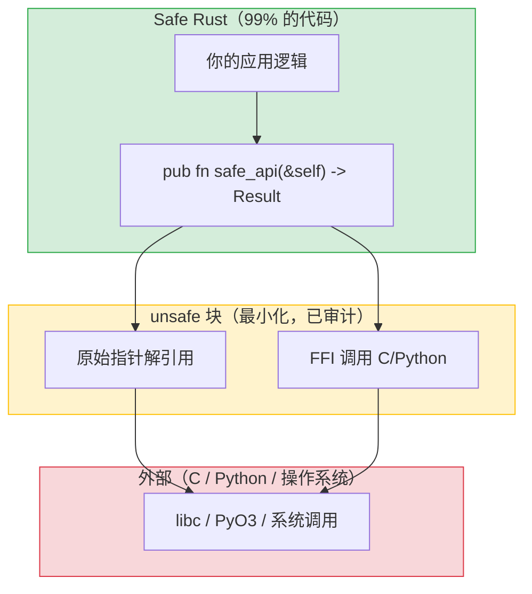

## 何时以及为何使用 Unsafe

> **你将学到：** `unsafe` 允许什么以及为什么存在、使用 PyO3 编写 Python 扩展（对 Python 开发者的杀手级特性）、
> Rust 的测试框架与 pytest 的对比、使用 mockall 进行 mocking，以及基准测试。
>
> **难度：** 🔴 高级

Rust 中的 `unsafe` 是一个逃逸舱 —— 它告诉编译器"我在做一些你无法验证的事情，但我保证它是正确的。"
Python 没有等价物，因为 Python 从不给你直接内存访问的能力。



> **模式**：安全 API 封装小的 `unsafe` 块。调用者从不见到 `unsafe`。Python 的 `ctypes` 没有这样的边界 —— 每个 FFI 调用隐式都是 unsafe 的。
>
> 📌 **另见**：[第 13 章 —— 并发](ch13-concurrency.md) 涵盖 `Send`/`Sync` trait，它们是编译器用于检查线程安全的自动 trait。

### Unsafe 允许什么

```rust
// unsafe 允许你做五件 safe Rust 禁止的事情：
// 1. 解引用原始指针
// 2. 调用 unsafe 函数/方法
// 3. 访问可变静态变量
// 4. 实现 unsafe trait
// 5. 访问 union 的字段

// 示例：调用 C 函数
extern "C" {
    fn abs(input: i32) -> i32;
}

fn main() {
    // SAFETY: abs() 是定义良好的 C 标准库函数
    let result = unsafe { abs(-42) };  // Safe Rust 无法验证 C 代码
    println!("{result}");               // 42
}
```

### 何时使用 Unsafe

```rust
// 1. FFI —— 调用 C 库（最常见原因）
// 2. 性能关键的内部循环（罕见）
// 3. 借用检查器无法表达的数据结构（罕见）

// 作为 Python 开发者，你主要会在以下地方遇到 unsafe：
// - PyO3 内部（Python ↔ Rust 桥接）
// - C 库绑定
// - 低级系统调用

// 经验法则：如果你在编写应用代码（而不是库代码），
// 几乎从不需要 unsafe。如果你认为需要，先在 Rust 社区询问 ——
// 通常有安全的替代方案。
```

***

## PyO3：用于 Python 的 Rust 扩展

PyO3 是 Python 和 Rust 之间的桥梁。它让你编写可从 Python 调用的 Rust 函数和类 ——
非常适合替换缓慢的 Python 热点代码。

### 创建 Python 扩展

```bash
# 设置
pip install maturin    # 用于编写 Rust Python 扩展的构建工具
maturin init           # 创建项目结构

# 项目结构：
# my_extension/
# ├── Cargo.toml
# ├── pyproject.toml
# └── src/
#     └── lib.rs
```

```toml
# Cargo.toml
[package]
name = "my_extension"
version = "0.1.0"
edition = "2021"

[lib]
crate-type = ["cdylib"]    # 用于 Python 的动态链接库

[dependencies]
pyo3 = { version = "0.22", features = ["extension-module"] }
```

```rust
// src/lib.rs —— 可从 Python 调用的 Rust 函数
use pyo3::prelude::*;

/// 一个快速的 Fibonacci 函数，用 Rust 编写。
#[pyfunction]
fn fibonacci(n: u64) -> u64 {
    let (mut a, mut b) = (0u64, 1u64);
    for _ in 0..n {
        let temp = b;
        b = a.wrapping_add(b);
        a = temp;
    }
    a
}

/// 找出所有不超过 n 的质数（埃拉托斯特尼筛法）。
#[pyfunction]
fn primes_up_to(n: usize) -> Vec<usize> {
    let mut is_prime = vec![true; n + 1];
    is_prime[0] = false;
    if n > 0 { is_prime[1] = false; }
    for i in 2..=((n as f64).sqrt() as usize) {
        if is_prime[i] {
            for j in (i * i..=n).step_by(i) {
                is_prime[j] = false;
            }
        }
    }
    (2..=n).filter(|&i| is_prime[i]).collect()
}

/// 一个可供 Python 使用的 Rust 类。
#[pyclass]
struct Counter {
    value: i64,
}

#[pymethods]
impl Counter {
    #[new]
    fn new(start: i64) -> Self {
        Counter { value: start }
    }

    fn increment(&mut self) {
        self.value += 1;
    }

    fn get_value(&self) -> i64 {
        self.value
    }

    fn __repr__(&self) -> String {
        format!("Counter(value={})", self.value)
    }
}

/// 定义 Python 模块。
#[pymodule]
fn my_extension(m: &Bound<'_, PyModule>) -> PyResult<()> {
    m.add_function(wrap_pyfunction!(fibonacci, m)?)?;
    m.add_function(wrap_pyfunction!(primes_up_to, m)?)?;
    m.add_class::<Counter>()?;
    Ok(())
}
```

### 从 Python 使用

```bash
# 构建和安装：
maturin develop --release   # 构建并安装到当前的 Python 虚拟环境
```

```python
# Python —— 像任何 Python 模块一样使用 Rust 扩展
import my_extension

# 调用 Rust 函数
result = my_extension.fibonacci(50)
print(result)  # 12586269025 —— 微秒级计算完成

# 使用 Rust 类
counter = my_extension.Counter(0)
counter.increment()
counter.increment()
print(counter.get_value())  # 2
print(counter)              # Counter(value=2)

# 性能对比：
import time

# Python 版本
def py_primes(n):
    sieve = [True] * (n + 1)
    for i in range(2, int(n**0.5) + 1):
        if sieve[i]:
            for j in range(i*i, n+1, i):
                sieve[j] = False
    return [i for i in range(2, n+1) if sieve[i]]

# 性能对比：

start = time.perf_counter()
py_result = py_primes(10_000_000)
py_time = time.perf_counter() - start

start = time.perf_counter()
rs_result = my_extension.primes_up_to(10_000_000)
rs_time = time.perf_counter() - start

print(f"Python: {py_time:.3f}s")    # ~3.5 秒
print(f"Rust:   {rs_time:.3f}s")    # ~0.05 秒 —— 70 倍更快！
print(f"Same results: {py_result == rs_result}")  # True
```

### PyO3 快速参考

| Python 概念 | PyO3 属性 | 说明 |
|-------------|-----------|------|
| 函数 | `#[pyfunction]` | 暴露给 Python |
| 类 | `#[pyclass]` | Python 可见的类 |
| 方法 | `#[pymethods]` | pyclass 上的方法 |
| `__init__` | `#[new]` | 构造函数 |
| `__repr__` | `fn __repr__()` | 字符串表示 |
| `__str__` | `fn __str__()` | 显示字符串 |
| `__len__` | `fn __len__()` | 长度 |
| `__getitem__` | `fn __getitem__()` | 索引 |
| 属性 | `#[getter]` / `#[setter]` | 属性访问 |
| 静态方法 | `#[staticmethod]` | 无 self |
| 类方法 | `#[classmethod]` | 接收 cls |

### FFI 安全模式

当通过 PyO3 或原始 C FFI 将 Rust 暴露给 Python 时，遵循这些规则可以防止最常见的 bug：

1. **永远不要让 panic 跨越 FFI 边界** —— Rust panic 展开到 Python（或 C）是**未定义行为**。PyO3 会自动为 `#[pyfunction]` 处理这个问题，但原始 `extern "C"` 函数需要显式保护：

    ```rust
    #[no_mangle]
    pub extern "C" fn raw_ffi_function() -> i32 {
        match std::panic::catch_unwind(|| {
            // 实际逻辑
            42
        }) {
            Ok(result) => result,
            Err(_) => -1,  // 返回错误码而不是 panic 进入 C/Python 代码
        }
    }
    ```

2. **共享结构体使用 `#[repr(C)]`** —— 如果 Python/C 代码直接读取结构体字段，你**必须**使用 `#[repr(C)]` 保证 C 兼容布局。如果你传递不透明指针（PyO3 为 `#[pyclass]` 做的），则不需要。

3. **`extern "C"`** —— 原始 FFI 函数必需，这样调用约定才能与 C/Python 期望的匹配。PyO3 的 `#[pyfunction]` 为你处理这个。

> **PyO3 优势**：PyO3 为你封装了这些安全问题中的大多数 —— panic 捕获、类型转换、GIL 管理。除非你有特定理由，否则优先使用 PyO3 而不是原始 FFI。

***

<!-- ch14a: Testing -->
## 单元测试与 pytest 的对比

### Python 中的 pytest 测试

```python
# test_calculator.py
import pytest
from calculator import add, divide

def test_add():
    assert add(2, 3) == 5

def test_add_negative():
    assert add(-1, 1) == 0

def test_divide():
    assert divide(10, 2) == 5.0

def test_divide_by_zero():
    with pytest.raises(ZeroDivisionError):
        divide(1, 0)

# 参数化测试
@pytest.mark.parametrize("a,b,expected", [
    (1, 2, 3),
    (0, 0, 0),
    (-1, -1, -2),
    (100, 200, 300),
])
def test_add_parametrized(a, b, expected):
    assert add(a, b) == expected

# Fixture
@pytest.fixture
def sample_data():
    return [1, 2, 3, 4, 5]

def test_sum(sample_data):
    assert sum(sample_data) == 15
```

```bash
# 运行测试
pytest                      # 运行所有测试
pytest test_calculator.py   # 运行一个文件
pytest -k "test_add"        # 运行匹配的测试
pytest -v                   # 详细输出
pytest --tb=short           # 简短 traceback
```

### Rust 内置的测试

```rust
// src/calculator.rs —— 测试与代码在同一个文件中！
fn add(a: i32, b: i32) -> i32 {
    a + b
}

fn divide(a: f64, b: f64) -> Result<f64, String> {
    if b == 0.0 {
        Err("Division by zero".to_string())
    } else {
        Ok(a / b)
    }
}

// 测试放在 #[cfg(test)] 模块中 —— 只在 `cargo test` 期间编译
#[cfg(test)]
mod tests {
    use super::*;  // 导入父模块中的所有内容

    #[test]
    fn test_add() {
        assert_eq!(add(2, 3), 5);
    }

    #[test]
    fn test_add_negative() {
        assert_eq!(add(-1, 1), 0);
    }

    #[test]
    fn test_divide() {
        assert_eq!(divide(10.0, 2.0), Ok(5.0));
    }

    #[test]
    fn test_divide_by_zero() {
        assert!(divide(1.0, 0.0).is_err());
    }

    // 测试某些操作是否 panic（类似于 pytest.raises）
    #[test]
    #[should_panic(expected = "out of bounds")]
    fn test_out_of_bounds() {
        let v = vec![1, 2, 3];
        let _ = v[99];  // Panic
    }
}
```

```bash
# 运行测试
cargo test                         # 运行所有测试
cargo test test_add                # 运行匹配的测试
cargo test -- --nocapture          # 显示 println! 输出
cargo test -p my_crate             # 测试工作区中的一个 crate
cargo test -- --test-threads=1     # 顺序（用于有副作用的测试）
```

### 测试快速参考表

| pytest | Rust | 说明 |
|--------|------|------|
| `assert x == y` | `assert_eq!(x, y)` | 相等 |
| `assert x != y` | `assert_ne!(x, y)` | 不等 |
| `assert condition` | `assert!(condition)` | 布尔 |
| `assert condition, "msg"` | `assert!(condition, "msg")` | 带消息的断言 |
| `pytest.raises(E)` | `#[should_panic]` | 期望 panic 发生 |
| `@pytest.fixture` | 在测试或辅助函数中设置 | Rust 无内置 fixture |
| `@pytest.mark.parametrize` | `rstest` crate | 参数化测试 |
| `conftest.py` | `tests/common/mod.rs` | 共享测试辅助 |
| `pytest.skip()` | `#[ignore]` | 跳过测试 |
| `tmp_path` fixture | `tempfile` crate | 临时目录 |

***

## 使用 rstest 进行参数化测试

```rust
// Cargo.toml: rstest = "0.23"

use rstest::rstest;

// 类似于 @pytest.mark.parametrize
#[rstest]
#[case(1, 2, 3)]
#[case(0, 0, 0)]
#[case(-1, -1, -2)]
#[case(100, 200, 300)]
fn test_add(#[case] a: i32, #[case] b: i32, #[case] expected: i32) {
    assert_eq!(add(a, b), expected);
}

// 类似于 @pytest.fixture
use rstest::fixture;

#[fixture]
fn sample_data() -> Vec<i32> {
    vec![1, 2, 3, 4, 5]
}

#[rstest]
fn test_sum(sample_data: Vec<i32>) {
    assert_eq!(sample_data.iter().sum::<i32>(), 15);
}
```

***

## 使用 mockall 进行 Mock 测试

```python
# Python —— 使用 unittest.mock 进行 Mock 测试
from unittest.mock import Mock, patch

def test_fetch_user():
    mock_db = Mock()
    mock_db.get_user.return_value = {"name": "Alice"}

    result = fetch_user_name(mock_db, 1)
    assert result == "Alice"
    mock_db.get_user.assert_called_once_with(1)
```

```rust
// Rust —— 使用 mockall crate 进行 Mock 测试
// Cargo.toml: mockall = "0.13"

use mockall::{automock, predicate::*};

#[automock]                          // 自动生成 MockDatabase
trait Database {
    fn get_user(&self, id: i64) -> Option<User>;
}

fn fetch_user_name(db: &dyn Database, id: i64) -> Option<String> {
    db.get_user(id).map(|u| u.name)
}

#[test]
fn test_fetch_user() {
    let mut mock = MockDatabase::new();
    mock.expect_get_user()
        .with(eq(1))                   // assert_called_with(1)
        .times(1)                      // assert_called_once
        .returning(|_| Some(User { name: "Alice".into() }));

    let result = fetch_user_name(&mock, 1);
    assert_eq!(result, Some("Alice".to_string()));
}
```

---

## 练习

<details>
<summary><strong>🏋️ 练习：Unsafe 周围的安全包装器</strong>（点击展开）</summary>

**挑战**：编写一个安全函数 `split_at_mid`，接收 `&mut [i32]` 并返回两个可变切片 `(&mut [i32], &mut [i32])`，在中点分割。内部使用带原始指针的 `unsafe` 块（模拟 `split_at_mut` 的操作）。然后将其包装在安全 API 中。

<details>
<summary>🔑 解答</summary>

```rust
fn split_at_mid(slice: &mut [i32]) -> (&mut [i32], &mut [i32]) {
    let mid = slice.len() / 2;
    let ptr = slice.as_mut_ptr();
    let len = slice.len();

    assert!(mid <= len); // unsafe 之前的安全检查

    // SAFETY: mid <= len（上面已断言），并且 ptr 来自有效的 &mut 切片，
    // 所以两个子切片都在边界内且不重叠。
    unsafe {
        (
            std::slice::from_raw_parts_mut(ptr, mid),
            std::slice::from_raw_parts_mut(ptr.add(mid), len - mid),
        )
    }
}

fn main() {
    let mut data = vec![1, 2, 3, 4, 5, 6];
    let (left, right) = split_at_mid(&mut data);
    left[0] = 99;
    right[0] = 88;
    println!("left: {left:?}, right: {right:?}");
    // left: [99, 2, 3], right: [88, 5, 6]
}
```

**核心要点**：`unsafe` 块很小并由 `assert!` 保护。公共 API 完全安全 —— 调用者从不见到 `unsafe`。这是 Rust 模式：内部 unsafe，外部安全接口。Python 的 `ctypes` 不给你这样的保证。

</details>
</details>

***
