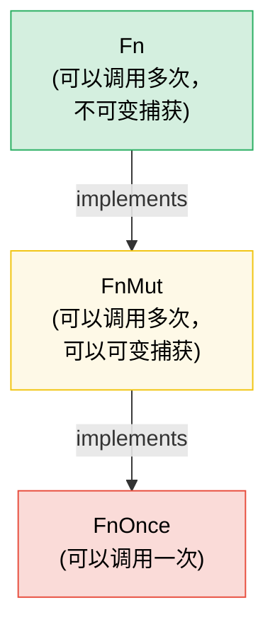

# 7. Closures and Higher-Order Functions 🟢

> **你将学到：**
> - 三个闭包 trait（`Fn`、`FnMut`、`FnOnce`）以及捕获如何工作
> - 将闭包作为参数传递和从函数返回
> - 用于函数式风格编程的组合器链和迭代器适配器
> - 使用正确的 trait bound 设计你自己的高阶 API

## Fn、FnMut、FnOnce — 闭包 Trait

Rust 中的每个闭包实现三个 trait 中的一个或多个，基于它如何捕获变量：

```rust
// FnOnce —— 消费捕获的值（只能调用一次）
let name = String::from("Alice");
let greet = move || {
    println!("Hello, {name}!"); // 获取 `name` 的所有权
    drop(name); // name 被消费
};
greet(); // ✅ 第一次调用
// greet(); // ❌ 不能再调用 —— `name` 被消费了

// FnMut —— 可变借用捕获的值（可以调用多次）
let mut count = 0;
let mut increment = || {
    count += 1; // 可变借用 `count`
};
increment(); // count == 1
increment(); // count == 2

// Fn —— 不可变借用捕获的值（可以多次、并发调用）
let prefix = "Result";
let display = |x: i32| {
    println!("{prefix}: {x}"); // 不可变借用 `prefix`
};
display(1);
display(2);
```

**层次结构**：`Fn` : `FnMut` : `FnOnce` —— 每个都是下一个的子 trait：

```text
FnOnce  ← 所有东西都可以至少调用一次
 ↑
FnMut   ← 可以重复调用（可能改变状态）
 ↑
Fn      ← 可以重复和并发调用（无可变性）
```

如果闭包实现 `Fn`，它也必须实现 `FnMut` 和 `FnOnce`。

### 闭包作为参数和返回值

```rust
// --- 参数 ---

// 静态 dispatch（单态化 —— 最快）
fn apply_twice<F: Fn(i32) -> i32>(f: F, x: i32) -> i32 {
    f(f(x))
}

// 也用 impl Trait 编写：
fn apply_twice_v2(f: impl Fn(i32) -> i32, x: i32) -> i32 {
    f(f(x))
}

// 动态 dispatch（trait object —— 灵活，轻微开销）
fn apply_dyn(f: &dyn Fn(i32) -> i32, x: i32) -> i32 {
    f(x)
}

// --- 返回值 ---

// 不能在没有 boxing 的情况下按值返回闭包（它们有匿名类型）：
fn make_adder(n: i32) -> Box<dyn Fn(i32) -> i32> {
    Box::new(move |x| x + n)
}

// 使用 impl Trait（更简单，单态化，但不能动态）：
fn make_adder_v2(n: i32) -> impl Fn(i32) -> i32 {
    move |x| x + n
}

fn main() {
    let double = |x: i32| x * 2;
    println!("{}", apply_twice(double, 3)); // 12

    let add5 = make_adder(5);
    println!("{}", add5(10)); // 15
}
```

### 组合器链和迭代器适配器

高阶函数在迭代器上发光 —— 这是习惯性的 Rust：

```rust
// C 风格循环（命令式）：
let data = vec![1, 2, 3, 4, 5, 6, 7, 8, 9, 10];
let mut result = Vec::new();
for x in &data {
    if x % 2 == 0 {
        result.push(x * x);
    }
}

// 习惯 Rust（函数式组合器链）：
let result: Vec<i32> = data.iter()
    .filter(|&&x| x % 2 == 0)
    .map(|&x| x * x)
    .collect();

// 相同性能 —— 迭代器是惰性的并被 LLVM 优化
assert_eq!(result, vec![4, 16, 36, 64, 100]);
```

**常见组合器速查表**：

| 组合器 | 做什么 | 示例 |
|-----------|-------------|---------|
| `.map(f)` | 转换每个元素 | `.map(|x| x * 2)` |
| `.filter(p)` | 保留谓词为 true 的元素 | `.filter(|x| x > &5)` |
| `.filter_map(f)` | 一步完成 Map + filter（返回 `Option`） | `.filter_map(|x| x.parse().ok())` |
| `.flat_map(f)` | Map 然后扁平化嵌套迭代器 | `.flat_map(|s| s.chars())` |
| `.fold(init, f)` | 归约为单个值（如 C# 中的 `Aggregate`） | `.fold(0, |acc, x| acc + x)` |
| `.any(p)` / `.all(p)` | 短路布尔检查 | `.any(|x| x > 100)` |
| `.enumerate()` | 添加索引 | `.enumerate().map(|(i, x)| ...)` |
| `.zip(other)` | 与另一个迭代器配对 | `.zip(labels.iter())` |
| `.take(n)` / `.skip(n)` | 前 N 个/跳过 N 个元素 | `.take(10)` |
| `.chain(other)` | 连接两个迭代器 | `.chain(extra.iter())` |
| `.peekable()` | 前瞻而不消费 | `.peek()` |
| `.collect()` | 收集到集合中 | `.collect::<Vec<_>>()` |

### 实现你自己的高阶 API

设计接受闭包的 API 以实现自定义：

```rust
/// 使用可配置的策略重试操作
fn retry<T, E, F, S>(
    mut operation: F,
    mut should_retry: S,
    max_attempts: usize,
) -> Result<T, E>
where
    F: FnMut() -> Result<T, E>,
    S: FnMut(&E, usize) -> bool, // (error, attempt) → 重试？
{
    for attempt in 1..=max_attempts {
        match operation() {
            Ok(val) => return Ok(val),
            Err(e) if attempt < max_attempts && should_retry(&e, attempt) => {
                continue;
            }
            Err(e) => return Err(e),
        }
    }
    unreachable!()
}

// 用法 —— 调用者控制重试逻辑：
```

```rust
# fn connect_to_database() -> Result<(), String> { Ok(()) }
# fn http_get(_url: &str) -> Result<String, String> { Ok(String::new()) }
# trait TransientError { fn is_transient(&self) -> bool; }
# impl TransientError for String { fn is_transient(&self) -> bool { true } }
# let url = "http://example.com";
let result = retry(
    || connect_to_database(),
    |err, attempt| {
        eprintln!("Attempt {attempt} failed: {err}");
        true // 总是重试
    },
    3,
);

// 用法 —— 仅重试特定错误：
let result = retry(
    || http_get(url),
    |err, _| err.is_transient(), // 仅重试瞬时错误
    5,
);
```

### `with` 模式 —— 括号资源的访问

有时你需要保证资源在操作期间处于特定状态，并在之后恢复 —— 无论调用者的代码如何退出（提前返回、`?`、panic）。与其直接暴露资源并希望调用者记得设置和清理，**通过闭包借用资源**：

```text
设置 → 用资源调用闭包 → 清理
```

调用者从不接触设置或清理。他们不会忘记、不会弄错，也不会在闭包作用域之外持有资源。

#### 示例：GPIO Pin 方向

GPIO 控制器管理支持双向 I/O 的 pins。一些调用者需要 pin 配置为输入，另一些为输出。与其暴露原始 pin 访问并信任调用者正确设置方向，控制器提供 `with_pin_input` 和 `with_pin_output`：

```rust
/// GPIO pin 方向 —— 不公开，调用者从不直接设置这个。
#[derive(Debug, Clone, Copy, PartialEq)]
enum Direction { In, Out }

/// 借给闭包的 GPIO pin handle。不能存储或克隆 ——
/// 它只存在于回调期间。
pub struct GpioPin<'a> {
    pin_number: u8,
    _controller: &'a GpioController,
}

impl GpioPin<'_> {
    pub fn read(&self) -> bool {
        // 从硬件寄存器读取 pin 电平
        println!("  reading pin {}", self.pin_number);
        true // stub
    }

    pub fn write(&self, high: bool) {
        // 通过硬件寄存器驱动 pin 电平
        println!("  writing pin {} = {high}", self.pin_number);
    }
}

pub struct GpioController {
    current_direction: std::cell::Cell<Option<Direction>>,
}

impl GpioController {
    pub fn new() -> Self {
        GpioController {
            current_direction: std::cell::Cell::new(None),
        }
    }

    /// 配置 pin 为输入，运行闭包，恢复状态。
    /// 调用者接收一个 `GpioPin`，它只存在于回调期间。
    pub fn with_pin_input<R>(
        &self,
        pin: u8,
        mut f: impl FnMut(&GpioPin<'_>) -> R,
    ) -> R {
        let prev = self.current_direction.get();
        self.set_direction(pin, Direction::In);
        let handle = GpioPin { pin_number: pin, _controller: self };
        let result = f(&handle);
        // 恢复之前的方向（或保持原样 —— 策略选择）
        if let Some(dir) = prev {
            self.set_direction(pin, dir);
        }
        result
    }

    /// 配置 pin 为输出，运行闭包，恢复状态。
    pub fn with_pin_output<R>(
        &self,
        pin: u8,
        mut f: impl FnMut(&GpioPin<'_>) -> R,
    ) -> R {
        let prev = self.current_direction.get();
        self.set_direction(pin, Direction::Out);
        let handle = GpioPin { pin_number: pin, _controller: self };
        let result = f(&handle);
        if let Some(dir) = prev {
            self.set_direction(pin, dir);
        }
        result
    }

    fn set_direction(&self, pin: u8, dir: Direction) {
        println!("  [hw] pin {pin} → {dir:?}");
        self.current_direction.set(Some(dir));
    }
}

fn main() {
    let gpio = GpioController::new();

    // 调用者 1：需要输入 —— 不知道也不关心方向如何管理
    let level = gpio.with_pin_input(4, |pin| {
        pin.read()
    });
    println!("Pin 4 level: {level}");

    // 调用者 2：需要输出 —— 相同的 API 形状，不同的保证
    gpio.with_pin_output(4, |pin| {
        pin.write(true);
        // do more work...
        pin.write(false);
    });

    // 不能在闭包之外使用 pin handle：
    // let escaped_pin = gpio.with_pin_input(4, |pin| pin);
    // ❌ ERROR: borrowed value does not live long enough
}
```

**`with` 模式的保证：**
- 方向**总是在**调用者代码运行**之前设置**
- 方向**总是在**之后**恢复**，即使闭包提前返回
- `GpioPin` handle**不能逃逸**闭包 —— 借用检查器通过与控制器引用绑定的生命周期强制执行
- 调用者从不导入 `Direction`，从不调用 `set_direction` —— API 无法误用

#### `with` 模式出现的位置

`with` 模式出现在 Rust 标准库和生态系统中：

| API | 设置 | 回调 | 清理 |
|-----|-------|----------|----------|
| `std::thread::scope` | 创建作用域 | `\|s\| { s.spawn(...) }` | Join 所有线程 |
| `Mutex::lock` | 获取锁 | 使用 `MutexGuard`（RAII，不是闭包，但相同思想） | drop 时释放 |
| `tempfile::tempdir` | 创建临时目录 | 使用路径 | drop 时删除 |
| `std::io::BufWriter::new` | 缓冲写入 | 写入操作 | drop 时刷新 |
| GPIO `with_pin_*`（上面） | 设置方向 | 使用 pin handle | 恢复方向 |

基于闭包的变体在以下情况最强：
- **设置和清理是配对的**，忘记其中任何一个都是 bug
- **资源不应该在操作之外存活** —— 借用检查器自然地强制执行
- **存在多种配置**（`with_pin_input` vs `with_pin_output`） —— 每个 `with_*` 方法封装不同的设置，不向调用者暴露配置

> **`with` vs RAII (Drop)：** 两者都保证清理。当调用者需要在多个语句和函数调用中持有资源时使用 RAII / `Drop`。当操作是**括号的** —— 一次设置、一块工作、一次清理 —— 并且你不希望调用者能够破坏括号时使用 `with`。

> **API 设计中的 FnMut vs Fn**：默认使用 `FnMut` bound —— 它最灵活（调用者可以传递 `Fn` 或 `FnMut` 闭包）。仅当你需要并发调用闭包（例如，从多个线程）时才要求 `Fn`。仅当你恰好调用一次时才要求 `FnOnce`。

> **关键要点 —— Closures**
> - `Fn` 借用，`FnMut` 可变借用，`FnOnce` 消费 —— 接受你的 API 需要的最弱的 bound
> - 参数中用 `impl Fn`，存储用 `Box<dyn Fn>`，返回用 `impl Fn`（或动态用 `Box<dyn Fn>`）
> - 组合器链（`map`、`filter`、`and_then`）组合清晰并内联到紧凑循环
> - `with` 模式（通过闭包的括号访问）保证设置/清理并防止资源逃逸 —— 当调用者不应该管理配置生命周期时使用它

> **另见：** [第 2 章 — Traits 深入](ch02-traits-in-depth.md) 了解 `Fn`/`FnMut`/`FnOnce` 如何与 trait objects 关联。[第 8 章 — 函数式 vs 命令式](ch08-functional-vs-imperative-when-elegance-wins.md) 了解何时选择组合器而非循环。[第 15 章 — API 设计](ch15-crate-architecture-and-api-design.md) 了解 ergonomic 参数模式。



> 每个 `Fn` 也是 `FnMut`，每个 `FnMut` 也是 `FnOnce`。默认接受 `FnMut` —— 它是对调用者最灵活的 bound。

---

### 练习：高阶组合器管道 ★★（约 25 分钟）

创建一个 `Pipeline` 结构体来链接转换。它应该支持 `.pipe(f)` 添加转换和 `.execute(input)` 运行完整链。

<details>
<summary>🔑 解答</summary>

```rust
struct Pipeline<T> {
    transforms: Vec<Box<dyn Fn(T) -> T>>,
}

impl<T: 'static> Pipeline<T> {
    fn new() -> Self {
        Pipeline { transforms: Vec::new() }
    }

    fn pipe(mut self, f: impl Fn(T) -> T + 'static) -> Self {
        self.transforms.push(Box::new(f));
        self
    }

    fn execute(self, input: T) -> T {
        self.transforms.into_iter().fold(input, |val, f| f(val))
    }
}

fn main() {
    let result = Pipeline::new()
        .pipe(|s: String| s.trim().to_string())
        .pipe(|s| s.to_uppercase())
        .pipe(|s| format!(">>> {s} <<<"))
        .execute("  hello world  ".to_string());

    println!("{result}"); // >>> HELLO WORLD <<<

    let result = Pipeline::new()
        .pipe(|x: i32| x * 2)
        .pipe(|x| x + 10)
        .pipe(|x| x * x)
        .execute(5);

    println!("{result}"); // (5*2 + 10)^2 = 400
}
```

</details>

***
