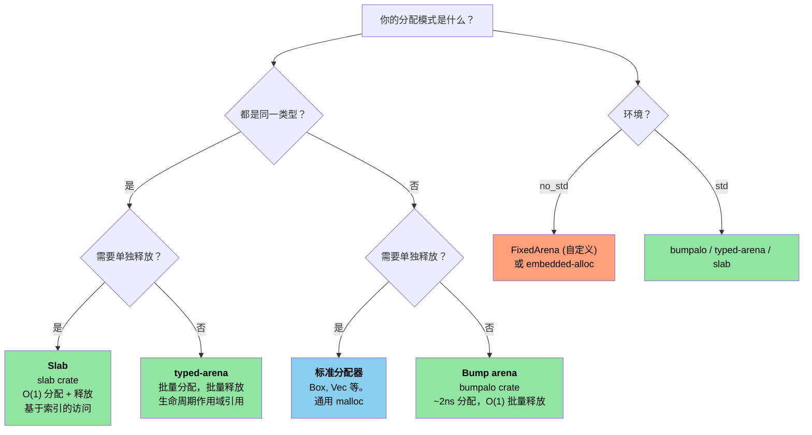

# 12. Unsafe Rust — Controlled Danger 🔴

> **你将学到：**
> - 五种 unsafe 超能力以及何时需要每一种
> - 编写可靠的抽象：安全的 API、不安全的内部实现
> - 从 Rust 调用 C（以及反向调用）的 FFI 模式
> - 常见的 UB 陷阱和 arena/slab 分配器模式

## 五种 Unsafe 超能力

`unsafe` 解锁了编译器无法验证的五种操作：

```rust
// SAFETY: 每个操作都在内联解释 below.
unsafe {
    // 1. 解引用原始指针
    let ptr: *const i32 = &42;
    let value = *ptr; // 可能是悬空/null 指针

    // 2. 调用 unsafe 函数
    let layout = std::alloc::Layout::new::<u64>();
    let mem = std::alloc::alloc(layout);

    // 3. 访问可变静态变量
    static mut COUNTER: u32 = 0;
    COUNTER += 1; // 如果多个线程访问则存在数据竞争

    // 4. 实现 unsafe trait
    // unsafe impl Send for MyType {}

    // 5. 访问 union 的字段
    // union IntOrFloat { i: i32, f: f32 }
    // let u = IntOrFloat { i: 42 };
    // let f = u.f; // 重新解释位 —— 可能是垃圾
}
```

> **关键原则**：`unsafe` 不会关闭借用检查器或类型系统。
> 它只解锁这五种特定能力。所有其他 Rust 规则仍然适用。

### 编写可靠的抽象

`unsafe` 的目的是为不安全操作构建**安全的抽象**：

```rust
/// 固定容量的栈分配缓冲区。
/// 所有公共方法都是安全的 —— unsafe 被封装。
pub struct StackBuf<T, const N: usize> {
    data: [std::mem::MaybeUninit<T>; N],
    len: usize,
}

impl<T, const N: usize> StackBuf<T, N> {
    pub fn new() -> Self {
        StackBuf {
            // 每个元素都是独立的 MaybeUninit —— 不需要 unsafe。
            // `const { ... }` 块（Rust 1.79+）让我们可以重复非 Copy 的常量表达式 N 次。
            data: [const { std::mem::MaybeUninit::uninit() }; N],
            len: 0,
        }
    }

    pub fn push(&mut self, value: T) -> Result<(), T> {
        if self.len >= N {
            return Err(value); // 缓冲区满 —— 将值返回给调用者
        }
        // SAFETY: len < N，所以 data[len] 在边界内。
        // 我们将有效的 T 写入 MaybeUninit 槽中。
        self.data[self.len] = std::mem::MaybeUninit::new(value);
        self.len += 1;
        Ok(())
    }

    pub fn get(&self, index: usize) -> Option<&T> {
        if index < self.len {
            // SAFETY: index < len，且 data[0..len] 都已初始化。
            Some(unsafe { self.data[index].assume_init_ref() })
        } else {
            None
        }
    }
}

impl<T, const N: usize> Drop for StackBuf<T, N> {
    fn drop(&mut self) {
        // SAFETY: data[0..len] 已初始化 —— 正确地 drop 它们。
        for i in 0..self.len {
            unsafe { self.data[i].assume_init_drop(); }
        }
    }
}
```

**可靠 unsafe 代码的三条规则**：
1. **记录不变量** —— 每个 `// SAFETY:` 注释解释为什么操作有效
2. **封装** —— unsafe 在安全 API 内部；用户不会触发 UB
3. **最小化** —— 只有最小的块是 `unsafe`

### FFI 模式：从 Rust 调用 C

```rust
// 声明 C 函数签名：
extern "C" {
    fn strlen(s: *const std::ffi::c_char) -> usize;
    fn printf(format: *const std::ffi::c_char, ...) -> std::ffi::c_int;
}

// 安全包装器：
fn safe_strlen(s: &str) -> usize {
    let c_string = std::ffi::CString::new(s).expect("string contains null byte");
    // SAFETY: c_string 是有效的空终止字符串，在调用期间存活。
    unsafe { strlen(c_string.as_ptr()) }
}

// 从 C 调用 Rust（导出函数）：
#[no_mangle]
pub extern "C" fn rust_add(a: i32, b: i32) -> i32 {
    a + b
}
```

**常见 FFI 类型**：

| Rust | C | 说明 |
|---|---|---|
| `i32` / `u32` | `int32_t` / `uint32_t` | 固定宽度，安全 |
| `*const T` / `*mut T` | `const T*` / `T*` | 原始指针 |
| `std::ffi::CStr` | `const char*` (借用) | 空终止，借用 |
| `std::ffi::CString` | `char*` (拥有) | 空终止，拥有 |
| `std::ffi::c_void` | `void` | 不透明指针目标 |
| `Option<fn(...)>` | 可空函数指针 | `None` = NULL |

### 常见 UB 陷阱

| 陷阱 | 示例 | 为什么是 UB |
|---|---|---|
| 空指针解引用 | `*std::ptr::null::<i32>()` | 解引用空指针总是 UB |
| 悬空指针 | `drop()` 后解引用 | 内存可能被重用 |
| 数据竞争 | 两个线程写入 `static mut` | 无同步的并发写入 |
| 错误的 `assume_init` | `MaybeUninit::<String>::uninit().assume_init()` | 读取未初始化内存。**注意**：`[const { MaybeUninit::uninit() }; N]` (Rust 1.79+) 是创建 `MaybeUninit` 数组的安全方法 —— 不需要 `unsafe` 或 `assume_init`（参见上面的 `StackBuf::new()`） |
| 违反别名 | 创建两个 `&mut` 指向同一数据 | 违反 Rust 的别名模型 |
| 无效枚举值 | `std::mem::transmute::<u8, bool>(2)` | `bool` 只能是 0 或 1 |

> **何时在生产环境中使用 `unsafe`**：
> - FFI 边界（调用 C/C++ 代码）
> - 性能关键的内部循环（避免边界检查）
> - 构建原语（`Vec`、`HashMap` —— 这些在内部使用 unsafe）
> - 如果可以避免，绝不要在应用程序逻辑中使用

### 自定义分配器 —— Arena 和 Slab 模式

在 C 中，你会为特定的分配模式编写自定义 `malloc()` 替代品 ——
一次性释放所有内容的 arena 分配器、用于固定大小对象的 slab 分配器、
或用于高吞吐量系统的池分配器。Rust 通过
`GlobalAlloc` trait 和分配器 crate 提供相同的能力，同时受益于生命周期作用域的
arena，在**编译时防止释放后使用**。

#### Arena 分配器 —— 批量分配、批量释放

Arena 通过向前推进指针来分配。单个物品不能被释放 ——
整个 arena 一次性释放。这非常适合请求作用域或
帧作用域的分配：

```rust
use bumpalo::Bump;

fn process_sensor_frame(raw_data: &[u8]) {
    // 为这个帧的分配创建一个 arena
    let arena = Bump::new();

    // 在 arena 中分配对象 —— 每个约 2ns（只是指针推进）
    let header = arena.alloc(parse_header(raw_data));
    let readings: &mut [f32] = arena.alloc_slice_fill_default(header.sensor_count);

    for (i, chunk) in raw_data[header.payload_offset..].chunks(4).enumerate() {
        if i < readings.len() {
            readings[i] = f32::from_le_bytes(chunk.try_into().unwrap());
        }
    }

    // 使用 readings...
    let avg = readings.iter().sum::<f32>() / readings.len() as f32;
    println!("Frame avg: {avg:.2}");

    // `arena` 在这里 drop —— 所有分配一次性释放 O(1)
    // 无每个对象的析构函数开销，无碎片
}
# fn parse_header(_: &[u8]) -> Header { Header { sensor_count: 4, payload_offset: 8 } }
# struct Header { sensor_count: usize, payload_offset: usize }
```

**Arena vs 标准分配器**：

| 方面 | `Vec::new()` / `Box::new()` | `Bump` arena |
|---|---|---|
| 分配速度 | ~25ns (malloc) | ~2ns (指针推进) |
| 释放速度 | 每个对象的析构函数 | O(1) 批量释放 |
| 碎片 | 是（长生命周期进程） | arena 内无碎片 |
| 生命周期安全 | 堆 —— 在 `Drop` 时释放 | arena 引用 —— 编译时作用域 |
| 使用场景 | 通用 | 请求/帧/批处理 |

#### `typed-arena` —— 类型安全的 Arena

当所有 arena 对象都是同一类型时，`typed-arena` 提供更简单的 API，
返回带有 arena 生命周期的引用：

```rust
use typed_arena::Arena;

struct AstNode<'a> {
    value: i32,
    children: Vec<&'a AstNode<'a>>,
}

fn build_tree() {
    let arena: Arena<AstNode<'_>> = Arena::new();

    // 分配节点 —— 返回与 arena 生命周期绑定的 &AstNode
    let root = arena.alloc(AstNode { value: 1, children: vec![] });
    let left = arena.alloc(AstNode { value: 2, children: vec![] });
    let right = arena.alloc(AstNode { value: 3, children: vec![] });

    // 构建树 —— 所有引用在 `arena` 存活期间都有效
    //（真正可变的树需要内部可变性来进行可变访问）

    println!("Root: {}, Left: {}, Right: {}", root.value, left.value, right.value);

    // `arena` 在这里 drop —— 所有节点一次性释放
}
```

#### Slab 分配器 —— 固定大小对象池

slab 分配器预先分配固定大小槽位的池。对象单独分配
和返回，但所有槽位大小相同 —— 消除
碎片并实现 O(1) 分配/释放：

```rust
use slab::Slab;

struct Connection {
    id: u64,
    buffer: [u8; 1024],
    active: bool,
}

fn connection_pool_example() {
    // 为连接预分配一个 slab
    let mut connections: Slab<Connection> = Slab::with_capacity(256);

    // insert 返回键（usize 索引）—— O(1)
    let key1 = connections.insert(Connection {
        id: 1001,
        buffer: [0; 1024],
        active: true,
    });

    let key2 = connections.insert(Connection {
        id: 1002,
        buffer: [0; 1024],
        active: true,
    });

    // 按键访问 —— O(1)
    if let Some(conn) = connections.get_mut(key1) {
        conn.buffer[0..5].copy_from_slice(b"hello");
    }

    // remove 返回值 —— O(1)，槽位被重用于下一次 insert
    let removed = connections.remove(key2);
    assert_eq!(removed.id, 1002);

    // 下一次 insert 重用已释放的槽位 —— 无碎片
    let key3 = connections.insert(Connection {
        id: 1003,
        buffer: [0; 1024],
        active: true,
    });
    assert_eq!(key3, key2); // 重用同一槽位！
}
```

#### 实现最小 Arena（用于 `no_std`）

对于裸机环境（无法引入 `bumpalo`），这是一个基于 `unsafe` 的最小 arena：

```rust
#![cfg_attr(not(test), no_std)]

use core::alloc::Layout;
use core::cell::{Cell, UnsafeCell};

/// 由固定大小字节数组支持的简单 bump 分配器。
/// 非线程安全 —— 在多线程上下文中每核心使用或加锁。
///
/// **重要**：像 `bumpalo` 一样，这个 arena 在 drop 时**不会**调用
/// 已分配物品的析构函数。带有 `Drop` 实现的类型会
/// 泄漏其资源（文件句柄、套接字等）。只分配
/// 没有有意义 `Drop` 实现的类型，或者在 arena 之前手动 drop 它们。
pub struct FixedArena<const N: usize> {
    // UnsafeCell 在这里是必需的：我们通过 `&self` 修改 `buf`。
    // 没有 UnsafeCell，将 &self.buf 转换为 *mut u8 会是 UB
    //（违反 Rust 的别名模型 —— 共享引用意味着不可变）。
    buf: UnsafeCell<[u8; N]>,
    offset: Cell<usize>, // 用于 &self 分配的内部可变性
}

impl<const N: usize> FixedArena<N> {
    pub const fn new() -> Self {
        FixedArena {
            buf: UnsafeCell::new([0; N]),
            offset: Cell::new(0),
        }
    }

    /// 在 arena 中分配一个 `T`。如果空间不足返回 `None`。
    pub fn alloc<T>(&self, value: T) -> Option<&mut T> {
        let layout = Layout::new::<T>();
        let current = self.offset.get();

        // 向上对齐
        let aligned = (current + layout.align() - 1) & !(layout.align() - 1);
        let new_offset = aligned + layout.size();

        if new_offset > N {
            return None; // Arena 满
        }

        self.offset.set(new_offset);

        // SAFETY:
        // - `aligned` 在 `buf` 边界内（上面已检查）
        // - 对齐正确（对齐到 T 的要求）
        // - 无别名：每个分配返回唯一的、不重叠的区域
        // - UnsafeCell 授予通过 &self 修改的权限
        // - arena 的生命周期比返回的引用长（调用者必须确保）
        let ptr = unsafe {
            let base = (self.buf.get() as *mut u8).add(aligned);
            let typed = base as *mut T;
            typed.write(value);
            &mut *typed
        };

        Some(ptr)
    }

    /// 重置 arena —— 使所有之前的分配失效。
    ///
    /// # Safety
    /// 调用者必须确保不存在对 arena 分配数据的引用。
    pub unsafe fn reset(&self) {
        self.offset.set(0);
    }

    pub fn used(&self) -> usize {
        self.offset.get()
    }

    pub fn remaining(&self) -> usize {
        N - self.offset.get()
    }
}
```

#### 选择分配器策略

> **注意**：下面的图表使用 Mermaid 语法。它在 GitHub 和支持 Mermaid 的工具中渲染
>（带有 `mermaid` 插件的 mdBook、带有 Mermaid 扩展的 VS Code）。在纯 Markdown 查看器中，你将看到原始源码。



| C 模式 | Rust 等价物 | 关键优势 |
|---|---|---|
| 自定义 `malloc()` 池 | `#[global_allocator]` 实现 | 类型安全、可调试 |
| `obstack` (GNU) | `bumpalo::Bump` | 生命周期作用域、无释放后使用 |
| Kernel slab (`kmem_cache`) | `slab::Slab<T>` | 类型安全、基于索引 |
| 栈分配临时缓冲区 | `FixedArena<N>`（上面） | 无堆、`const` 可构造 |
| `alloca()` | `[T; N]` 或 `SmallVec` | 编译时大小、无 UB |

> **交叉引用**：对于裸机分配器设置（使用 `embedded-alloc` 的 `#[global_allocator]`），
> 请参阅 *Rust Training for C Programmers* 第 15.1 章 "Global Allocator Setup"，
> 其中涵盖嵌入式特定的引导。

> **关键要点 —— Unsafe Rust**
> - 记录不变量（`SAFETY:` 注释），封装在安全 API 后，最小化 unsafe 范围
> - `[const { MaybeUninit::uninit() }; N]` (Rust 1.79+) 替代旧的 `assume_init` 反模式
> - FFI 需要 `extern "C"`、`#[repr(C)]`，以及小心的 null/生命周期处理
> - Arena 和 slab 分配器以通用灵活性换取分配速度

> **另见：** [第 4 章 — PhantomData](ch04-phantomdata-types-that-carry-no-data.md) 了解方差和 drop-check 与 unsafe 代码的交互。[第 8 章 — 智能指针](ch09-smart-pointers-and-interior-mutability.md) 了解 Pin 和自引用类型。

---

### 练习：unsafe 的安全包装器 ★★★（约 45 分钟）

编写一个 `FixedVec<T, const N: usize>` —— 固定容量、栈分配的向量。
要求：
- `push(&mut self, value: T) -> Result<(), T>` 满时返回 `Err(value)`
- `pop(&mut self) -> Option<T>` 返回并移除最后一个元素
- `as_slice(&self) -> &[T]` 借用已初始化的元素
- 所有公共方法必须是安全的；所有 unsafe 必须用 `SAFETY:` 注释封装
- `Drop` 必须清理已初始化的元素

<details>
<summary>🔑 解答</summary>

```rust
use std::mem::MaybeUninit;

pub struct FixedVec<T, const N: usize> {
    data: [MaybeUninit<T>; N],
    len: usize,
}

impl<T, const N: usize> FixedVec<T, N> {
    pub fn new() -> Self {
        FixedVec {
            data: [const { MaybeUninit::uninit() }; N],
            len: 0,
        }
    }

    pub fn push(&mut self, value: T) -> Result<(), T> {
        if self.len >= N { return Err(value); }
        // SAFETY: len < N，所以 data[len] 在边界内。
        self.data[self.len] = MaybeUninit::new(value);
        self.len += 1;
        Ok(())
    }

    pub fn pop(&mut self) -> Option<T> {
        if self.len == 0 { return None; }
        self.len -= 1;
        // SAFETY: data[len] 已初始化（递减前 len > 0）。
        Some(unsafe { self.data[self.len].assume_init_read() })
    }

    pub fn as_slice(&self) -> &[T] {
        // SAFETY: data[0..len] 都已初始化，且 MaybeUninit<T>
        // 与 T 具有相同的布局。
        unsafe { std::slice::from_raw_parts(self.data.as_ptr() as *const T, self.len) }
    }

    pub fn len(&self) -> usize { self.len }
    pub fn is_empty(&self) -> bool { self.len == 0 }
}

impl<T, const N: usize> Drop for FixedVec<T, N> {
    fn drop(&mut self) {
        // SAFETY: data[0..len] 已初始化 —— drop 每一个。
        for i in 0..self.len {
            unsafe { self.data[i].assume_init_drop(); }
        }
    }
}

fn main() {
    let mut v = FixedVec::<String, 4>::new();
    v.push("hello".into()).unwrap();
    v.push("world".into()).unwrap();
    assert_eq!(v.as_slice(), &["hello", "world"]);
    assert_eq!(v.pop(), Some("world".into()));
    assert_eq!(v.len(), 1);
}
```

</details>

***
