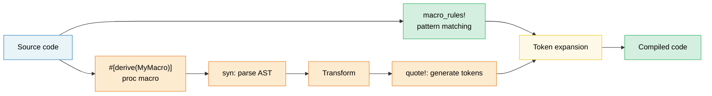

# 13. Macros — Code That Writes Code 🟡

> **你将学到：**
> - 带有模式匹配和重复的声明式宏（`macro_rules!`）
> - 何时宏是正确的工具 vs 泛型/traits
> - 过程宏：derive、属性和函数式
> - 使用 `syn` 和 `quote` 编写自定义 derive 宏

## 声明式宏（macro_rules!）

宏在编译时匹配语法模式并展开为代码：

```rust
// 创建一个 HashMap 的简单宏
macro_rules! hashmap {
    // 匹配：key => value 对，用逗号分隔
    ( $( $key:expr => $value:expr ),* $(,)? ) => {
        {
            let mut map = std::collections::HashMap::new();
            $( map.insert($key, $value); )*
            map
        }
    };
}

let scores = hashmap! {
    "Alice" => 95,
    "Bob" => 87,
    "Carol" => 92,
};
// 展开为：
// let mut map = HashMap::new();
// map.insert("Alice", 95);
// map.insert("Bob", 87);
// map.insert("Carol", 92);
// map
```

**宏片段类型**：

| 片段 | 匹配 | 示例 |
|---|---|---|
| `$x:expr` | 任何表达式 | `42`, `a + b`, `foo()` |
| `$x:ty` | 类型 | `i32`, `Vec<String>` |
| `$x:ident` | 标识符 | `my_var`, `Config` |
| `$x:pat` | 模式 | `Some(x)`, `_` |
| `$x:stmt` | 语句 | `let x = 5;` |
| `$x:tt` | 单个 token 树 | 任何内容（最灵活） |
| `$x:literal` | 字面值 | `42`, `"hello"`, `true` |

**重复**：`$( ... ),*` 表示"零个或多个，逗号分隔"

```rust
// 自动生成测试函数
macro_rules! test_cases {
    ( $( $name:ident: $input:expr => $expected:expr ),* $(,)? ) => {
        $(
            #[test]
            fn $name() {
                assert_eq!(process($input), $expected);
            }
        )*
    };
}

test_cases! {
    test_empty: "" => "",
    test_hello: "hello" => "HELLO",
    test_trim: "  spaces  " => "SPACES",
}
// 生成三个独立的 #[test] 函数
```

### 何时（不）使用宏

**使用宏当**：
- 减少 traits/泛型无法处理的样板代码（可变参数、DRY 测试生成）
- 创建 DSL（`html!`, `sql!`, `vec!`）
- 条件代码生成（`cfg!`, `compile_error!`）

**不使用宏当**：
- 函数或泛型可以工作（宏更难调试，自动补全无法帮助）
- 需要在宏内部进行类型检查（宏在 token 上操作，而非类型）
- 模式只使用一两次（不值得抽象成本）

```rust
// ❌ 不必要的宏 —— 函数就可以：
macro_rules! double {
    ($x:expr) => { $x * 2 };
}

// ✅ 直接用函数：
fn double(x: i32) -> i32 { x * 2 }

// ✅ 好的宏用法 —— 可变参数，不能是函数：
macro_rules! println {
    ($($arg:tt)*) => { /* format string + args */ };
}
```

### 过程宏概述

过程宏是转换 token 流的 Rust 函数。它们需要一个独立的 crate，设置 `proc-macro = true`：

```rust
// 三种类型的过程宏：

// 1. Derive 宏 —— #[derive(MyTrait)]
// 从结构体定义生成 trait 实现
#[derive(Debug, Clone, Serialize, Deserialize)]
struct Config {
    name: String,
    port: u16,
}

// 2. 属性宏 —— #[my_attribute]
// 转换被注解的项
#[route(GET, "/api/users")]
async fn list_users() -> Json<Vec<User>> { /* ... */ }

// 3. 函数式宏 —— my_macro!(...)
// 自定义语法
let query = sql!(SELECT * FROM users WHERE id = ?);
```

### Derive 宏实战

最常见的过程宏类型。下面是 `#[derive(Debug)]` 的概念工作原理：

```rust
// 输入（你的结构体）：
#[derive(Debug)]
struct Point {
    x: f64,
    y: f64,
}

// derive 宏生成：
impl std::fmt::Debug for Point {
    fn fmt(&self, f: &mut std::fmt::Formatter<'_>) -> std::fmt::Result {
        f.debug_struct("Point")
            .field("x", &self.x)
            .field("y", &self.y)
            .finish()
    }
}
```

**常用的 derive 宏**：

| Derive | Crate | 生成什么 |
|---|---|---|
| `Debug` | std | `fmt::Debug` 实现（调试打印） |
| `Clone`, `Copy` | std | 值复制 |
| `PartialEq`, `Eq` | std | 相等性比较 |
| `Hash` | std | 用于 HashMap 键的哈希 |
| `Serialize`, `Deserialize` | serde | JSON/YAML 等编码 |
| `Error` | thiserror | `std::error::Error` + `Display` |
| `Parser` | `clap` | CLI 参数解析 |
| `Builder` | derive_builder | Builder 模式 |

> **实用建议**：大胆使用 derive 宏 —— 它们消除容易出错的样板代码。
> 编写自己的过程宏是高级主题；在构建自定义宏之前先使用现有的
> （`serde`、`thiserror`、`clap`）。

### 宏卫生和 `$crate`

**卫生**意味着宏内部创建的标识符不会与调用者作用域中的标识符冲突。
Rust 的 `macro_rules!` 是*部分*卫生的：

```rust
macro_rules! make_var {
    () => {
        let x = 42; // 这个 'x' 在宏的作用域中
    };
}

fn main() {
    let x = 10;
    make_var!();   // 创建不同的 'x'（卫生的）
    println!("{x}"); // 打印 10，不是 42 —— 宏的 x 不会泄漏
}
```

**`$crate`**：在库中编写宏时，使用 `$crate` 引用你自己的 crate ——
无论用户如何导入你的 crate，它都能正确解析：

```rust
// 在 my_diagnostics crate 中：

pub fn log_result(msg: &str) {
    println!("[diag] {msg}");
}

#[macro_export]
macro_rules! diag_log {
    ($($arg:tt)*) => {
        // ✅ $crate 总是解析为 my_diagnostics，即使用户
        // 在他们的 Cargo.toml 中重命名了 crate
        $crate::log_result(&format!($($arg)*))
    };
}

// ❌ 不使用 $crate：
// my_diagnostics::log_result(...)  ← 如果用户这样写会失败：
//   [dependencies]
//   diag = { package = "my_diagnostics", version = "1" }
```

> **规则**：在 `#[macro_export]` 宏中总是使用 `$crate::`。绝不要直接使用
> 你的 crate 名称。

### 递归宏和 `tt` Munching

递归宏一次处理一个 token 的输入 —— 这种技术称为
**`tt` munching**（token-tree munching）：

```rust
// 计算传递给宏的表达式数量
macro_rules! count {
    // 基本情况：没有 token 剩余
    () => { 0usize };
    // 递归情况：消费一个表达式，计算其余的
    ($head:expr $(, $tail:expr)* $(,)?) => {
        1usize + count!($($tail),*)
    };
}

fn main() {
    let n = count!("a", "b", "c", "d");
    assert_eq!(n, 4);

    // 在编译时也有效：
    const N: usize = count!(1, 2, 3);
    assert_eq!(N, 3);
}
```

```rust
// 从表达式列表构建异构元组：
macro_rules! tuple_from {
    // 基本：单个元素
    ($single:expr $(,)?) => { ($single,) };
    // 递归：第一个元素 + 其余
    ($head:expr, $($tail:expr),+ $(,)?) => {
        ($head, tuple_from!($($tail),+))
    };
}

let t = tuple_from!(1, "hello", 3.14, true);
// 展开为：(1, ("hello", (3.14, (true,))))
```

**片段说明符的微妙之处**：

| 片段 | 陷阱 |
|---|---|
| `$x:expr` | 贪婪解析 —— `1 + 2` 是一个表达式，不是三个 token |
| `$x:ty` | 贪婪解析 —— `Vec<String>` 是一个类型；后面不能跟 `+` 或 `<` |
| `$x:tt` | 精确匹配一个 token 树 —— 最灵活，检查最少 |
| `$x:ident` | 仅限普通标识符 —— 不是路径如 `std::io` |
| `$x:pat` | 在 Rust 2021 中，匹配 `A | B` 模式；对单个模式使用 `$x:pat_param` |

> **何时使用 `tt`**：当你需要转发 token 给另一个宏而不受解析器约束时。
> `$($args:tt)*` 是"接受一切"模式（`println!`、`format!`、`vec!` 使用）。

### 使用 `syn` 和 `quote` 编写 Derive 宏

Derive 宏存在于独立的 crate 中（`proc-macro = true`），使用 `syn`（解析 Rust）
和 `quote`（生成 Rust）转换 token 流：

```toml
# my_derive/Cargo.toml
[lib]
proc-macro = true

[dependencies]
syn = { version = "2", features = ["full"] }
quote = "1"
proc-macro2 = "1"
```

```rust
// my_derive/src/lib.rs
use proc_macro::TokenStream;
use quote::quote;
use syn::{parse_macro_input, DeriveInput};

/// 生成 `describe()` 方法的 derive 宏
/// 返回结构体名称和字段名称。
#[proc_macro_derive(Describe)]
pub fn derive_describe(input: TokenStream) -> TokenStream {
    let input = parse_macro_input!(input as DeriveInput);
    let name = &input.ident;
    let name_str = name.to_string();

    // 提取字段名称（仅适用于命名字段的结构体）
    let fields = match &input.data {
        syn::Data::Struct(data) => {
            data.fields.iter()
                .filter_map(|f| f.ident.as_ref())
                .map(|id| id.to_string())
                .collect::<Vec<_>>()
        }
        _ => vec![],
    };

    let field_list = fields.join(", ");

    let expanded = quote! {
        impl #name {
            pub fn describe() -> String {
                format!("{} {{ {} }}", #name_str, #field_list)
            }
        }
    };

    TokenStream::from(expanded)
}
```

```rust
// 在应用程序 crate 中：
use my_derive::Describe;

#[derive(Describe)]
struct SensorReading {
    sensor_id: u16,
    value: f64,
    timestamp: u64,
}

fn main() {
    println!("{}", SensorReading::describe());
    // "SensorReading { sensor_id, value, timestamp }"
}
```

**工作流**：`TokenStream`（原始 token）→ `syn::parse`（AST）→
检查/转换 → `quote!`（生成 token）→ `TokenStream`（返回编译器）。

| Crate | 角色 | 关键类型 |
|---|---|---|
| `proc-macro` | 编译器接口 | `TokenStream` |
| `syn` | 将 Rust 源码解析为 AST | `DeriveInput`, `ItemFn`, `Type` |
| `quote` | 从模板生成 Rust token | `quote!{}`, `#variable` 插值 |
| `proc-macro2` | syn/quote 和 proc-macro 之间的桥接 | `TokenStream`, `Span` |

> **实用技巧**：在编写自己的宏之前，先研究简单 derive 宏的源码，
> 如 `thiserror` 或 `derive_more`。`cargo expand` 命令（通过 `cargo-expand`）
> 显示任何宏的展开结果 —— 对调试非常宝贵。

> **关键要点 —— 宏**
> - `macro_rules!` 用于简单代码生成；过程宏（`syn` + `quote`）用于复杂 derive
> - 可能时优先使用泛型/traits 而非宏 —— 宏更难调试和维护
> - `$crate` 确保卫生；`tt` munching 实现递归模式匹配

> **另见：** [第 2 章 — Traits](ch02-traits-in-depth.md) 了解何时 traits/泛型优于宏。[第 13 章 — 测试](ch14-testing-and-benchmarking-patterns.md) 了解测试宏生成的代码。



---

### 练习：声明式宏 —— `map!` ★（约 15 分钟）

编写一个 `map!` 宏，从键值对创建 `HashMap`：

```rust,ignore
let m = map! {
    "host" => "localhost",
    "port" => "8080",
};
assert_eq!(m.get("host"), Some(&"localhost"));
```

要求：支持尾随逗号和空调用 `map!{}`。

<details>
<summary>🔑 解答</summary>

```rust
macro_rules! map {
    () => { std::collections::HashMap::new() };
    ( $( $key:expr => $val:expr ),+ $(,)? ) => {{
        let mut m = std::collections::HashMap::new();
        $( m.insert($key, $val); )+
        m
    }};
}

fn main() {
    let config = map! {
        "host" => "localhost",
        "port" => "8080",
        "timeout" => "30",
    };
    assert_eq!(config.len(), 3);
    assert_eq!(config["host"], "localhost");

    let empty: std::collections::HashMap<String, String> = map!();
    assert!(empty.is_empty());

    let scores = map! { 1 => 100, 2 => 200 };
    assert_eq!(scores[&1], 100);
}
```

</details>

***
