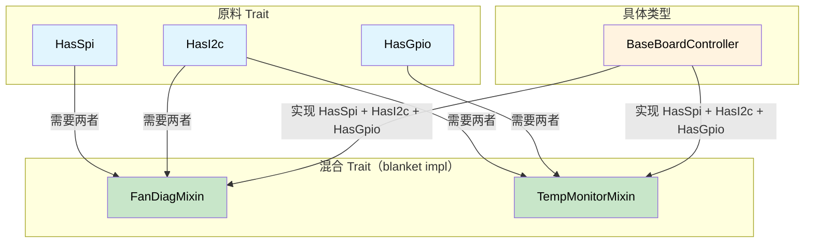

# Capability 混合——编译时硬件契约 🟡

> **你将学到：** 原料 trait（总线 capability）如何与混合 trait 和 blanket impl 结合，消除诊断代码重复，同时保证每个硬件依赖在编译时得到满足。
>
> **交叉引用：** [ch04](ch04-capability-tokens-zero-cost-proof-of-aut.md)（capability 令牌）、[ch09](ch09-phantom-types-for-resource-tracking.md)（phantom 类型）、[ch10](ch10-putting-it-all-together-a-complete-diagn.md)（集成）

## 问题：诊断代码重复

服务器平台在子系统间共享诊断模式。风扇诊断、温度监控和电源时序都遵循类似的工作流程，但操作不同的硬件总线。没有抽象会导致复制粘贴：

```c
// C — 在子系统间重复逻辑
int run_fan_diag(spi_bus_t *spi, i2c_bus_t *i2c) {
    // ... 50 行 SPI 传感器读取 ...
    // ... 30 行 I2C 寄存器检查 ...
    // ... 20 行阈值比较（与 CPU 诊断相同）...
}

int run_cpu_temp_diag(i2c_bus_t *i2c, gpio_t *gpio) {
    // ... 30 行 I2C 寄存器检查（与风扇诊断相同）...
    // ... 15 行 GPIO 中断检查 ...
    // ... 20 行阈值比较（与风扇诊断相同）...
}
```

阈值比较逻辑是相同的，但由于总线类型不同，你无法提取它。使用 capability 混合，每个硬件总线是一个**原料 trait**，当正确的原料存在时，诊断行为会自动提供。

## 原料 Trait（硬件 Capability）

每个总线或外设都是 trait 上的关联类型。诊断控制器声明它有哪些总线：

```rust,ignore
/// SPI 总线 capability。
pub trait HasSpi {
    type Spi: SpiBus;
    fn spi(&self) -> &Self::Spi;
}

/// I2C 总线 capability。
pub trait HasI2c {
    type I2c: I2cBus;
    fn i2c(&self) -> &Self::I2c;
}

/// GPIO 引脚访问 capability。
pub trait HasGpio {
    type Gpio: GpioController;
    fn gpio(&self) -> &Self::Gpio;
}

/// IPMI 访问 capability。
pub trait HasIpmi {
    type Ipmi: IpmiClient;
    fn ipmi(&self) -> &Self::Ipmi;
}

// 总线 trait 定义：
pub trait SpiBus {
    fn transfer(&self, data: &[u8]) -> Vec<u8>;
}

pub trait I2cBus {
    fn read_register(&self, addr: u8, reg: u8) -> u8;
    fn write_register(&self, addr: u8, reg: u8, value: u8);
}

pub trait GpioController {
    fn read_pin(&self, pin: u32) -> bool;
    fn set_pin(&self, pin: u32, value: bool);
}

pub trait IpmiClient {
    fn send_raw(&self, netfn: u8, cmd: u8, data: &[u8]) -> Vec<u8>;
}
```

## 混合 Trait（诊断行为）

混合为任何具有所需 capability 的类型**自动**提供行为：

```rust,ignore
# pub trait SpiBus { fn transfer(&self, data: &[u8]) -> Vec<u8>; }
# pub trait I2cBus {
#     fn read_register(&self, addr: u8, reg: u8) -> u8;
#     fn write_register(&self, addr: u8, reg: u8, value: u8);
# }
# pub trait GpioController { fn read_pin(&self, pin: u32) -> bool; }
# pub trait IpmiClient { fn send_raw(&self, netfn: u8, cmd: u8, data: &[u8]) -> Vec<u8>; }
# pub trait HasSpi { type Spi: SpiBus; fn spi(&self) -> &Self::Spi; }
# pub trait HasI2c { type I2c: I2cBus; fn i2c(&self) -> &Self::I2c; }
# pub trait HasGpio { type Gpio: GpioController; fn gpio(&self) -> &Self::Gpio; }
# pub trait HasIpmi { type Ipmi: IpmiClient; fn ipmi(&self) -> &Self::Ipmi; }

/// 风扇诊断混合——为任何具有 SPI + I2C 的类型自动实现。
pub trait FanDiagMixin: HasSpi + HasI2c {
    fn read_fan_speed(&self, fan_id: u8) -> u32 {
        // 通过 SPI 读取转速计
        let cmd = [0x80 | fan_id, 0x00];
        let response = self.spi().transfer(&cmd);
        u32::from_be_bytes([0, 0, response[0], response[1]])
    }

    fn set_fan_pwm(&self, fan_id: u8, duty_percent: u8) {
        // 通过 I2C 控制器设置 PWM
        self.i2c().write_register(0x2E, fan_id, duty_percent);
    }

    fn run_fan_diagnostic(&self) -> bool {
        // 完整诊断：读取所有风扇，检查阈值
        for fan_id in 0..6 {
            let speed = self.read_fan_speed(fan_id);
            if speed < 1000 || speed > 20000 {
                println!("风扇 {fan_id}：FAIL ({speed} RPM)");
                return false;
            }
        }
        true
    }
}

// Blanket impl——任何具有 SPI + I2C 的类型免费获得 FanDiagMixin
impl<T: HasSpi + HasI2c> FanDiagMixin for T {}

/// 温度监控混合——需要 I2C + GPIO。
pub trait TempMonitorMixin: HasI2c + HasGpio {
    fn read_temperature(&self, sensor_addr: u8) -> f64 {
        let raw = self.i2c().read_register(sensor_addr, 0x00);
        raw as f64 * 0.5  // 每 LSB 0.5°C
    }

    fn check_thermal_alert(&self, alert_pin: u32) -> bool {
        self.gpio().read_pin(alert_pin)
    }

    fn run_thermal_diagnostic(&self) -> bool {
        for addr in [0x48, 0x49, 0x4A] {
            let temp = self.read_temperature(addr);
            if temp > 95.0 {
                println!("传感器 0x{addr:02X}：CRITICAL ({temp}°C)");
                return false;
            }
            if self.check_thermal_alert(addr as u32) {
                println!("传感器 0x{addr:02X}：ALERT 引脚断言");
                return false;
            }
        }
        true
    }
}

impl<T: HasI2c + HasGpio> TempMonitorMixin for T {}

/// 电源时序混合——需要 I2C + IPMI。
pub trait PowerSeqMixin: HasI2c + HasIpmi {
    fn read_voltage_rail(&self, rail: u8) -> f64 {
        let raw = self.i2c().read_register(0x40, rail);
        raw as f64 * 0.01  // 每 LSB 10mV
    }

    fn check_power_good(&self) -> bool {
        let resp = self.ipmi().send_raw(0x04, 0x2D, &[0x01]);
        !resp.is_empty() && resp[0] == 0x00
    }
}

impl<T: HasI2c + HasIpmi> PowerSeqMixin for T {}
```

## 具体控制器——混合搭配

具体诊断控制器声明它的能力，并**自动继承**所有匹配的混合：

```rust,ignore
# pub trait SpiBus { fn transfer(&self, data: &[u8]) -> Vec<u8>; }
# pub trait I2cBus {
#     fn read_register(&self, addr: u8, reg: u8) -> u8;
#     fn write_register(&self, addr: u8, reg: u8, value: u8);
# }
# pub trait GpioController {
#     fn read_pin(&self, pin: u32) -> bool;
#     fn set_pin(&self, pin: u32, value: bool);
# }
# pub trait IpmiClient { fn send_raw(&self, netfn: u8, cmd: u8, data: &[u8]) -> Vec<u8>; }
# pub trait HasSpi { type Spi: SpiBus; fn spi(&self) -> &Self::Spi; }
# pub trait HasI2c { type I2c: I2cBus; fn i2c(&self) -> &Self::I2c; }
# pub trait HasGpio { type Gpio: GpioController; fn gpio(&self) -> &Self::Gpio; }
# pub trait HasIpmi { type Ipmi: IpmiClient; fn ipmi(&self) -> &Self::Ipmi; }
# pub trait FanDiagMixin: HasSpi + HasI2c {}
# impl<T: HasSpi + HasI2c> FanDiagMixin for T {}
# pub trait TempMonitorMixin: HasI2c + HasGpio {}
# impl<T: HasI2c + HasGpio> TempMonitorMixin for T {}
# pub trait PowerSeqMixin: HasI2c + HasIpmi {}
# impl<T: HasI2c + HasIpmi> PowerSeqMixin for T {}

// 具体总线实现（示意存根）
pub struct LinuxSpi { bus: u8 }
impl SpiBus for LinuxSpi {
    fn transfer(&self, data: &[u8]) -> Vec<u8> { vec![0; data.len()] }
}

pub struct LinuxI2c { bus: u8 }
impl I2cBus for LinuxI2c {
    fn read_register(&self, _addr: u8, _reg: u8) -> u8 { 42 }
    fn write_register(&self, _addr: u8, _reg: u8, _value: u8) {}
}

pub struct LinuxGpio;
impl GpioController for LinuxGpio {
    fn read_pin(&self, _pin: u32) -> bool { false }
    fn set_pin(&self, _pin: u32, _value: bool) {}
}

pub struct IpmiToolClient;
impl IpmiClient for IpmiToolClient {
    fn send_raw(&self, _netfn: u8, _cmd: u8, _data: &[u8]) -> Vec<u8> { vec![0x00] }
}

/// BaseBoardController 具有所有总线 → 获得所有混合。
pub struct BaseBoardController {
    spi: LinuxSpi,
    i2c: LinuxI2c,
    gpio: LinuxGpio,
    ipmi: IpmiToolClient,
}

impl HasSpi for BaseBoardController {
    type Spi = LinuxSpi;
    fn spi(&self) -> &LinuxSpi { &self.spi }
}

impl HasI2c for BaseBoardController {
    type I2c = LinuxI2c;
    fn i2c(&self) -> &LinuxI2c { &self.i2c }
}

impl HasGpio for BaseBoardController {
    type Gpio = LinuxGpio;
    fn gpio(&self) -> &LinuxGpio { &self.gpio }
}

impl HasIpmi for BaseBoardController {
    type Ipmi = IpmiToolClient;
    fn ipmi(&self) -> &IpmiToolClient { &self.ipmi }
}

// BaseBoardController 现在自动具有：
// - FanDiagMixin    （因为它 HasSpi + HasI2c）
// - TempMonitorMixin（因为它 HasI2C + HasGpio）
// - PowerSeqMixin   （因为它 HasI2C + HasIpmi）
// 不需要手动实现——blanket impl 完成所有工作。
```

## 构造正确性方面

混合模式是构造正确的，因为：

1. **没有 SPI 就无法调用 `read_fan_speed()`** ——该方法只存在于实现 `HasSpi + HasI2c` 的类型上
2. **你不能忘记总线** ——如果从 `BaseBoardController` 中移除 `HasSpi`，`FanDiagMixin` 方法在编译时消失
3. **Mock 测试是自动的** ——用 `MockSpi` 替换 `LinuxSpi`，所有混合逻辑与 mock 一起工作
4. **新平台只需声明能力** ——只有 I2C 的 GPU 子卡获得 `TempMonitorMixin`（如果它也有 GPIO），但没有 `FanDiagMixin`（没有 SPI）

### 何时使用 Capability 混合

| 场景 | 使用混合？ |
|----------|:------:|
| 跨职能诊断行为 | ✅ 是——防止复制粘贴 |
| 多总线硬件控制器 | ✅ 是——声明能力，获取行为 |
| 平台特定测试台 | ✅ 是——mock 能力进行测试 |
| 单总线简单外设 | ⚠️ 开销可能不值得 |
| 纯业务逻辑（无硬件） | ❌ 更简单的模式足够 |

## 混合 Trait 架构



## 练习：网络诊断混合

为网络诊断设计混合系统：
- 原料 trait：`HasEthernet`、`HasIpmi`
- 混合：`LinkHealthMixin`（需要 `HasEthernet`），具有 `check_link_status(&self)`
- 混合：`RemoteDiagMixin`（需要 `HasEthernet + HasIpmi`），具有 `remote_health_check(&self)`
- 具体类型：`NicController` 实现两个原料。

<details>
<summary>解决方案</summary>

```rust,ignore
pub trait HasEthernet {
    fn eth_link_up(&self) -> bool;
}

pub trait HasIpmi {
    fn ipmi_ping(&self) -> bool;
}

pub trait LinkHealthMixin: HasEthernet {
    fn check_link_status(&self) -> &'static str {
        if self.eth_link_up() { "link: UP" } else { "link: DOWN" }
    }
}
impl<T: HasEthernet> LinkHealthMixin for T {}

pub trait RemoteDiagMixin: HasEthernet + HasIpmi {
    fn remote_health_check(&self) -> &'static str {
        if self.eth_link_up() && self.ipmi_ping() {
            "remote: HEALTHY"
        } else {
            "remote: DEGRADED"
        }
    }
}
impl<T: HasEthernet + HasIpmi> RemoteDiagMixin for T {}

pub struct NicController;
impl HasEthernet for NicController {
    fn eth_link_up(&self) -> bool { true }
}
impl HasIpmi for NicController {
    fn ipmi_ping(&self) -> bool { true }
}
// NicController 自动获得两个混合方法
```

</details>

## 关键要点

1. **原料 trait 声明硬件能力** ——`HasSpi`、`HasI2c`、`HasGpio` 是关联类型 trait。
2. **混合 trait 通过 blanket impl 提供行为** ——`impl<T: HasSpi + HasI2c> FanDiagMixin for T {}`。
3. **添加新平台 = 列出它的能力** ——编译器提供所有匹配的混合方法。
4. **移除总线 = 使用它的地方都是编译错误** ——你不会忘记更新下游代码。
5. **Mock 测试是免费的** ——用 `MockSpi` 替换 `LinuxSpi`；所有混合逻辑不变工作。

---
