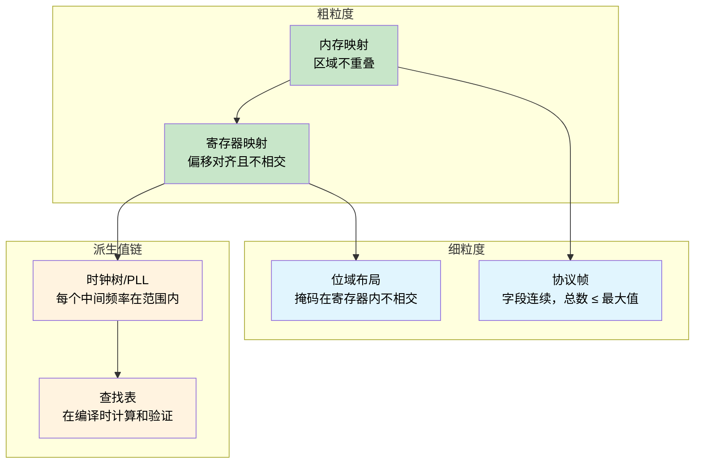
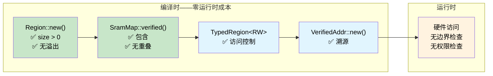

# Const Fn —— 编译时正确性证明 🟠

> **你将学到：** `const fn` 和 `assert!` 如何将编译器变成证明引擎——在编译时验证 SRAM 内存映射、寄存器布局、协议帧、位域掩码、时钟树和查找表，零运行时成本。
>
> **交叉引用：** [ch04](ch04-capability-tokens-zero-cost-proof-of-aut.md)（capability 令牌）、[ch06](ch06-dimensional-analysis-making-the-compiler.md)（量纲分析）、[ch09](ch09-phantom-types-for-resource-tracking.md)（phantom 类型）

## 问题：虚假的内存映射

在嵌入式和系统编程中，内存映射是一切的基础——它们定义了 bootloader、固件、数据段和栈的位置。边界出错，两个子系统会静默相互损坏。在 C 中，这些映射通常是 `#define` 常量，没有结构关系：

```c
/* STM32F4 SRAM 布局——256 KB 在 0x20000000 */
#define SRAM_BASE       0x20000000
#define SRAM_SIZE       (256 * 1024)

#define BOOT_BASE       0x20000000
#define BOOT_SIZE       (16 * 1024)

#define FW_BASE         0x20004000
#define FW_SIZE         (128 * 1024)

#define DATA_BASE       0x20024000
#define DATA_SIZE       (80 * 1024)     /* 有人把这项从 64K 增加到 80K */

#define STACK_BASE      0x20038000
#define STACK_SIZE      (48 * 1024)     /* 0x20038000 + 48K = 0x20044000 —— 超出 SRAM 末尾！ */
```

bug：`16 + 128 + 80 + 48 = 272 KB`，但 SRAM 只有 256 KB。栈超出物理内存末尾 16 KB。没有编译器警告，没有链接器错误，没有运行时检查——只有当栈增长到未映射空间时的静默损坏。

**每个失败模式都是在部署后才发现的** —— 可能表现为仅在重栈使用时才出现的神秘崩溃，发生在数据段调整后数周。

## Const Fn：将编译器变成证明引擎

Rust 的 `const fn` 函数可以在编译时运行。当 `const fn` 在编译时求值期间 panic 时，panic 变成**编译错误**。与 `assert!` 结合，这将编译器变成你的不变量的定理证明器：

```rust
pub const fn checked_add(a: u32, b: u32) -> u32 {
    let sum = a as u64 + b as u64;
    assert!(sum <= u32::MAX as u64, "溢出");
    sum as u32
}

// ✅ 编译通过——100 + 200 适合 u32
const X: u32 = checked_add(100, 200);

// ❌ 编译错误："溢出"
// const Y: u32 = checked_add(u32::MAX, 1);

fn main() {
    println!("{X}");
}
```

> **关键见解：** `const fn` + `assert!` = 证明义务。每个断言是一个编译器必须验证的定理。如果证明失败，程序无法编译。不需要测试套件，不需要代码审查捕获——编译器本身就是审计员。

## 构建已验证的 SRAM 内存映射

### Region 类型

`Region` 表示连续的内存块。它的构造函数是一个 `const fn`，强制执行基本有效性：

```rust
#[derive(Debug, Clone, Copy)]
pub struct Region {
    pub base: u32,
    pub size: u32,
}

impl Region {
    /// 创建区域。如果不变量失败，在编译时 panic。
    pub const fn new(base: u32, size: u32) -> Self {
        assert!(size > 0, "区域大小必须非零");
        assert!(
            base as u64 + size as u64 <= u32::MAX as u64,
            "区域超出 32 位地址空间"
        );
        Self { base, size }
    }

    pub const fn end(&self) -> u32 {
        self.base + self.size
    }

    /// 如果 `inner` 完全适合 `self` 则为真。
    pub const fn contains(&self, inner: &Region) -> bool {
        inner.base >= self.base && inner.end() <= self.end()
    }

    /// 如果两个区域共享任何地址则为真。
    pub const fn overlaps(&self, other: &Region) -> bool {
        self.base < other.end() && other.base < self.end()
    }

    /// 如果 `addr` 落在此区域内则为真。
    pub const fn contains_addr(&self, addr: u32) -> bool {
        addr >= self.base && addr < self.end()
    }
}

// 每个 Region 诞生时都是有效的——你无法构造无效的区域
const R: Region = Region::new(0x2000_0000, 1024);

fn main() {
    println!("区域：{:#010X}..{:#010X}", R.base, R.end());
}
```

### 已验证的内存映射

现在我们将区域组合成完整的 SRAM 映射。构造函数证明六个无重叠不变量和四个包含不变量——全部在编译时：

```rust
# #[derive(Debug, Clone, Copy)]
# pub struct Region { pub base: u32, pub size: u32 }
# impl Region {
#     pub const fn new(base: u32, size: u32) -> Self {
#         assert!(size > 0, "区域大小必须非零");
#         assert!(base as u64 + size as u64 <= u32::MAX as u64, "溢出");
#         Self { base, size }
#     }
#     pub const fn end(&self) -> u32 { self.base + self.size }
#     pub const fn contains(&self, inner: &Region) -> bool {
#         inner.base >= self.base && inner.end() <= self.end()
#     }
#     pub const fn overlaps(&self, other: &Region) -> bool {
#         self.base < other.end() && other.base < self.end()
#     }
# }
pub struct SramMap {
    pub total:      Region,
    pub bootloader: Region,
    pub firmware:   Region,
    pub data:       Region,
    pub stack:      Region,
}

impl SramMap {
    pub const fn verified(
        total: Region,
        bootloader: Region,
        firmware: Region,
        data: Region,
        stack: Region,
    ) -> Self {
        // ── 包含：每个子区域适合总 SRAM ──
        assert!(total.contains(&bootloader), "bootloader 超出 SRAM");
        assert!(total.contains(&firmware),   "firmware 超出 SRAM");
        assert!(total.contains(&data),       "数据段超出 SRAM");
        assert!(total.contains(&stack),      "栈超出 SRAM");

        // ── 无重叠：没有一对子区域共享地址 ──
        assert!(!bootloader.overlaps(&firmware), "bootloader/firmware 重叠");
        assert!(!bootloader.overlaps(&data),     "bootloader/data 重叠");
        assert!(!bootloader.overlaps(&stack),    "bootloader/栈重叠");
        assert!(!firmware.overlaps(&data),       "firmware/data 重叠");
        assert!(!firmware.overlaps(&stack),      "firmware/栈重叠");
        assert!(!data.overlaps(&stack),          "数据/栈重叠");

        Self { total, bootloader, firmware, data, stack }
    }
}

// ✅ 所有 10 个不变量在编译时验证——零运行时成本
const SRAM: SramMap = SramMap::verified(
    Region::new(0x2000_0000, 256 * 1024),   // 256 KB 总 SRAM
    Region::new(0x2000_0000,  16 * 1024),   // bootloader: 16 KB
    Region::new(0x2000_4000, 128 * 1024),   // firmware:  128 KB
    Region::new(0x2002_4000,  64 * 1024),   // data:       64 KB
    Region::new(0x2003_4000,  48 * 1024),   // stack:      48 KB
);

fn main() {
    println!("SRAM:  {:#010X} — {} KB", SRAM.total.base, SRAM.total.size / 1024);
    println!("Boot:  {:#010X} — {} KB", SRAM.bootloader.base, SRAM.bootloader.size / 1024);
    println!("FW:    {:#010X} — {} KB", SRAM.firmware.base, SRAM.firmware.size / 1024);
    println!("Data:  {:#010X} — {} KB", SRAM.data.base, SRAM.data.size / 1024);
    println!("Stack: {:#010X} — {} KB", SRAM.stack.base, SRAM.stack.size / 1024);
}
```

十个编译时检查，零运行时指令。二进制文件只包含已验证的常量。

### 破坏映射

假设有人将数据段从 64 KB 增加到 80 KB 而不调整其他任何东西：

```rust,ignore
// ❌ 无法编译
const BAD_SRAM: SramMap = SramMap::verified(
    Region::new(0x2000_0000, 256 * 1024),
    Region::new(0x2000_0000,  16 * 1024),
    Region::new(0x2000_4000, 128 * 1024),
    Region::new(0x2002_4000,  80 * 1024),   // 80 KB —— 16 KB 太大
    Region::new(0x2003_8000,  48 * 1024),   // 栈被推到 SRAM 末尾之外
);
```

编译器报告：

```text
error[E0080]: evaluation of constant value failed
  --> src/main.rs:38:9
   |
38 |         assert!(total.contains(&stack), "stack exceeds SRAM");
   |         ^^^^^^^^^^^^^^^^^^^^^^^^^^^^^^^^^^^^^^^^^^^^^^^^^^^^^
   |         the evaluated program panicked at 'stack exceeds SRAM'
```

> **原本是神秘现场失败的 bug 现在是编译错误。** 不需要单元测试，不需要代码审查捕获——编译器证明它不可能。与 C 对比，同样的 bug 会静默发布，并在数月后作为栈损坏出现在现场。

## 使用 Phantom 类型分层访问控制

将 `const fn` 验证与 phantom 类型访问权限（[ch09](ch09-phantom-types-for-resource-tracking.md)）结合，在类型级别强制执行读/写约束：

```rust
use std::marker::PhantomData;

pub struct ReadOnly;
pub struct ReadWrite;

pub struct TypedRegion<Access> {
    base: u32,
    size: u32,
    _access: PhantomData<Access>,
}

impl<A> TypedRegion<A> {
    pub const fn new(base: u32, size: u32) -> Self {
        assert!(size > 0, "区域大小必须非零");
        Self { base, size, _access: PhantomData }
    }
}

// 读取可用于任何访问级别
fn read_word<A>(region: &TypedRegion<A>, offset: u32) -> u32 {
    assert!(offset + 4 <= region.size, "读取越界");
    // 真实固件：unsafe { core::ptr::read_volatile((region.base + offset) as *const u32) }
    0 // 存根
}

// 写入需要 ReadWrite——函数签名强制执行它
fn write_word(region: &TypedRegion<ReadWrite>, offset: u32, value: u32) {
    assert!(offset + 4 <= region.size, "写入越界");
    // 真实固件：unsafe { core::ptr::write_volatile(...) }
    let _ = value; // 存根
}

const BOOTLOADER: TypedRegion<ReadOnly>  = TypedRegion::new(0x2000_0000, 16 * 1024);
const DATA:       TypedRegion<ReadWrite> = TypedRegion::new(0x2002_4000, 64 * 1024);

fn main() {
    read_word(&BOOTLOADER, 0);      // ✅ 从只读区域读取
    read_word(&DATA, 0);            // ✅ 从读写区域读取
    write_word(&DATA, 0, 42);       // ✅ 写入读写区域
    // write_word(&BOOTLOADER, 0, 42); // ❌ 编译错误：期望 ReadWrite，找到 ReadOnly
}
```

bootloader 区域在物理上是可写的（它是 SRAM），但类型系统防止意外写入。**硬件能力**和**软件权限**之间的这种区别正是正确构造的含义。

## 指针溯源：证明地址属于区域

更进一步，我们可以创建已验证的地址——在静态上被证明位于特定区域内的值：

```rust
# #[derive(Debug, Clone, Copy)]
# pub struct Region { pub base: u32, pub size: u32 }
# impl Region {
#     pub const fn new(base: u32, size: u32) -> Self {
#         assert!(size > 0);
#         assert!(base as u64 + size as u64 <= u32::MAX as u64);
#         Self { base, size }
#     }
#     pub const fn end(&self) -> u32 { self.base + self.size }
#     pub const fn contains_addr(&self, addr: u32) -> bool {
#         addr >= self.base && addr < self.end()
#     }
# }
/// 在编译时被证明位于区域内的地址。
pub struct VerifiedAddr {
    addr: u32, // 私有的——只能通过已检查的构造函数创建
}

impl VerifiedAddr {
    /// 如果 `addr` 在 `region` 外，在编译时 panic。
    pub const fn new(region: &Region, addr: u32) -> Self {
        assert!(region.contains_addr(addr), "地址不在区域内");
        Self { addr }
    }

    pub const fn raw(&self) -> u32 {
        self.addr
    }
}

const DATA: Region = Region::new(0x2002_4000, 64 * 1024);

// ✅ 在编译时被证明在数据区域内
const STATUS_WORD: VerifiedAddr = VerifiedAddr::new(&DATA, 0x2002_4000);
const CONFIG_WORD: VerifiedAddr = VerifiedAddr::new(&DATA, 0x2002_5000);

// ❌ 无法编译：地址在 bootloader 区域内，不在数据区
// const BAD_ADDR: VerifiedAddr = VerifiedAddr::new(&DATA, 0x2000_0000);

fn main() {
    println!("状态寄存器在 {:#010X}", STATUS_WORD.raw());
    println!("配置寄存器在 {:#010X}", CONFIG_WORD.raw());
}
```

**在编译时建立溯源** —— 访问这些地址时不需要运行时边界检查。构造函数是私有的，所以只有编译器证明有效时 `VerifiedAddr` 才能存在。

## 内存映射之外

`const fn` 证明模式适用于任何你有**编译时已知值和结构不变量**的地方。上面的 SRAM 映射证明了*区域间*属性（包含、无重叠）。同样的技术可以扩展到越来越细粒度的域：



每个子节遵循相同的模式：定义一个带有 `const fn` 构造函数的类型，编码不变量，然后使用 `const _: () = { ... }` 或 `const` 绑定来触发验证。

### 寄存器映射

硬件寄存器块有固定的偏移和宽度。错误对齐或重叠的寄存器定义总是 bug：

```rust
#[derive(Debug, Clone, Copy)]
pub struct Register {
    pub offset: u32,
    pub width: u32,
}

impl Register {
    pub const fn new(offset: u32, width: u32) -> Self {
        assert!(
            width == 1 || width == 2 || width == 4,
            "寄存器宽度必须是 1、2 或 4 字节"
        );
        assert!(offset % width == 0, "寄存器必须自然对齐");
        Self { offset, width }
    }

    pub const fn end(&self) -> u32 {
        self.offset + self.width
    }
}

const fn disjoint(a: &Register, b: &Register) -> bool {
    a.end() <= b.offset || b.end() <= a.offset
}

// UART 外设寄存器
const DATA:   Register = Register::new(0x00, 4);
const STATUS: Register = Register::new(0x04, 4);
const CTRL:   Register = Register::new(0x08, 4);
const BAUD:   Register = Register::new(0x0C, 4);

// 编译时证明：没有寄存器重叠另一个
const _: () = {
    assert!(disjoint(&DATA,   &STATUS));
    assert!(disjoint(&DATA,   &CTRL));
    assert!(disjoint(&DATA,   &BAUD));
    assert!(disjoint(&STATUS, &CTRL));
    assert!(disjoint(&STATUS, &BAUD));
    assert!(disjoint(&CTRL,   &BAUD));
};

fn main() {
    println!("UART DATA:   offset={:#04X}, width={}", DATA.offset, DATA.width);
    println!("UART STATUS: offset={:#04X}, width={}", STATUS.offset, STATUS.width);
}
```

注意 `const _: () = { ... };` 习语——一个未命名常量，唯一目的是运行编译时断言。如果任何断言失败，常量无法求值，编译停止。

#### 小练习：SPI 寄存器银行

给定这些 SPI 控制器寄存器，添加 const fn 断言证明：
1. 每个寄存器自然对齐（offset % width == 0）
2. 没有两个寄存器重叠
3. 所有寄存器适合 64 字节寄存器块

<details>
<summary>提示</summary>

重用 UART 示例中的 `Register` 和 `disjoint` 函数。定义三到四个 `const Register` 值（例如，`CTRL` 在偏移 0x00 宽度 4，`STATUS` 在 0x04 宽度 4，`TX_DATA` 在 0x08 宽度 1，`RX_DATA` 在 0x0C 宽度 1）并断言这三个属性。

</details>

### 协议帧布局

网络或总线协议帧在特定偏移处有字段。`then()` 方法使连续性结构化——间隙和重叠通过构造不可能：

```rust
#[derive(Debug, Clone, Copy)]
pub struct Field {
    pub offset: usize,
    pub size: usize,
}

impl Field {
    pub const fn new(offset: usize, size: usize) -> Self {
        assert!(size > 0, "字段大小必须非零");
        Self { offset, size }
    }

    pub const fn end(&self) -> usize {
        self.offset + self.size
    }

    /// 创建紧接在此字段之后的下一个字段。
    pub const fn then(&self, size: usize) -> Field {
        Field::new(self.end(), size)
    }
}

const MAX_FRAME: usize = 256;

const HEADER:  Field = Field::new(0, 4);
const SEQ_NUM: Field = HEADER.then(2);
const PAYLOAD: Field = SEQ_NUM.then(246);
const CRC:     Field = PAYLOAD.then(4);

// 编译时证明：帧适合最大大小
const _: () = assert!(CRC.end() <= MAX_FRAME, "帧超出最大大小");

fn main() {
    println!("Header:  [{}..{})", HEADER.offset, HEADER.end());
    println!("SeqNum:  [{}..{})", SEQ_NUM.offset, SEQ_NUM.end());
    println!("Payload: [{}..{})", PAYLOAD.offset, PAYLOAD.end());
    println!("CRC:     [{}..{})", CRC.offset, CRC.end());
    println!("Total:   {}/{} 字节", CRC.end(), MAX_FRAME);
}
```

字段通过构造是连续的——每个正好在前一个结束的地方开始。最终断言证明帧适合协议的最大大小。

### 用于泛型验证的内联 Const 块

从 Rust 1.79 开始，`const { ... }` 块让你在使用点验证 const 泛型参数——完美用于 DMA 缓冲区大小约束或对齐要求：

```rust,ignore
fn dma_transfer<const N: usize>(buf: &[u8; N]) {
    const { assert!(N % 4 == 0, "DMA 缓冲区大小必须是 4 字节对齐") };
    const { assert!(N <= 65536, "DMA 传输超出最大大小") };
    // ... 发起传输 ...
}

dma_transfer(&[0u8; 1024]);   // ✅ 1024 可被 4 整除且 ≤ 65536
// dma_transfer(&[0u8; 1023]); // ❌ 编译错误：不是 4 字节对齐
```

断言在函数单态化时求值——每个带有不同 `N` 的调用点都有自己的编译时检查。

### 寄存器内的位域布局

寄存器映射证明寄存器*互不重叠*——但**单个寄存器内的位**呢？控制寄存器将多个字段打包到一个字中。如果两个字段共享位位置，读写会静默相互损坏。在 C 中，这通常通过手动审查掩码常量来捕获（或不被捕获）。

`const fn` 可以证明每个字段的掩码/移位对与同一寄存器中的每个其他字段不相交：

```rust
#[derive(Debug, Clone, Copy)]
pub struct BitField {
    pub mask: u32,
    pub shift: u8,
}

impl BitField {
    pub const fn new(shift: u8, width: u8) -> Self {
        assert!(width > 0, "位域宽度必须非零");
        assert!(shift as u32 + width as u32 <= 32, "位域超出 32 位寄存器");
        // 构建掩码：从位 `shift` 开始的 `width` 个 1
        let mask = ((1u64 << width as u64) - 1) as u32;
        Self { mask: mask << shift as u32, shift }
    }

    pub const fn positioned_mask(&self) -> u32 {
        self.mask
    }

    pub const fn encode(&self, value: u32) -> u32 {
        assert!(value & !( self.mask >> self.shift as u32 ) == 0, "值超出字段宽度");
        value << self.shift as u32
    }
}

const fn fields_disjoint(a: &BitField, b: &BitField) -> bool {
    a.positioned_mask() & b.positioned_mask() == 0
}

// SPI 控制寄存器字段：enable[0], mode[1:2], clock_div[4:7], irq_en[8]
const SPI_EN:     BitField = BitField::new(0, 1);   // 位 0
const SPI_MODE:   BitField = BitField::new(1, 2);   // 位 1–2
const SPI_CLKDIV: BitField = BitField::new(4, 4);   // 位 4–7
const SPI_IRQ:    BitField = BitField::new(8, 1);   // 位 8

// 编译时证明：没有字段共享位位置
const _: () = {
    assert!(fields_disjoint(&SPI_EN,   &SPI_MODE));
    assert!(fields_disjoint(&SPI_EN,   &SPI_CLKDIV));
    assert!(fields_disjoint(&SPI_EN,   &SPI_IRQ));
    assert!(fields_disjoint(&SPI_MODE, &SPI_CLKDIV));
    assert!(fields_disjoint(&SPI_MODE, &SPI_IRQ));
    assert!(fields_disjoint(&SPI_CLKDIV, &SPI_IRQ));
};

fn main() {
    let ctrl = SPI_EN.encode(1)
             | SPI_MODE.encode(0b10)
             | SPI_CLKDIV.encode(0b0110)
             | SPI_IRQ.encode(1);
    println!("SPI_CTRL = {:#010b} ({:#06X})", ctrl, ctrl);
}
```

这补充了上面的寄存器映射模式——寄存器映射证明*寄存器间*的不相交性，而位域布局证明*寄存器内*的不相交性。一起它们提供从寄存器块到单个位的完整覆盖。

### 时钟树/PLL 配置

微控制器通过乘法器/除法器链派生外设时钟。PLL 产生 `f_vco = f_in × N / M`，VCO 频率必须保持在硬件指定的范围内。为特定板获取任何参数错误，芯片输出垃圾时钟或拒绝锁定。这些约束是 `const fn` 的完美选择：

```rust
#[derive(Debug, Clone, Copy)]
pub struct PllConfig {
    pub input_khz: u32,     // 外部振荡器
    pub m: u32,             // 输入除法器
    pub n: u32,             // VCO 乘法器
    pub p: u32,             // 系统时钟除法器
}

impl PllConfig {
    pub const fn verified(input_khz: u32, m: u32, n: u32, p: u32) -> Self {
        // 输入除法器产生 PLL 输入频率
        let pll_input = input_khz / m;
        assert!(pll_input >= 1_000 && pll_input <= 2_000,
            "PLL 输入必须是 1–2 MHz");

        // VCO 频率必须在硬件限制内
        let vco = pll_input as u64 * n as u64;
        assert!(vco >= 192_000 && vco <= 432_000,
            "VCO 必须是 192–432 MHz");

        // 系统时钟除法器必须是偶数（硬件约束）
        assert!(p == 2 || p == 4 || p == 6 || p == 8,
            "P 必须是 2、4、6 或 8");

        // 最终系统时钟
        let sysclk = vco / p as u64;
        assert!(sysclk <= 168_000,
            "系统时钟超出 168 MHz 最大值");

        Self { input_khz, m, n, p }
    }

    pub const fn vco_khz(&self) -> u32 {
        (self.input_khz / self.m) * self.n
    }

    pub const fn sysclk_khz(&self) -> u32 {
        self.vco_khz() / self.p
    }
}

// STM32F4 带有 8 MHz HSE 晶体 → 168 MHz 系统时钟
const PLL: PllConfig = PllConfig::verified(8_000, 8, 336, 2);

// ❌ 无法编译：VCO = 480 MHz 超出 432 MHz 限制
// const BAD: PllConfig = PllConfig::verified(8_000, 8, 480, 2);

fn main() {
    println!("VCO:    {} MHz", PLL.vco_khz() / 1_000);
    println!("SYSCLK: {} MHz", PLL.sysclk_khz() / 1_000);
}
```

取消注释 `BAD` 常量会产生编译时错误，指出违反的约束：

```text
error[E0080]: evaluation of constant value failed
  --> src/main.rs:18:9
   |
18 |         assert!(vco >= 192_000 && vco <= 432_000,
   |         ^^^^^^^^^^^^^^^^^^^^^^^^^^^^^^^^^^^^^^^^^
   |         the evaluated program panicked at 'VCO must be 192–432 MHz'
```

编译器在推导链的*中间*捕获约束违反——不是在末尾。如果你改为违反系统时钟限制（`sysclk > 168 MHz`），错误消息将指向该断言。

> **派生值约束链将单个 `const fn` 变成多阶段证明。** 每个中间值有自己的硬件强制范围。更改一个参数（例如，换成 25 MHz 晶体）立即暴露任何下游违反。

### 编译时查找表

`const fn` 可以在编译时计算整个查找表，将它们放在 `.rodata` 中，零启动成本。这对于 CRC 表、三角函数、编码映射和纠错码特别有价值——任何你通常使用构建脚本或代码生成的地方：

```rust
const fn crc32_table() -> [u32; 256] {
    let mut table = [0u32; 256];
    let mut i: usize = 0;
    while i < 256 {
        let mut crc = i as u32;
        let mut j = 0;
        while j < 8 {
            if crc & 1 != 0 {
                crc = (crc >> 1) ^ 0xEDB8_8320; // 标准 CRC-32 多项式
            } else {
                crc >>= 1;
            }
            j += 1;
        }
        table[i] = crc;
        i += 1;
    }
    table
}

/// 完整 CRC-32 表——在编译时计算，放在 .rodata 中
const CRC32_TABLE: [u32; 256] = crc32_table();

/// 在运行时使用预计算表计算字节切片的 CRC-32。
fn crc32(data: &[u8]) -> u32 {
    let mut crc: u32 = !0;
    for &byte in data {
        let index = ((crc ^ byte as u32) & 0xFF) as usize;
        crc = (crc >> 8) ^ CRC32_TABLE[index];
    }
    !crc
}

// 烟雾测试：众所周知的 "123456789" 的 CRC-32
const _: () = {
    // 在编译时验证单个表条目
    assert!(CRC32_TABLE[0] == 0x0000_0000);
    assert!(CRC32_TABLE[1] == 0x7707_3096);
};

fn main() {
    let check = crc32(b"123456789");
    // "123456789" 的已知 CRC-32 是 0xCBF43926
    assert_eq!(check, 0xCBF4_3926);
    println!("CRC-32 of '123456789' = {:#010X} ✓", check);
    println!("表大小：{} entries × 4 bytes = {} bytes in .rodata",
        CRC32_TABLE.len(), CRC32_TABLE.len() * 4);
}
```

`crc32_table()` 函数完全在编译期间运行。生成的 1 KB 表被嵌入到二进制的只读数据段中——没有分配器，没有初始化代码，没有启动成本。与使用代码生成器或在启动时计算表的 C 方法对比。Rust 版本被证明是正确的（`const _` 断言验证已知值）并且被证明是完整的（如果函数无法生成有效表，编译器将拒绝程序）。

## 何时使用 Const Fn 证明

| 场景 | 推荐 |
|----------|:---:|
| 内存映射、寄存器偏移、分区表 | ✅ 总是 |
| 带有固定字段的协议帧布局 | ✅ 总是 |
| 寄存器内的位域掩码 | ✅ 总是 |
| 时钟树/PLL 参数链 | ✅ 总是 |
| 查找表（CRC、三角、编码） | ✅ 总是——零启动成本 |
| 具有交叉值不变量的常量（无重叠、总和 ≤ 边界） | ✅ 总是 |
| 具有域约束的配置值 | ✅ 当值在编译时已知 |
| 从用户输入或文件计算的值 | ❌ 使用运行时验证 |
| 高度动态结构（树、图） | ❌ 使用基于属性的测试 |
| 单值范围检查 | ⚠️  考虑 newtype + `From` 替代（[ch07](ch07-validated-boundaries-parse-dont-validate.md)） |

### 成本总结

| 什么 | 运行时成本 |
|------|:------:|
| `const fn` 断言（`assert!`、`panic!`） | 仅编译时——0 条指令 |
| `const _: () = { ... }` 验证块 | 仅编译时——不在二进制文件中 |
| `Region`、`Register`、`Field` 结构体 | 纯数据——与原始整数相同的布局 |
| 内联 `const { }` 泛型验证 | 在编译时单态化——0 成本 |
| 查找表（`crc32_table()`） | 在编译时计算——放在 `.rodata` 中 |
| Phantom 类型访问标记（`TypedRegion<RW>`） | 零大小——被优化掉 |

每一行都是**零运行时成本**——证明只存在于编译期间。生成的二进制文件只包含已验证的常量和查找表，没有断言检查代码。

## 练习：Flash 分区映射

为从 `0x0800_0000` 开始的 1 MB NOR flash 设计一个已验证的 flash 分区映射。要求：

1. 四个分区：**bootloader**（64 KB）、**application**（640 KB）、**config**（64 KB）、**OTA staging**（256 KB）
2. 每个分区必须**4 KB 对齐**（flash 擦除粒度）：base 和 size 必须是 4096 的倍数
3. 没有分区可以重叠另一个
4. 所有分区必须适合 flash
5. 添加一个 `const fn total_used()` 返回所有分区大小的总和，并断言它等于 1 MB

<details>
<summary>解决方案</summary>

```rust
#[derive(Debug, Clone, Copy)]
pub struct FlashRegion {
    pub base: u32,
    pub size: u32,
}

impl FlashRegion {
    pub const fn new(base: u32, size: u32) -> Self {
        assert!(size > 0, "分区大小必须非零");
        assert!(base % 4096 == 0, "分区 base 必须是 4 KB 对齐");
        assert!(size % 4096 == 0, "分区大小必须是 4 KB 对齐");
        assert!(
            base as u64 + size as u64 <= u32::MAX as u64,
            "分区超出地址空间"
        );
        Self { base, size }
    }

    pub const fn end(&self) -> u32 { self.base + self.size }

    pub const fn contains(&self, inner: &FlashRegion) -> bool {
        inner.base >= self.base && inner.end() <= self.end()
    }

    pub const fn overlaps(&self, other: &FlashRegion) -> bool {
        self.base < other.end() && other.base < self.end()
    }
}

pub struct FlashMap {
    pub total:  FlashRegion,
    pub boot:   FlashRegion,
    pub app:    FlashRegion,
    pub config: FlashRegion,
    pub ota:    FlashRegion,
}

impl FlashMap {
    pub const fn verified(
        total: FlashRegion,
        boot: FlashRegion,
        app: FlashRegion,
        config: FlashRegion,
        ota: FlashRegion,
    ) -> Self {
        assert!(total.contains(&boot),   "bootloader 超出 flash");
        assert!(total.contains(&app),    "application 超出 flash");
        assert!(total.contains(&config), "config 超出 flash");
        assert!(total.contains(&ota),    "OTA staging 超出 flash");

        assert!(!boot.overlaps(&app),    "boot/app 重叠");
        assert!(!boot.overlaps(&config), "boot/config 重叠");
        assert!(!boot.overlaps(&ota),    "boot/ota 重叠");
        assert!(!app.overlaps(&config),  "app/config 重叠");
        assert!(!app.overlaps(&ota),     "app/ota 重叠");
        assert!(!config.overlaps(&ota),  "config/ota 重叠");

        Self { total, boot, app, config, ota }
    }

    pub const fn total_used(&self) -> u32 {
        self.boot.size + self.app.size + self.config.size + self.ota.size
    }
}

const FLASH: FlashMap = FlashMap::verified(
    FlashRegion::new(0x0800_0000, 1024 * 1024),  // 1 MB 总计
    FlashRegion::new(0x0800_0000,   64 * 1024),   // bootloader: 64 KB
    FlashRegion::new(0x0801_0000,  640 * 1024),   // application: 640 KB
    FlashRegion::new(0x080B_0000,   64 * 1024),   // config: 64 KB
    FlashRegion::new(0x080C_0000,  256 * 1024),   // OTA staging: 256 KB
);

// flash 的每个字节都有交代
const _: () = assert!(
    FLASH.total_used() == 1024 * 1024,
    "分区必须正好填满 flash"
);

fn main() {
    println!("Flash map: {} KB used / {} KB total",
        FLASH.total_used() / 1024,
        FLASH.total.size / 1024);
}
```

</details>



## 关键要点

1. **`const fn` + `assert!` = 编译时证明义务** —— 如果断言在 const 求值期间失败，程序无法编译。不需要测试，不需要代码审查捕获——编译器证明它。

2. **内存映射是理想的候选** —— 子区域包含、无重叠、总大小边界和对齐约束都可以表示为 const fn 断言。C 的 `#define` 方法不提供这些保证。

3. **Phantom 类型分层在上** —— 结合 const fn（值验证）与 phantom 类型访问标记（权限验证），零运行时成本进行纵深防御。

4. **溯源可以在编译时建立** —— `VerifiedAddr` 在编译时证明地址属于特定区域，消除每次访问的运行时边界检查。

5. **模式泛化到内存之外** —— 寄存器映射、位域掩码、协议帧、时钟树、DMA 参数——任何你有编译时已知值和结构不变量的地方。

6. **位域和时钟树是理想的候选** —— 寄存器内位的不相交性和派生值约束链（VCO 范围、除法器限制）正是 `const fn` 轻松证明的那种不变量。

7. **`const fn` 取代代码生成器和构建脚本用于查找表** —— CRC 表、三角函数、编码映射——在编译时计算，放在 `.rodata` 中，零启动成本，没有外部工具。

8. **内联 `const { }` 块验证泛型参数** —— 从 Rust 1.79 开始，你可以在调用点强制执行 const 泛型参数的约束，在任何代码运行之前捕获误用。
