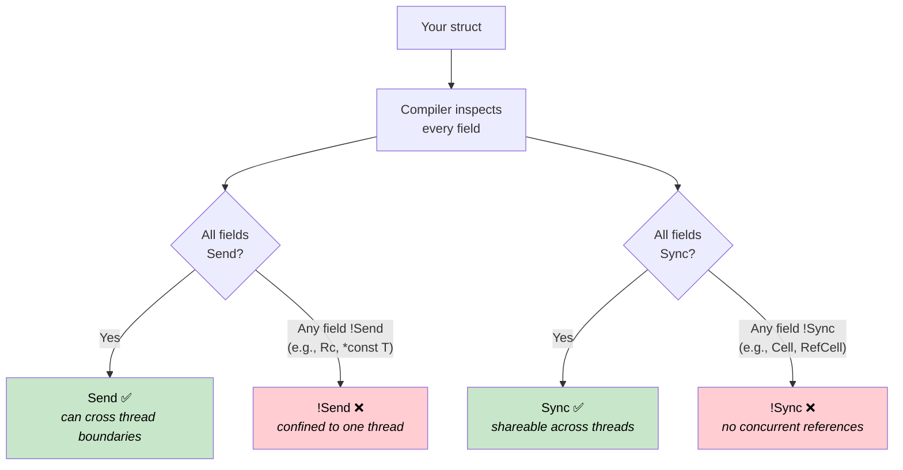
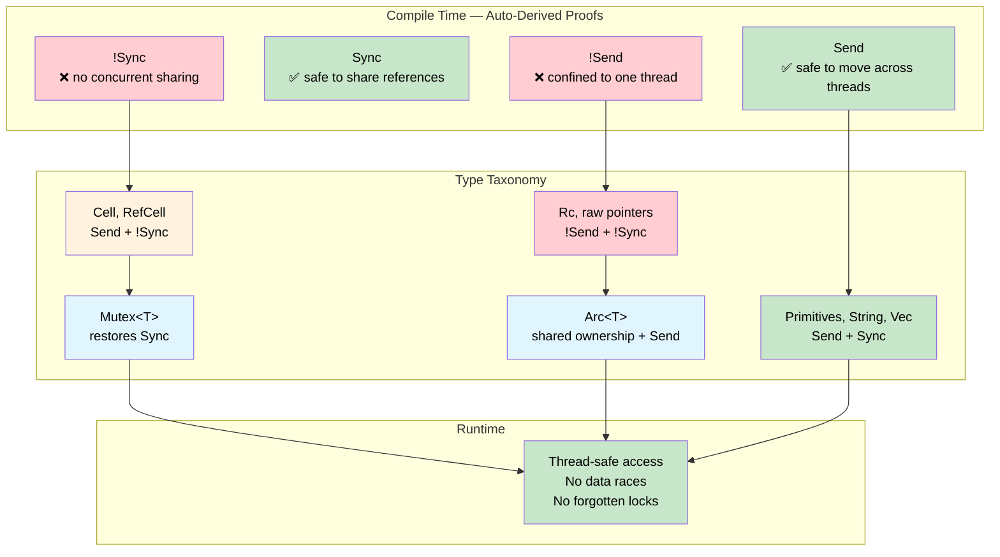

# Send & Sync — 编译期并发证明 🟠

> **你将学到：** Rust 的 `Send` 和 `Sync` auto-traits 如何将编译器变成并发审计器——在编译期证明哪些类型可以跨越线程边界、哪些可以共享，零运行时开销。
>
> **交叉引用：** [ch04](ch04-capability-tokens-zero-cost-proof-of-aut.md)（capability 令牌）、[ch09](ch09-phantom-types-for-resource-tracking.md)（phantom 类型）、[ch15](ch15-const-fn-compile-time-correctness-proofs.md)（const fn 证明）

## 问题：没有安全网的并发访问

在系统编程中，外设、共享缓冲区和全局状态会从多个上下文中访问——主循环、中断处理程序、DMA 回调和工作线程。在 C 语言中，编译器完全不提供任何强制执行：

```c
/* 共享传感器缓冲区——从主循环和 ISR 访问 */
volatile uint32_t sensor_buf[64];
volatile uint32_t buf_index = 0;

void SENSOR_IRQHandler(void) {
    sensor_buf[buf_index++] = read_sensor();  /* 竞争：buf_index 读 + 写 */
}

void process_sensors(void) {
    for (uint32_t i = 0; i < buf_index; i++) {  /* buf_index 在循环中间改变 */
        process(sensor_buf[i]);                   /* 读取中途数据被覆盖 */
    }
    buf_index = 0;                                /* ISR 在这两行之间触发 */
}
```

`volatile` 关键字防止编译器优化掉读取操作，但它对数据竞争**毫无作用**。两个上下文可以同时读写 `buf_index`，产生撕裂值（torn values）、丢失更新或缓冲区溢出。同样的问题出现在 `pthread_mutex_t` 上——编译器会欣然让你忘记加锁：

```c
pthread_mutex_t lock;
int shared_counter;

void increment(void) {
    shared_counter++;  /* 哎呀——忘了 pthread_mutex_lock(&lock) */
}
```

**每个并发 bug 都在运行时才发现**——通常是在生产环境下高负载时，且间歇性出现。

## Send 和 Sync 证明的内容

Rust 定义了两个编译器自动派生的 marker traits：

| Trait | 证明 | 非正式含义 |
|-------|------|------------|
| `Send` | `T` 类型的值可以安全地**移动**到另一个线程 | "这可以跨越线程边界" |
| `Sync` | **共享引用** `&T` 可以安全地被多个线程使用 | "这可以从多个线程读取" |

这些是**auto-traits**——编译器通过检查每个字段自动派生。一个结构体是 `Send` 当且仅当它的所有字段都是 `Send`。一个结构体是 `Sync` 当且仅当它的所有字段都是 `Sync`。如果任何字段选择退出，整个结构体就退出。不需要标注，没有运行时开销——证明是结构性的。



> **编译器就是审计器。** 在 C 语言中，线程安全标注存在于注释和头文件文档中——仅供参考，从不强制执行。在 Rust 中，`Send` 和 `Sync` 从类型本身的结构派生。添加一个 `Cell<f32>` 字段会自动使包含的结构体变成 `!Sync`。不需要程序员采取行动，也无法忘记。

这两个 trait 通过一个关键恒等式联系：

> **`T` 是 `Sync` 当且仅当 `&T` 是 `Send`。**

这很直观：如果共享引用可以安全地发送到另一个线程，那么底层类型就安全支持并发读取。

### 选择退出的类型

某些类型故意是 `!Send` 或 `!Sync`：

| 类型 | Send | Sync | 原因 |
|------|:----:|:----:|------|
| `u32`、`String`、`Vec<T>` | ✅ | ✅ | 无内部可变性，无裸指针 |
| `Cell<T>`、`RefCell<T>` | ✅ | ❌ | 无同步的内部可变性 |
| `Rc<T>` | ❌ | ❌ | 引用计数不是原子的 |
| `*const T`、`*mut T` | ❌ | ❌ | 裸指针没有安全保证 |
| `Arc<T>`（其中 `T: Send + Sync`） | ✅ | ✅ | 原子引用计数 |
| `Mutex<T>`（其中 `T: Send`） | ✅ | ✅ | 锁序列化所有访问 |

此表中的每个 ❌ 都是**编译期不变量**。你不能意外地将 `Rc` 发送到另一个线程——编译器会拒绝它。

## !Send 外设句柄

在嵌入式系统中，外设寄存器块位于固定的内存地址，应该只从单个执行上下文访问。裸指针天生就是 `!Send` 和 `!Sync`，所以包装一个会自动使包含的类型退出这两个 trait：

```rust
/// 内存映射 UART 外设的句柄。
/// 裸指针使其自动成为 !Send 和 !Sync。
pub struct Uart {
    regs: *const u32,
}

impl Uart {
    pub fn new(base: usize) -> Self {
        Self { regs: base as *const u32 }
    }

    pub fn write_byte(&self, byte: u8) {
        // 在真实固件中：unsafe { write_volatile(self.regs.add(DATA_OFFSET), byte as u32) }
        println!("UART TX: {:#04X}", byte);
    }
}

fn main() {
    let uart = Uart::new(0x4000_1000);
    uart.write_byte(b'A');  // ✅ 在创建的线程上使用

    // ❌ 无法编译：Uart 是 !Send
    // std::thread::spawn(move || {
    //     uart.write_byte(b'B');
    // });
}
```

注释掉的 `thread::spawn` 会产生：

```text
error[E0277]: `*const u32` cannot be sent between threads safely
   |
   |     std::thread::spawn(move || {
   |     ^^^^^^^^^^^^^^^^^^ within `Uart`, the trait `Send` is not
   |                        implemented for `*const u32`
```

**没有裸指针？使用 `PhantomData`。** 有时一个类型没有裸指针，但仍应限制在一个线程中——例如，从 C 库获得的文件描述符索引或句柄：

```rust
use std::marker::PhantomData;

/// 来自 C 库的不透明句柄。PhantomData<*const ()> 使其
/// 成为 !Send + !Sync，即使内部的 fd 只是普通整数。
pub struct LibHandle {
    fd: i32,
    _not_send: PhantomData<*const ()>,
}

impl LibHandle {
    pub fn open(path: &str) -> Self {
        let _ = path;
        Self { fd: 42, _not_send: PhantomData }
    }

    pub fn fd(&self) -> i32 { self.fd }
}

fn main() {
    let handle = LibHandle::open("/dev/sensor0");
    println!("fd = {}", handle.fd());

    // ❌ 无法编译：LibHandle 是 !Send
    // std::thread::spawn(move || { let _ = handle.fd(); });
}
```

这相当于 C 语言的"请阅读文档说明这个句柄不是线程安全的"的编译期版本。在 Rust 中，编译器强制执行它。

## Mutex 将 !Sync 转换为 Sync

`Cell<T>` 和 `RefCell<T>` 提供无需任何同步的内部可变性——所以它们是 `!Sync`。但有时你确实需要在线程间共享可变状态。`Mutex<T>` 添加了缺失的同步，编译器会识别这一点：

> **如果 `T: Send`，那么 `Mutex<T>: Send + Sync`。**

锁序列化所有访问，所以 `!Sync` 的内部类型变成可安全共享。编译器在结构上证明这一点——没有运行时检查"程序员是否忘记加锁"：

```rust
use std::sync::{Arc, Mutex};
use std::cell::Cell;

/// 使用 Cell 的内部可变性的传感器缓存。
/// Cell<u32> 是 !Sync——不能直接跨线程共享。
struct SensorCache {
    last_reading: Cell<u32>,
    reading_count: Cell<u32>,
}

fn main() {
    // Mutex 使 SensorCache 安全共享——编译器证明
    let cache = Arc::new(Mutex::new(SensorCache {
        last_reading: Cell::new(0),
        reading_count: Cell::new(0),
    }));

    let handles: Vec<_> = (0..4).map(|i| {
        let c = Arc::clone(&cache);
        std::thread::spawn(move || {
            let guard = c.lock().unwrap();  // 访问前必须加锁
            guard.last_reading.set(i * 10);
            guard.reading_count.set(guard.reading_count.get() + 1);
        })
    }).collect();

    for h in handles { h.join().unwrap(); }

    let guard = cache.lock().unwrap();
    println!("Last reading: {}", guard.last_reading.get());
    println!("Total reads:  {}", guard.reading_count.get());
}
```

与 C 版本对比：`pthread_mutex_lock` 是程序员可能忘记的运行时调用。在这里，类型系统使得不通过 `Mutex` 访问 `SensorCache` 在结构上无法表示。证明是结构性的——唯一的运行时成本是锁本身。

> **`Mutex` 不仅同步——它证明同步。** `Mutex::lock()` 返回一个 `MutexGuard`，它 `Deref` 为 `&T`。没有办法不通过锁就获得内部数据的引用。API 使得"忘记加锁"在结构上无法表示。

## 函数约束即定理

`std::thread::spawn` 有这个签名：

```rust,ignore
pub fn spawn<F, T>(f: F) -> JoinHandle<T>
where
    F: FnOnce() -> T + Send + 'static,
    T: Send + 'static,
```

`Send + 'static` 约束不仅是实现细节——它是一个**定理**：

> "任何传递给 `spawn` 的闭包和返回值都在编译期被证明安全地在另一个线程上运行，没有悬空引用。"

你可以将相同的模式应用到你自己的 API：

```rust
use std::sync::mpsc;

/// 在后台线程上运行任务并返回其结果。
/// 约束证明：闭包及其结果是线程安全的。
fn run_on_background<F, T>(task: F) -> T
where
    F: FnOnce() -> T + Send + 'static,
    T: Send + 'static,
{
    let (tx, rx) = mpsc::channel();
    std::thread::spawn(move || {
        let _ = tx.send(task());
    });
    rx.recv().expect("background task panicked")
}

fn main() {
    // ✅ u32 是 Send，闭包没有捕获非 Send 的内容
    let result = run_on_background(|| 6 * 7);
    println!("Result: {result}");

    // ✅ String 是 Send
    let greeting = run_on_background(|| String::from("hello from background"));
    println!("{greeting}");

    // ❌ 无法编译：Rc 是 !Send
    // use std::rc::Rc;
    // let data = Rc::new(42);
    // run_on_background(move || *data);
}
```

取消注释 `Rc` 示例会产生精确的诊断：

```text
error[E0277]: `Rc<i32>` cannot be sent between threads safely
   --> src/main.rs
    |
    |     run_on_background(move || *data);
    |     ^^^^^^^^^^^^^^^^^^ `Rc<i32>` cannot be sent between threads safely
    |
note: required by a bound in `run_on_background`
    |
    |     F: FnOnce() -> T + Send + 'static,
    |                        ^^^^ required by this bound
```

编译器追踪违反回到精确的约束——并告诉程序员**为什么**。与 C 的 `pthread_create` 对比：

```c
int pthread_create(pthread_t *thread, const pthread_attr_t *attr,
                   void *(*start_routine)(void *), void *arg);
```

`void *arg` 接受任何内容——线程安全与否。C 编译器无法区分非原子引用计数和普通整数。Rust 的 trait 约束在类型级别进行区分。

## 何时使用 Send/Sync 证明

| 场景 | 方法 |
|------|------|
| 包装裸指针的外设句柄 | 自动 `!Send + !Sync`——无需操作 |
| C 库的句柄（整数 fd/handle） | 添加 `PhantomData<*const ()>` 实现 `!Send + !Sync` |
| 锁后面的共享配置 | `Arc<Mutex<T>>`——编译器证明访问安全 |
| 跨线程消息传递 | `mpsc::channel`——`Send` 约束自动强制执行 |
| 任务生成器或线程池 API | 在签名中要求 `F: Send + 'static` |
| 单线程资源（如 GPU 上下文） | `PhantomData<*const ()>` 防止共享 |
| 类型应该是 `Send` 但包含裸指针 | `unsafe impl Send` 带文档化的安全性证明 |

### 成本摘要

| 内容 | 运行时成本 |
|------|:----------:|
| `Send` / `Sync` 自动派生 | 仅编译期——0 字节 |
| `PhantomData<*const ()>` 字段 | 零大小——优化掉 |
| `!Send` / `!Sync` 强制执行 | 仅编译期——无运行时检查 |
| `F: Send + 'static` 函数约束 | 单态化——静态分派，无装箱 |
| `Mutex<T>` 锁 | 运行时锁（共享可变性不可避免） |
| `Arc<T>` 引用计数 | 原子递增/递减（共享所有权不可避免） |

前四行是**零成本**——它们只存在于类型系统中，编译后消失。`Mutex` 和 `Arc` 带有不可避免的运行时成本，但这些成本是任何正确的并发程序必须支付的**最低**成本——Rust 只是确保你支付它们。

## 练习：DMA 传输守卫

设计一个 `DmaTransfer<T>`，在 DMA 传输进行时持有缓冲区。要求：

1. `DmaTransfer` 必须是 `!Send`——DMA 控制器使用绑定到这个内核内存总线的物理地址
2. `DmaTransfer` 必须是 `!Sync`——DMA 写入时并发读取会看到撕裂数据
3. 提供一个 `wait()` 方法**消费**守卫并返回缓冲区——所有权证明传输完成
4. 缓冲区类型 `T` 必须实现 `DmaSafe` marker trait

<details>
<summary>解答</summary>

```rust
use std::marker::PhantomData;

/// 可用作 DMA 缓冲区的类型的 marker trait。
/// 在真实固件中：类型必须是 repr(C) 且无填充。
trait DmaSafe {}

impl DmaSafe for [u8; 64] {}
impl DmaSafe for [u8; 256] {}

/// 表示进行中的 DMA 传输的守卫。
/// !Send + !Sync：不能发送到另一个线程或共享。
pub struct DmaTransfer<T: DmaSafe> {
    buffer: T,
    channel: u8,
    _no_send_sync: PhantomData<*const ()>,
}

impl<T: DmaSafe> DmaTransfer<T> {
    /// 开始 DMA 传输。缓冲区被消费——其他人无法触碰它。
    pub fn start(buffer: T, channel: u8) -> Self {
        // 在真实固件中：配置 DMA 通道，设置源/目标，开始传输
        println!("DMA channel {} started", channel);
        Self {
            buffer,
            channel,
            _no_send_sync: PhantomData,
        }
    }

    /// 等待传输完成并返回缓冲区。
    /// 消费 self——守卫在此之后不再存在。
    pub fn wait(self) -> T {
        // 在真实固件中：轮询 DMA 状态寄存器直到完成
        println!("DMA channel {} complete", self.channel);
        self.buffer
    }
}

fn main() {
    let buf = [0u8; 64];

    // 开始传输——buf 被移入守卫
    let transfer = DmaTransfer::start(buf, 2);

    // ❌ buf 不再可访问——所有权防止 DMA 期间使用
    // println!("{:?}", buf);

    // ❌ 无法编译：DmaTransfer 是 !Send
    // std::thread::spawn(move || { transfer.wait(); });

    // ✅ 在原始线程上等待，取回缓冲区
    let buf = transfer.wait();
    println!("Buffer recovered: {} bytes", buf.len());
}
```

</details>



## 关键要点

1. **`Send` 和 `Sync` 是关于并发安全性的编译期证明**——编译器通过检查每个字段在结构上派生它们。无需标注，无运行时成本，无需显式选择。

2. **裸指针自动选择退出**——任何包含 `*const T` 或 `*mut T` 的类型变成 `!Send + !Sync`。这使得外设句柄自然地限制在线程内。

3. **`PhantomData<*const ()>` 是显式选择退出**——当一个类型没有裸指针但仍应限制在线程内时（C 库句柄、GPU 上下文），phantom 字段可以完成这项工作。

4. **`Mutex<T>` 恢复 `Sync` 并带证明**——编译器在结构上证明所有访问都通过锁。与 C 的 `pthread_mutex_t` 不同，你不可能忘记加锁。

5. **函数约束是定理**——生成器签名中的 `F: Send + 'static` 是编译期证明义务：每个调用点必须证明其闭包是线程安全的。与 C 的 `void *arg` 对比，它接受任何内容。

6. **该模式补充所有其他正确性技术**——typestate 证明协议排序，phantom 类型证明权限，`const fn` 证明值不变量，`Send`/`Sync` 证明并发安全性。它们一起覆盖完整的正确性表面。
