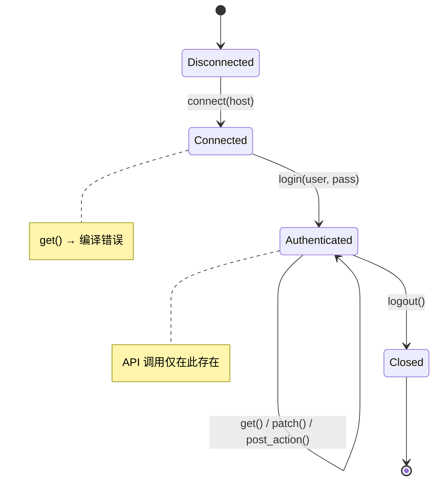
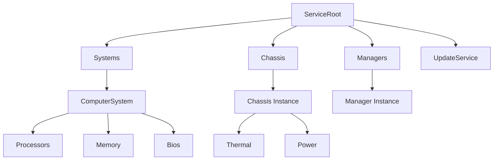
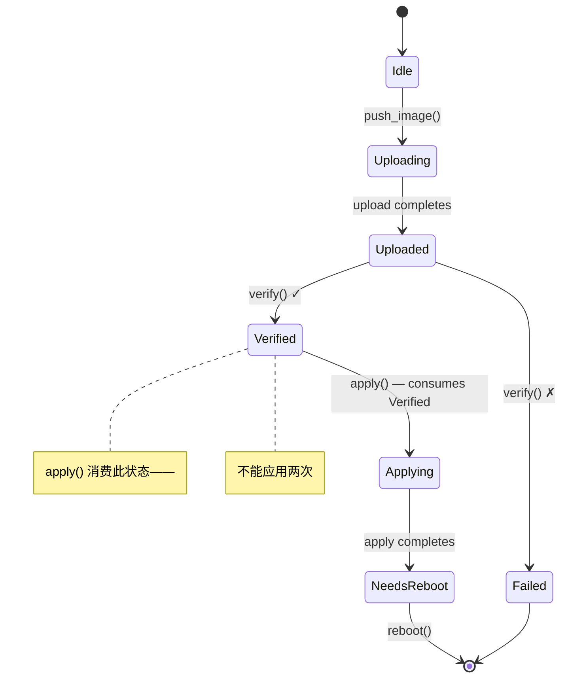

# 实战演练 — 类型安全的 Redfish 客户端 🟡

> **你将学到：** 如何组合 type-state 会话、capability 令牌、phantom 类型资源导航、量纲分析、验证边界、构建器 type-state 和一次性类型成一个完整的、零开销的 Redfish 客户端——其中每个协议违规都是编译错误。
>
> **交叉引用：** [ch02](ch02-typed-command-interfaces-request-determi.md)（类型化命令）、[ch03](ch03-single-use-types-cryptographic-guarantee.md)（一次性类型）、[ch04](ch04-capability-tokens-zero-cost-proof-of-aut.md)（capability 令牌）、[ch05](ch05-protocol-state-machines-type-state-for-r.md)（type-state）、[ch06](ch06-dimensional-analysis-making-the-compiler.md)（量纲类型）、[ch07](ch07-validated-boundaries-parse-dont-validate.md)（验证边界）、[ch09](ch09-phantom-types-for-resource-tracking.md)（phantom 类型）、[ch10](ch10-putting-it-all-together-a-complete-diagn.md)（IPMI 集成）、[ch11](ch11-fourteen-tricks-from-the-trenches.md)（技巧 4 — 构建器 type-state）

## 为什么 Redfish 值得单独一章

第 10 章围绕 IPMI 组合核心模式——一个字节级协议。但大多数 BMC 平台现在除了（或替代）IPMI 外还暴露**Redfish** REST API，而 Redfish 引入了它自己类别的正确性危险：

| 危险 | 示例 | 后果 |
|------|------|------|
| 格式错误的 URI | `GET /redfish/v1/Chassis/1/Processors`（错误的父节点） | 返回 404 或错误数据静默返回 |
| 错误电源状态下的操作 | 在已关闭的系统上调用 `Reset(ForceOff)` | BMC 返回错误，或更糟，与另一个操作竞争 |
| 缺少特权 | 操作员级代码调用 `Manager.ResetToDefaults` | 生产环境中返回 403，安全审计发现 |
| 不完整的 PATCH | 从 PATCH 体中遗漏必需的 BIOS 属性 | 静默无操作或部分配置损坏 |
| 未验证的固件应用 | 在检查图像完整性之前调用 `SimpleUpdate` | BMC 变砖 |
| Schema 版本不匹配 | 在 v1.5 BMC 上访问 `LastResetTime`（v1.13 添加） | 字段为 `null` → 运行时 panic |
| 遥测单位混淆 | 比较入口温度 (°C) 与功耗 (W) | 无意义的阈值决策 |

在 C、Python 或无类型的 Rust 中，每一个都仅通过纪律和测试来防止。本章使它们成为**编译错误**。

## 无类型的 Redfish 客户端

一个典型的 Redfish 客户端看起来像这样：

```rust,ignore
use std::collections::HashMap;

struct RedfishClient {
    base_url: String,
    token: Option<String>,
}

impl RedfishClient {
    fn get(&self, path: &str) -> Result<serde_json::Value, String> {
        // ... HTTP GET ...
        Ok(serde_json::json!({})) // 存根
    }

    fn patch(&self, path: &str, body: &serde_json::Value) -> Result<(), String> {
        // ... HTTP PATCH ...
        Ok(()) // 存根
    }

    fn post_action(&self, path: &str, body: &serde_json::Value) -> Result<(), String> {
        // ... HTTP POST ...
        Ok(()) // 存根
    }
}

fn check_thermal(client: &RedfishClient) -> Result<(), String> {
    let resp = client.get("/redfish/v1/Chassis/1/Thermal")?;

    // 🐛 这个字段总是存在吗？如果 BMC 返回 null 怎么办？
    let cpu_temp = resp["Temperatures"][0]["ReadingCelsius"]
        .as_f64().unwrap();

    let fan_rpm = resp["Fans"][0]["Reading"]
        .as_f64().unwrap();

    // 🐛 比较 °C 与 RPM——都是 f64
    if cpu_temp > fan_rpm {
        println!("thermal issue");
    }

    // 🐛 这是正确的路径吗？没有编译期检查。
    client.post_action(
        "/redfish/v1/Systems/1/Actions/ComputerSystem.Reset",
        &serde_json::json!({"ResetType": "ForceOff"})
    )?;

    Ok(())
}
```

这"能工作"——直到它不能。每个 `unwrap()` 都是潜在的 panic，每个字符串路径都是未经检查的假设，单位混淆是看不见的。

---

## 第 1 节 — 会话生命周期（Type-State，ch05）

Redfish 会话有严格的生命周期：connect → authenticate → use → close。将每个状态编码为不同的类型。



```rust,ignore
use std::marker::PhantomData;

// ──── 会话状态 ────

pub struct Disconnected;
pub struct Connected;
pub struct Authenticated;

pub struct RedfishSession<S> {
    base_url: String,
    auth_token: Option<String>,
    _state: PhantomData<S>,
}

impl RedfishSession<Disconnected> {
    pub fn new(host: &str) -> Self {
        RedfishSession {
            base_url: format!("https://{}", host),
            auth_token: None,
            _state: PhantomData,
        }
    }

    /// 转换：Disconnected → Connected。
    /// 验证服务根可达。
    pub fn connect(self) -> Result<RedfishSession<Connected>, RedfishError> {
        // GET /redfish/v1 — 验证服务根
        println!("Connecting to {}/redfish/v1", self.base_url);
        Ok(RedfishSession {
            base_url: self.base_url,
            auth_token: None,
            _state: PhantomData,
        })
    }
}

impl RedfishSession<Connected> {
    /// 转换：Connected → Authenticated。
    /// 通过 POST /redfish/v1/SessionService/Sessions 创建会话。
    pub fn login(
        self,
        user: &str,
        _pass: &str,
    ) -> Result<(RedfishSession<Authenticated>, LoginToken), RedfishError> {
        // POST /redfish/v1/SessionService/Sessions
        println!("Authenticated as {}", user);
        let token = "X-Auth-Token-abc123".to_string();
        Ok((
            RedfishSession {
                base_url: self.base_url,
                auth_token: Some(token),
                _state: PhantomData,
            },
            LoginToken { _private: () },
        ))
    }
}

impl RedfishSession<Authenticated> {
    /// 仅在 Authenticated 会话上可用。
    fn http_get(&self, path: &str) -> Result<serde_json::Value, RedfishError> {
        let _url = format!("{}{}", self.base_url, path);
        // ... HTTP GET with auth_token header ...
        Ok(serde_json::json!({})) // 存根
    }

    fn http_patch(
        &self,
        path: &str,
        body: &serde_json::Value,
    ) -> Result<serde_json::Value, RedfishError> {
        let _url = format!("{}{}", self.base_url, path);
        let _ = body;
        Ok(serde_json::json!({})) // 存根
    }

    fn http_post(
        &self,
        path: &str,
        body: &serde_json::Value,
    ) -> Result<serde_json::Value, RedfishError> {
        let _url = format!("{}{}", self.base_url, path);
        let _ = body;
        Ok(serde_json::json!({})) // 存根
    }

    /// 转换：Authenticated → Closed（会话被消费）。
    pub fn logout(self) {
        // DELETE /redfish/v1/SessionService/Sessions/{id}
        println!("Session closed");
        // self 被消费——登录后不能使用会话
    }
}

// 尝试在非 Authenticated 会话上调用 http_get：
//
//   let session = RedfishSession::new("bmc01").connect()?;
//   session.http_get("/redfish/v1/Systems");
//   ❌ 错误：method `http_get` not found for `RedfishSession<Connected>`

#[derive(Debug)]
pub enum RedfishError {
    ConnectionFailed(String),
    AuthenticationFailed(String),
    HttpError { status: u16, message: String },
    ValidationError(String),
}

impl std::fmt::Display for RedfishError {
    fn fmt(&self, f: &mut std::fmt::Formatter<'_>) -> std::fmt::Result {
        match self {
            Self::ConnectionFailed(msg) => write!(f, "connection failed: {msg}"),
            Self::AuthenticationFailed(msg) => write!(f, "auth failed: {msg}"),
            Self::HttpError { status, message } =>
                write!(f, "HTTP {status}: {message}"),
            Self::ValidationError(msg) => write!(f, "validation: {msg}"),
        }
    }
}
```

**消除的 bug 类别：** 在断开连接或未认证的会话上发送请求。该方法根本不存在——没有运行时检查可以忘记。

---

## 第 2 节 — 特权令牌（Capability Tokens，ch04）

Redfish 定义了四个特权级别：`Login`、`ConfigureComponents`、`ConfigureManager`、`ConfigureSelf`。不是在运行时检查权限，而是将它们编码为零大小的证明令牌。

```rust,ignore
// ──── 特权令牌（零大小）────

/// 证明调用者有 Login 特权。
/// 由成功登录返回——获得的唯一方式。
pub struct LoginToken { _private: () }

/// 证明调用者有 ConfigureComponents 特权。
/// 仅可通过管理员级认证获得。
pub struct ConfigureComponentsToken { _private: () }

/// 证明调用者有 ConfigureManager 特权（固件更新等）。
pub struct ConfigureManagerToken { _private: () }

// 扩展登录以基于角色返回特权令牌：

impl RedfishSession<Connected> {
    /// 管理员登录——返回所有特权令牌。
    pub fn login_admin(
        self,
        user: &str,
        pass: &str,
    ) -> Result<(
        RedfishSession<Authenticated>,
        LoginToken,
        ConfigureComponentsToken,
        ConfigureManagerToken,
    ), RedfishError> {
        let (session, login_tok) = self.login(user, pass)?;
        Ok((
            session,
            login_tok,
            ConfigureComponentsToken { _private: () },
            ConfigureManagerToken { _private: () },
        ))
    }

    /// 操作员登录——仅返回 Login + ConfigureComponents。
    pub fn login_operator(
        self,
        user: &str,
        pass: &str,
    ) -> Result<(
        RedfishSession<Authenticated>,
        LoginToken,
        ConfigureComponentsToken,
    ), RedfishError> {
        let (session, login_tok) = self.login(user, pass)?;
        Ok((
            session,
            login_tok,
            ConfigureComponentsToken { _private: () },
        ))
    }

    /// 只读登录——仅返回 Login 令牌。
    pub fn login_readonly(
        self,
        user: &str,
        pass: &str,
    ) -> Result<(RedfishSession<Authenticated>, LoginToken), RedfishError> {
        self.login(user, pass)
    }
}
```

现在特权需求是函数签名的一部分：

```rust,ignore
# use std::marker::PhantomData;
# pub struct Authenticated;
# pub struct RedfishSession<S> { base_url: String, auth_token: Option<String>, _state: PhantomData<S> }
# pub struct LoginToken { _private: () }
# pub struct ConfigureComponentsToken { _private: () }
# pub struct ConfigureManagerToken { _private: () }
# #[derive(Debug)] pub enum RedfishError { HttpError { status: u16, message: String } }

/// 任何有 Login 的人都可以读取热数据。
fn get_thermal(
    session: &RedfishSession<Authenticated>,
    _proof: &LoginToken,
) -> Result<serde_json::Value, RedfishError> {
    // GET /redfish/v1/Chassis/1/Thermal
    Ok(serde_json::json!({})) // 存根
}

/// 更改启动顺序需要 ConfigureComponents。
fn set_boot_order(
    session: &RedfishSession<Authenticated>,
    _proof: &ConfigureComponentsToken,
    order: &[&str],
) -> Result<(), RedfishError> {
    let _ = order;
    // PATCH /redfish/v1/Systems/1
    Ok(())
}

/// 恢复出厂设置需要 ConfigureManager。
fn reset_to_defaults(
    session: &RedfishSession<Authenticated>,
    _proof: &ConfigureManagerToken,
) -> Result<(), RedfishError> {
    // POST .../Actions/Manager.ResetToDefaults
    Ok(())
}

// 调用 reset_to_defaults 的操作员代码：
//
//   let (session, login, configure) = session.login_operator("op", "pass")?;
//   reset_to_defaults(&session, &???);
//   ❌ 错误：没有 ConfigureManagerToken 可用——操作员不能这样做
```

**消除的 bug 类别：** 特权升级。操作员级登录在物理上无法生成 `ConfigureManagerToken`——编译器不会让代码引用它。零运行时成本：对于编译后的二进制文件，这些令牌不存在。

---

## 第 3 节 — 类型化资源导航（Phantom Types，ch09）

Redfish 资源形成一棵树。将层次结构编码为类型可以防止构造非法 URI：



```rust,ignore
use std::marker::PhantomData;

// ──── 资源类型标记 ────

pub struct ServiceRoot;
pub struct SystemsCollection;
pub struct ComputerSystem;
pub struct ChassisCollection;
pub struct ChassisInstance;
pub struct ThermalResource;
pub struct PowerResource;
pub struct BiosResource;
pub struct ManagersCollection;
pub struct ManagerInstance;
pub struct UpdateServiceResource;

// ──── 类型化资源路径 ────

pub struct RedfishPath<R> {
    uri: String,
    _resource: PhantomData<R>,
}

impl RedfishPath<ServiceRoot> {
    pub fn root() -> Self {
        RedfishPath {
            uri: "/redfish/v1".to_string(),
            _resource: PhantomData,
        }
    }

    pub fn systems(&self) -> RedfishPath<SystemsCollection> {
        RedfishPath {
            uri: format!("{}/Systems", self.uri),
            _resource: PhantomData,
        }
    }

    pub fn chassis(&self) -> RedfishPath<ChassisCollection> {
        RedfishPath {
            uri: format!("{}/Chassis", self.uri),
            _resource: PhantomData,
        }
    }

    pub fn managers(&self) -> RedfishPath<ManagersCollection> {
        RedfishPath {
            uri: format!("{}/Managers", self.uri),
            _resource: PhantomData,
        }
    }

    pub fn update_service(&self) -> RedfishPath<UpdateServiceResource> {
        RedfishPath {
            uri: format!("{}/UpdateService", self.uri),
            _resource: PhantomData,
        }
    }
}

impl RedfishPath<SystemsCollection> {
    pub fn system(&self, id: &str) -> RedfishPath<ComputerSystem> {
        RedfishPath {
            uri: format!("{}/{}", self.uri, id),
            _resource: PhantomData,
        }
    }
}

impl RedfishPath<ComputerSystem> {
    pub fn bios(&self) -> RedfishPath<BiosResource> {
        RedfishPath {
            uri: format!("{}/Bios", self.uri),
            _resource: PhantomData,
        }
    }
}

impl RedfishPath<ChassisCollection> {
    pub fn instance(&self, id: &str) -> RedfishPath<ChassisInstance> {
        RedfishPath {
            uri: format!("{}/{}", self.uri, id),
            _resource: PhantomData,
        }
    }
}

impl RedfishPath<ChassisInstance> {
    pub fn thermal(&self) -> RedfishPath<ThermalResource> {
        RedfishPath {
            uri: format!("{}/Thermal", self.uri),
            _resource: PhantomData,
        }
    }

    pub fn power(&self) -> RedfishPath<PowerResource> {
        RedfishPath {
            uri: format!("{}/Power", self.uri),
            _resource: PhantomData,
        }
    }
}

impl RedfishPath<ManagersCollection> {
    pub fn manager(&self, id: &str) -> RedfishPath<ManagerInstance> {
        RedfishPath {
            uri: format!("{}/{}", self.uri, id),
            _resource: PhantomData,
        }
    }
}

impl<R> RedfishPath<R> {
    pub fn uri(&self) -> &str {
        &self.uri
    }
}

// ── 使用 ──

fn build_paths() {
    let root = RedfishPath::root();

    // ✅ 有效的导航
    let thermal = root.chassis().instance("1").thermal();
    assert_eq!(thermal.uri(), "/redfish/v1/Chassis/1/Thermal");

    let bios = root.systems().system("1").bios();
    assert_eq!(bios.uri(), "/redfish/v1/Systems/1/Bios");

    // ❌ 编译错误：ServiceRoot 没有 .thermal() 方法
    // root.thermal();

    // ❌ 编译错误：SystemsCollection 没有 .bios() 方法
    // root.systems().bios();

    // ❌ 编译错误：ChassisInstance 没有 .bios() 方法
    // root.chassis().instance("1").bios();
}
```

**消除的 bug 类别：** 格式错误的 URI、导航到给定父节点下不存在的子资源。层次结构在结构上强制执行——你只能通过 `Chassis → Instance → Thermal` 到达 `Thermal`。

---

## 第 4 节 — 类型化遥测读取（类型化命令 + 量纲分析，ch02 + ch06）

将类型化资源路径与量纲返回类型结合，这样编译器知道每个读取携带什么单位：

```rust,ignore
use std::marker::PhantomData;

// ──── 量纲类型（ch06）────

#[derive(Debug, Clone, Copy, PartialEq, PartialOrd)]
pub struct Celsius(pub f64);

#[derive(Debug, Clone, Copy, PartialEq, PartialOrd)]
pub struct Rpm(pub u32);

#[derive(Debug, Clone, Copy, PartialEq, PartialOrd)]
pub struct Watts(pub f64);

#[derive(Debug, Clone, Copy, PartialEq, PartialOrd)]
pub struct Volts(pub f64);

// ──── 类型化 Redfish GET（ch02 模式应用于 REST）────

/// Redfish 资源类型决定其解析的响应。
pub trait RedfishResource {
    type Response;
    fn parse(json: &serde_json::Value) -> Result<Self::Response, RedfishError>;
}

// ──── 已验证的热响应（ch07）────

#[derive(Debug)]
pub struct ValidThermalResponse {
    pub temperatures: Vec<TemperatureReading>,
    pub fans: Vec<FanReading>,
}

#[derive(Debug)]
pub struct TemperatureReading {
    pub name: String,
    pub reading: Celsius,           // ← 量纲类型，不是 f64
    pub upper_critical: Celsius,
    pub status: HealthStatus,
}

#[derive(Debug)]
pub struct FanReading {
    pub name: String,
    pub reading: Rpm,               // ← 量纲类型，不是 u32
    pub status: HealthStatus,
}

#[derive(Debug, Clone, Copy, PartialEq)]
pub enum HealthStatus { Ok, Warning, Critical }

impl RedfishResource for ThermalResource {
    type Response = ValidThermalResponse;

    fn parse(json: &serde_json::Value) -> Result<ValidThermalResponse, RedfishError> {
        // 一次解析和验证——边界验证（ch07）
        let temps = json["Temperatures"]
            .as_array()
            .ok_or_else(|| RedfishError::ValidationError(
                "missing Temperatures array".into(),
            ))?
            .iter()
            .map(|t| {
                Ok(TemperatureReading {
                    name: t["Name"]
                        .as_str()
                        .ok_or_else(|| RedfishError::ValidationError(
                            "missing Name".into(),
                        ))?
                        .to_string(),
                    reading: Celsius(
                        t["ReadingCelsius"]
                            .as_f64()
                            .ok_or_else(|| RedfishError::ValidationError(
                                "missing ReadingCelsius".into(),
                            ))?,
                    ),
                    upper_critical: Celsius(
                        t["UpperThresholdCritical"]
                            .as_f64()
                            .unwrap_or(105.0), // 安全默认值用于缺失的阈值
                    ),
                    status: parse_health(
                        t["Status"]["Health"]
                            .as_str()
                            .unwrap_or("OK"),
                    ),
                })
            })
            .collect::<Result<Vec<_>, _>>()?;

        let fans = json["Fans"]
            .as_array()
            .ok_or_else(|| RedfishError::ValidationError(
                "missing Fans array".into(),
            ))?
            .iter()
            .map(|f| {
                Ok(FanReading {
                    name: f["Name"]
                        .as_str()
                        .ok_or_else(|| RedfishError::ValidationError(
                            "missing Name".into(),
                        ))?
                        .to_string(),
                    reading: Rpm(
                        f["Reading"]
                            .as_u64()
                            .ok_or_else(|| RedfishError::ValidationError(
                                "missing Reading".into(),
                            ))? as u32,
                    ),
                    status: parse_health(
                        f["Status"]["Health"]
                            .as_str()
                            .unwrap_or("OK"),
                    ),
                })
            })
            .collect::<Result<Vec<_>, _>>()?;

        Ok(ValidThermalResponse { temperatures: temps, fans })
    }
}

fn parse_health(s: &str) -> HealthStatus {
    match s {
        "OK" => HealthStatus::Ok,
        "Warning" => HealthStatus::Warning,
        _ => HealthStatus::Critical,
    }
}

// ──── Authenticated 会话上的类型化 GET ────

impl RedfishSession<Authenticated> {
    pub fn get_resource<R: RedfishResource>(
        &self,
        path: &RedfishPath<R>,
    ) -> Result<R::Response, RedfishError> {
        let json = self.http_get(path.uri())?;
        R::parse(&json)
    }
}

// ── 使用 ──

fn read_thermal(
    session: &RedfishSession<Authenticated>,
    _proof: &LoginToken,
) -> Result<(), RedfishError> {
    let path = RedfishPath::root().chassis().instance("1").thermal();

    // 响应类型是推断的：ValidThermalResponse
    let thermal = session.get_resource(&path)?;

    for t in &thermal.temperatures {
        // t.reading 是 Celsius——只能与 Celsius 比较
        if t.reading > t.upper_critical {
            println!("CRITICAL: {} at {:?}", t.name, t.reading);
        }

        // ❌ 编译错误：不能比较 Celsius 与 Rpm
        // if t.reading > thermal.fans[0].reading { }

        // ❌ 编译错误：不能比较 Celsius 与 Watts
        // if t.reading > Watts(350.0) { }
    }

    Ok(())
}
```

**消除的 bug 类别：**
- **单位混淆：** `Celsius` ≠ `Rpm` ≠ `Watts`——编译器拒绝比较。
- **缺失字段 panic：** `parse()` 在边界验证；`ValidThermalResponse` 保证所有字段存在。
- **错误的响应类型：** `get_resource(&thermal_path)` 返回 `ValidThermalResponse`，不是原始 JSON。资源类型在编译期决定响应类型。

---

## 第 5 节 — 使用构建器 Type-State 的 PATCH（ch11，技巧 4）

Redfish PATCH 负载必须包含特定字段。一个在设置必需字段后提供 `.apply()` 的构建器可以防止不完整或空的 PATCH：

```rust,ignore
use std::marker::PhantomData;

// ──── 必需字段的类型级布尔值 ────

pub struct FieldUnset;
pub struct FieldSet;

// ──── BIOS 设置 PATCH 构建器 ────

pub struct BiosPatchBuilder<BootOrder, TpmState> {
    boot_order: Option<Vec<String>>,
    tpm_enabled: Option<bool>,
    _markers: PhantomData<(BootOrder, TpmState)>,
}

impl BiosPatchBuilder<FieldUnset, FieldUnset> {
    pub fn new() -> Self {
        BiosPatchBuilder {
            boot_order: None,
            tpm_enabled: None,
            _markers: PhantomData,
        }
    }
}

impl<T> BiosPatchBuilder<FieldUnset, T> {
    /// 设置启动顺序——将 BootOrder 标记转换为 FieldSet。
    pub fn boot_order(self, order: Vec<String>) -> BiosPatchBuilder<FieldSet, T> {
        BiosPatchBuilder {
            boot_order: Some(order),
            tpm_enabled: self.tpm_enabled,
            _markers: PhantomData,
        }
    }
}

impl<B> BiosPatchBuilder<B, FieldUnset> {
    /// 设置 TPM 状态——将 TpmState 标记转换为 FieldSet。
    pub fn tpm_enabled(self, enabled: bool) -> BiosPatchBuilder<B, FieldSet> {
        BiosPatchBuilder {
            boot_order: self.boot_order,
            tpm_enabled: Some(enabled),
            _markers: PhantomData,
        }
    }
}

impl BiosPatchBuilder<FieldSet, FieldSet> {
    /// .apply() 仅在设置所有必需字段时存在。
    pub fn apply(
        self,
        session: &RedfishSession<Authenticated>,
        _proof: &ConfigureComponentsToken,
        system: &RedfishPath<ComputerSystem>,
    ) -> Result<(), RedfishError> {
        let body = serde_json::json!({
            "Boot": {
                "BootOrder": self.boot_order.unwrap(),
            },
            "Oem": {
                "TpmEnabled": self.tpm_enabled.unwrap(),
            }
        });
        session.http_patch(
            &format!("{}/Bios/Settings", system.uri()),
            &body,
        )?;
        Ok(())
    }
}

// ── 使用 ──

fn configure_bios(
    session: &RedfishSession<Authenticated>,
    configure: &ConfigureComponentsToken,
) -> Result<(), RedfishError> {
    let system = RedfishPath::root().systems().system("1");

    // ✅ 设置所有必需字段——.apply() 可用
    BiosPatchBuilder::new()
        .boot_order(vec!["Pxe".into(), "Hdd".into()])
        .tpm_enabled(true)
        .apply(session, configure, &system)?;

    // ❌ 编译错误：.apply() 在 BiosPatchBuilder<FieldSet, FieldUnset> 上未找到
    // BiosPatchBuilder::new()
    //     .boot_order(vec!["Pxe".into()])
    //     .apply(session, configure, &system)?;

    // ❌ 编译错误：.apply() 在 BiosPatchBuilder<FieldUnset, FieldUnset> 上未找到
    // BiosPatchBuilder::new()
    //     .apply(session, configure, &system)?;

    Ok(())
}
```

**消除的 bug 类别：**
- **空 PATCH：** 不能在不设置每个必需字段的情况下调用 `.apply()`。
- **缺少特权：** `.apply()` 需要 `&ConfigureComponentsToken`。
- **错误的资源：** 接受 `&RedfishPath<ComputerSystem>`，不是原始字符串。

---

## 第 6 节 — 固件更新生命周期（Single-Use + Type-State，ch03 + ch05）

Redfish `UpdateService` 有严格的顺序：push image → verify → apply → reboot。每个阶段必须恰好发生一次，按顺序。



```rust,ignore
use std::marker::PhantomData;

// ──── 固件更新状态 ────

pub struct FwIdle;
pub struct FwUploaded;
pub struct FwVerified;
pub struct FwApplying;
pub struct FwNeedsReboot;

pub struct FirmwareUpdate<S> {
    task_uri: String,
    image_hash: String,
    _phase: PhantomData<S>,
}

impl FirmwareUpdate<FwIdle> {
    pub fn push_image(
        session: &RedfishSession<Authenticated>,
        _proof: &ConfigureManagerToken,
        image: &[u8],
    ) -> Result<FirmwareUpdate<FwUploaded>, RedfishError> {
        // POST /redfish/v1/UpdateService/Actions/UpdateService.SimpleUpdate
        // 或多部分推送到 /redfish/v1/UpdateService/upload
        let _ = image;
        println!("Image uploaded ({} bytes)", image.len());
        Ok(FirmwareUpdate {
            task_uri: "/redfish/v1/TaskService/Tasks/1".to_string(),
            image_hash: "sha256:abc123".to_string(),
            _phase: PhantomData,
        })
    }
}

impl FirmwareUpdate<FwUploaded> {
    /// 验证图像完整性。成功时返回 FwVerified。
    pub fn verify(self) -> Result<FirmwareUpdate<FwVerified>, RedfishError> {
        // 轮询任务直到验证完成
        println!("Image verified: {}", self.image_hash);
        Ok(FirmwareUpdate {
            task_uri: self.task_uri,
            image_hash: self.image_hash,
            _phase: PhantomData,
        })
    }
}

impl FirmwareUpdate<FwVerified> {
    /// 应用更新。消费 self——不能应用两次。
    /// 这是来自 ch03 的一次性模式。
    pub fn apply(self) -> Result<FirmwareUpdate<FwNeedsReboot>, RedfishError> {
        // PATCH /redfish/v1/UpdateService — 设置 ApplyTime
        println!("Firmware applied from {}", self.task_uri);
        // self 被移动——再次调用 apply() 是编译错误
        Ok(FirmwareUpdate {
            task_uri: self.task_uri,
            image_hash: self.image_hash,
            _phase: PhantomData,
        })
    }
}

impl FirmwareUpdate<FwNeedsReboot> {
    /// 重启以激活新固件。
    pub fn reboot(
        self,
        session: &RedfishSession<Authenticated>,
        _proof: &ConfigureManagerToken,
    ) -> Result<(), RedfishError> {
        // POST .../Actions/Manager.Reset {"ResetType": "GracefulRestart"}
        let _ = session;
        println!("BMC rebooting to activate firmware");
        Ok(())
    }
}

// ── 使用 ──

fn update_bmc_firmware(
    session: &RedfishSession<Authenticated>,
    manager_proof: &ConfigureManagerToken,
    image: &[u8],
) -> Result<(), RedfishError> {
    // 每个步骤返回下一个状态——旧状态被消费
    let uploaded = FirmwareUpdate::push_image(session, manager_proof, image)?;
    let verified = uploaded.verify()?;
    let needs_reboot = verified.apply()?;
    needs_reboot.reboot(session, manager_proof)?;

    // ❌ 编译错误：使用已移动的值 `verified`
    // verified.apply()?;

    // ❌ 编译错误：FirmwareUpdate<FwUploaded> 没有 .apply() 方法
    // uploaded.apply()?;      // 必须先验证！

    // ❌ 编译错误：push_image 需要 &ConfigureManagerToken
    // FirmwareUpdate::push_image(session, &login_token, image)?;

    Ok(())
}
```

**消除的 bug 类别：**
- **应用未验证的固件：** `.apply()` 仅存在于 `FwVerified` 上。
- **重复应用：** `apply()` 消费 `self`——移动的值不能重用。
- **跳过重启：** `FwNeedsReboot` 是一个不同的类型；你不能意外地在固件暂存时继续正常操作。
- **未授权的更新：** `push_image()` 需要 `&ConfigureManagerToken`。

---

## 第 7 节 — 整合在一起

这是组合所有六个部分的完整诊断工作流：

```rust,ignore
fn full_redfish_diagnostic() -> Result<(), RedfishError> {
    // ── 1. 会话生命周期（第 1 节）────
    let session = RedfishSession::new("bmc01.lab.local");
    let session = session.connect()?;

    // ── 2. 特权令牌（第 2 节）────
    // 管理员登录——获得所有 capability 令牌
    let (session, _login, configure, manager) =
        session.login_admin("admin", "p@ssw0rd")?;

    // ── 3. 类型化导航（第 3 节）────
    let thermal_path = RedfishPath::root()
        .chassis()
        .instance("1")
        .thermal();

    // ── 4. 类型化遥测读取（第 4 节）────
    let thermal: ValidThermalResponse = session.get_resource(&thermal_path)?;

    for t in &thermal.temperatures {
        // Celsius 只能与 Celsius 比较——量纲安全
        if t.reading > t.upper_critical {
            println!("🔥 {} is critical: {:?}", t.name, t.reading);
        }
    }

    for f in &thermal.fans {
        if f.reading < Rpm(1000) {
            println!("⚠ {} below threshold: {:?}", f.name, f.reading);
        }
    }

    // ── 5. 类型安全 PATCH（第 5 节）────
    let system_path = RedfishPath::root().systems().system("1");

    BiosPatchBuilder::new()
        .boot_order(vec!["Pxe".into(), "Hdd".into()])
        .tpm_enabled(true)
        .apply(&session, &configure, &system_path)?;

    // ── 6. 固件更新生命周期（第 6 节）────
    let firmware_image = include_bytes!("bmc_firmware.bin");
    let uploaded = FirmwareUpdate::push_image(&session, &manager, firmware_image)?;
    let verified = uploaded.verify()?;
    let needs_reboot = verified.apply()?;

    // ── 7. 干净关闭 ────
    needs_reboot.reboot(&session, &manager)?;
    session.logout();

    Ok(())
}
```

### 编译器证明的内容

| # | Bug 类别 | 如何防止 | 模式（章节） |
|---|---------|---------|-------------|
| 1 | 未认证会话上的请求 | `http_get()` 仅存在于 `Session<Authenticated>` 上 | Type-state（§1） |
| 2 | 特权升级 | `ConfigureManagerToken` 不由操作员登录返回 | Capability tokens（§2） |
| 3 | 格式错误的 Redfish URI | 导航方法强制执行父→子层次结构 | Phantom types（§3） |
| 4 | 单位混淆（°C vs RPM vs W） | `Celsius`、`Rpm`、`Watts` 是不同的类型 | 量纲分析（§4） |
| 5 | 缺失 JSON 字段 → panic | `ValidThermalResponse` 在解析边界验证 | 验证边界（§4） |
| 6 | 错误的响应类型 | `RedfishResource::Response` 每个资源固定 | 类型化命令（§4） |
| 7 | 不完整的 PATCH 负载 | `.apply()` 仅在所有字段是 `FieldSet` 时存在 | 构建器 type-state（§5） |
| 8 | 缺少 PATCH 特权 | `.apply()` 需要 `&ConfigureComponentsToken` | Capability tokens（§5） |
| 9 | 应用未验证的固件 | `.apply()` 仅存在于 `FwVerified` 上 | Type-state（§6） |
| 10 | 重复固件应用 | `apply()` 消费 `self`——值被移动 | 一次性类型（§6） |
| 11 | 没有权威的固件更新 | `push_image()` 需要 `&ConfigureManagerToken` | Capability tokens（§6） |
| 12 | 登录后使用 | `logout()` 消费会话 | 所有权（§1） |

**所有十二个保证的总运行时开销：零。**

生成的二进制文件与无类型版本进行相同的 HTTP 调用——但无类型版本可能有 12 类 bug。这个版本不可能。

---

## 对比：IPMI 集成（ch10）vs. Redfish 集成

| 维度 | ch10 (IPMI) | 本章 (Redfish) |
|------|-------------|----------------|
| 传输 | KCS/LAN 上的原始字节 | HTTPS 上的 JSON |
| 导航 | 扁平命令码（NetFn/Cmd） | 层次 URI 树 |
| 响应绑定 | `IpmiCmd::Response` | `RedfishResource::Response` |
| 特权模型 | 单个 `AdminToken` | 基于角色的多令牌 |
| 负载构造 | 字节数组 | JSON 的构建器 type-state |
| 更新生命周期 | 未覆盖 | 完整 type-state 链 |
| 锻炼的模式 | 7 | 8（添加构建器 type-state） |

这两章是互补的：ch10 展示了这些模式在字节级有效，本章展示了它们在 REST/JSON 级同样有效。类型系统不关心传输——它以两种方式证明正确性。

## 关键要点

1. **八个模式组合成一个 Redfish 客户端**——会话 type-state、capability 令牌、phantom 类型 URI、类型化命令、量纲分析、验证边界、构建器 type-state 和一次性固件应用。
2. **十二类 bug 变成编译错误**——见上表。
3. **零运行时开销**——每个证明令牌、phantom 类型和 type-state 标记都编译消失。二进制文件与手写的无类型代码相同。
4. **REST API 与字节协议受益相同**——来自 ch02–ch09 的模式同样适用于 JSON-over-HTTPS（Redfish）和 bytes-over-KCS（IPMI）。
5. **特权强制执行是结构性的，不是过程性的**——函数签名声明需要什么；编译器强制执行它。
6. **这是一个设计模板**——为你的特定 Redfish schema 和组织角色层次结构调整资源类型标记、capability 令牌和构建器。

---
